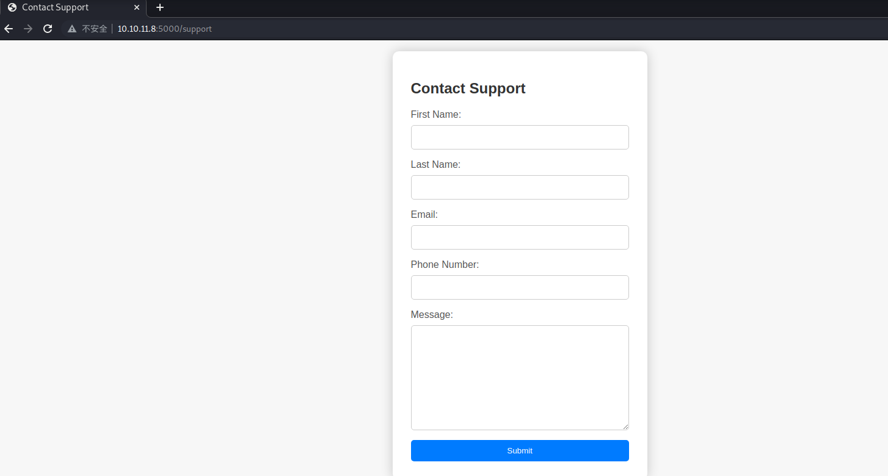
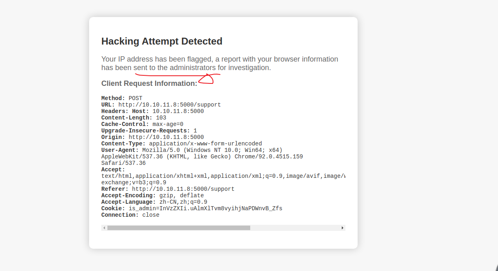
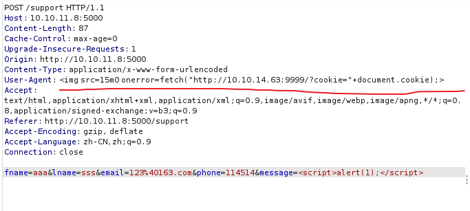
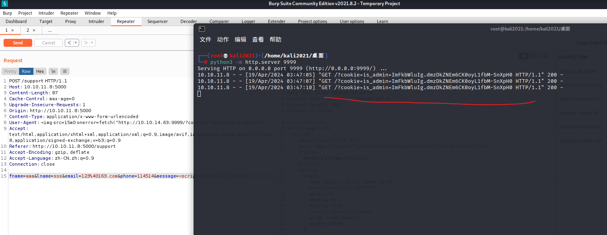
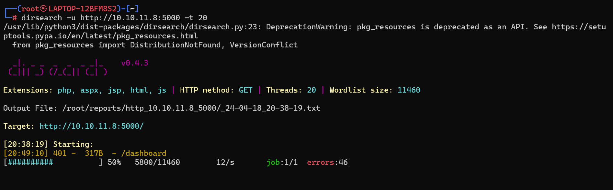
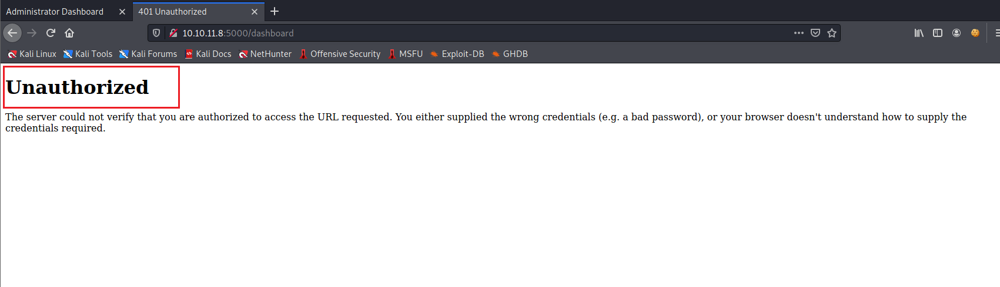
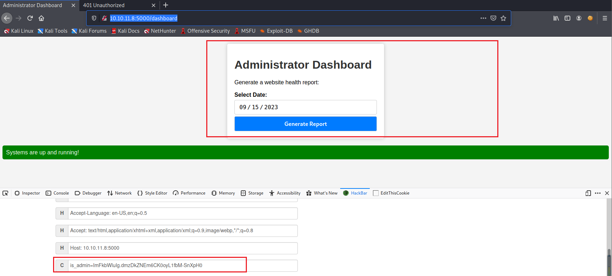
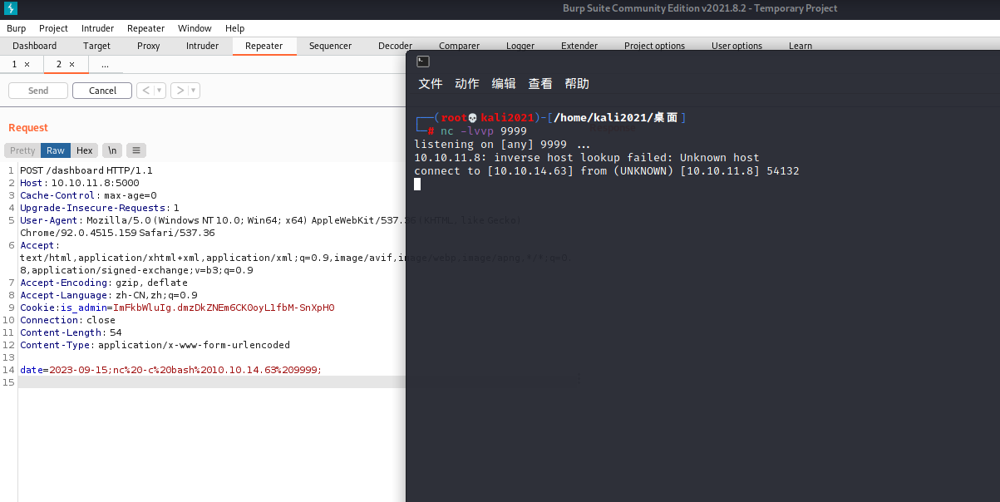
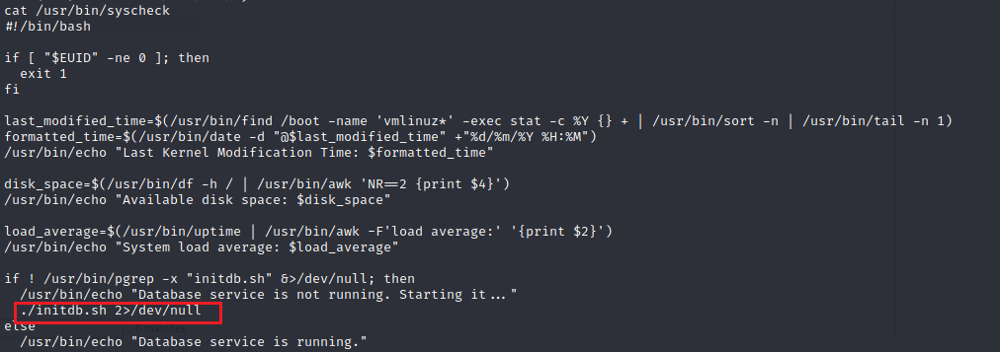
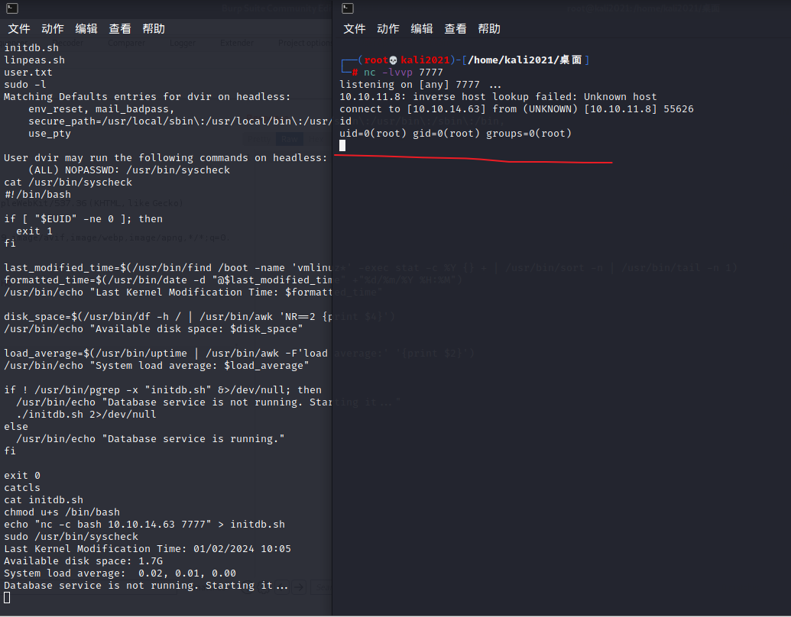

靶机ip: 10.10.11.8

先nmap扫
```
┌──(root💀kali2021)-[/home/kali2021/桌面]
└─# nmap -F 10.10.11.8                                                                                                                                                                                         1 ⚙
Starting Nmap 7.91 ( https://nmap.org ) at 2024-04-19 03:43 CST
Nmap scan report for 10.10.11.8
Host is up (0.39s latency).
Not shown: 98 closed ports
PORT     STATE SERVICE
22/tcp   open  ssh
5000/tcp open  upnp

Nmap done: 1 IP address (1 host up) scanned in 6.90 seconds
```

5000是个网页


一看就是XSS 但直接弹cookie会被waf


我们可以在UserAgent注入XSS代码 本地起一个web服务 然后故意触发检测让管理员访问来带出cookie




然后结合先前dirsearch扫出来的/dashboard 


可以用admin的cookie登陆




然后bp抓包(...) 看格式
是POST
`date=2023-09-15;`这种
由回显提示(Systems are up and running) 尝试直接拼接RCE
这里直接nc -c反弹shell


getshell后就来提权
先看 **/home**
在/home/dvir找到user的flag

`sudo -l`
```
sudo -l
Matching Defaults entries for dvir on headless:
    env_reset, mail_badpass,
    secure_path=/usr/local/sbin\:/usr/local/bin\:/usr/sbin\:/usr/bin\:/sbin\:/bin,
    use_pty

User dvir may run the following commands on headless:
    (ALL) NOPASSWD: /usr/bin/syscheck

```

` /usr/bin/syscheck` 这玩意儿有root权限
看看写了啥


稍微审计一下就知道执行了initdb.sh
那我们直接改这个文件反弹shell即可
然后 **sudo** 执行!!!
`sudo /usr/bin/syscheck`



成功提权 在/root找到root的flag

---
---

yysy 出的挺好的 是时候系统学习/总结一下XSS了(一直学的不是很扎实)
主要是环境还是挺难绷的... kali好多web的都没配好 可以把kali的Firefox配一个bp代理 不然打不了一点
