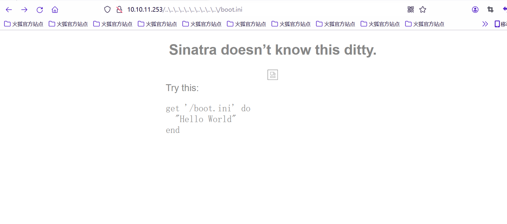
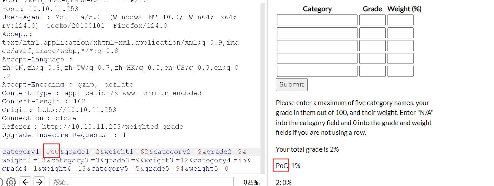
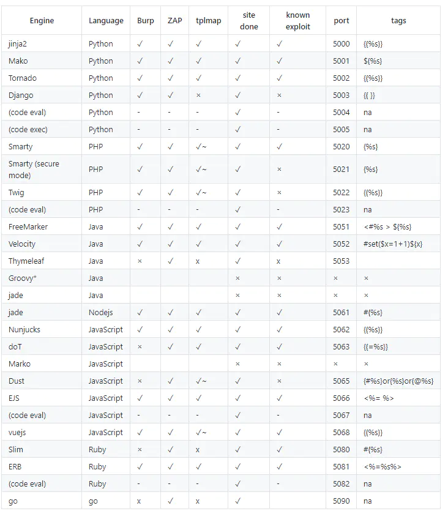
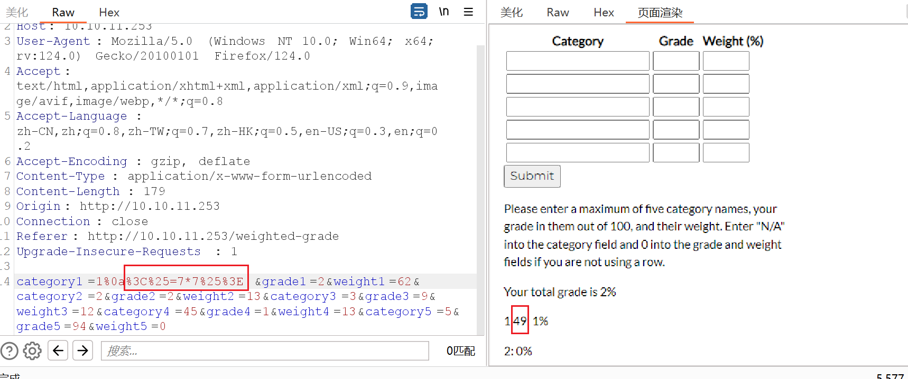

先关掉梯子ovpn连接好过后再开梯子打HTB

靶机ip: 10.10.11.253

信息收集
```
┌──(root㉿LAPTOP-12BFM8S2)-[~]
└─# nmap -A -sV -sC 10.10.11.253
Starting Nmap 7.94SVN ( https://nmap.org ) at 2024-04-19 21:51 CST
Nmap scan report for 10.10.11.253
Host is up (0.38s latency).
Not shown: 997 closed tcp ports (reset)
PORT    STATE    SERVICE VERSION
22/tcp  open     ssh     OpenSSH 8.9p1 Ubuntu 3ubuntu0.6 (Ubuntu Linux; protocol 2.0)
| ssh-hostkey:
|   256 80:e4:79:e8:59:28:df:95:2d:ad:57:4a:46:04:ea:70 (ECDSA)
|_  256 e9:ea:0c:1d:86:13:ed:95:a9:d0:0b:c8:22:e4:cf:e9 (ED25519)
80/tcp  open     http    nginx
|_http-title: Weighted Grade Calculator
524/tcp filtered ncp
Aggressive OS guesses: Linux 3.1 (91%), Linux 3.2 (91%), AXIS 210A or 211 Network Camera (Linux 2.6.17) (91%), Linux 4.15 - 5.8 (90%), Linux 5.4 (90%), Linux 5.3 - 5.4 (90%), ASUS RT-N56U WAP (Linux 3.4) (89%), Linux 3.16 (89%), Linux 2.6.32 (89%), Linux 5.0 - 5.5 (89%)
No exact OS matches for host (test conditions non-ideal).
Network Distance: 3 hops
Service Info: OS: Linux; CPE: cpe:/o:linux:linux_kernel

TRACEROUTE (using port 8080/tcp)
HOP RTT       ADDRESS
1   0.69 ms   LAPTOP-12BFM8S2.mshome.net (172.20.128.1)
2   381.18 ms 10.10.14.1
3   381.98 ms 10.10.11.253

```

给的网页是一个可以计算加权成绩平均分的玩意儿
对输入也有waf
emmm 这方面应该是不好突破的

信息收集有个 `WEBrick 1.7.0` 一搜还真有exploit

[exploit-db](https://www.exploit-db.com/exploits/5215)


```
Example:

http://[server]:[port]/..%5c..%5c..%5c..%5c..%5c..%5c..%5c..%5c..%5c..%5c/boot.ini
```

回显这种页面


感觉不大行得通... 只能回去继续看calc那里

猜测是存在ssti的
这个网站是Ruby+Sinatra 不是常见版本的ssti
尝试几个payload都不大行...
都会被waf啊啊啊...

到这里思路其实出现了一点小偏差
我的初始分析是服务端把我们输入的值进行类似parseint这种可能会触发SSTI

但实际应该是在Categories这里也有render类似的


所有应该尝试在Categoris注入
正常SSTI会被waf 用%0a绕过(emmm)

那就对着这张表慢慢试吧(记得url编码)


最后发现 `<%=7*7%>` 可以


那就SSTI RCE 反弹shell吧

这里要弹的话要kali openvpn... 不然ip:port不对弹不了(windows和kali都连就行了)
ip: 10.10.14.63

貌似Windows的bp打不到Linux的...

但tm这环境... 弹不了一点...
...

