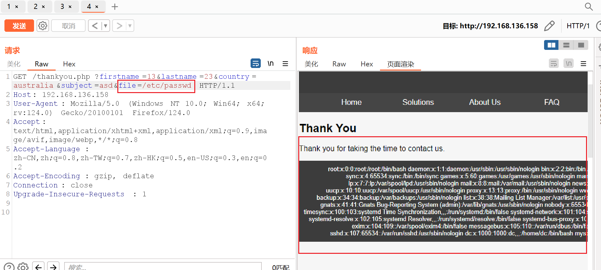
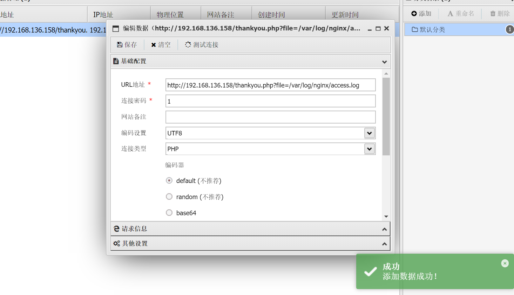

靶机描述:
```
DC-5 is another purposely built vulnerable lab with the intent of gaining experience in the world of penetration testing.

The plan was for DC-5 to kick it up a notch, so this might not be great for beginners, but should be ok for people with intermediate or better experience. Time will tell (as will feedback).

As far as I am aware, there is only one exploitable entry point to get in (there is no SSH either). This particular entry point may be quite hard to identify, but it is there. You need to look for something a little out of the ordinary (something that changes with a refresh of a page). This will hopefully provide some kind of idea as to what the vulnerability might involve.

And just for the record, there is no phpmailer exploit involved. :-)

The ultimate goal of this challenge is to get root and to read the one and only flag.

Linux skills and familiarity with the Linux command line are a must, as is some experience with basic penetration testing tools.

For beginners, Google can be of great assistance, but you can always tweet me at @DCAU7 for assistance to get you going again. But take note: I won't give you the answer, instead, I'll give you an idea about how to move forward.

But if you're really, really stuck, you can watch this video which shows the first step.
```

提示我们不是常规的入口点

**环境配置**
ova导入 启动改NAT 即可

靶机ip: 192.168.136.158

**信息收集**

nmap
```
PORT    STATE SERVICE VERSION
80/tcp  open  http    nginx 1.6.2
|_http-server-header: nginx/1.6.2
|_http-title: Welcome
111/tcp open  rpcbind 2-4 (RPC #100000)
| rpcinfo: 
|   program version    port/proto  service
|   100000  2,3,4        111/tcp   rpcbind
|   100000  2,3,4        111/udp   rpcbind
|   100000  3,4          111/tcp6  rpcbind
|   100000  3,4          111/udp6  rpcbind
|   100024  1          36497/udp   status
|   100024  1          46822/udp6  status
|   100024  1          51921/tcp6  status
|_  100024  1          58259/tcp   status
MAC Address: 00:0C:29:E5:98:39 (VMware)
Device type: general purpose
Running: Linux 3.X|4.X
OS CPE: cpe:/o:linux:linux_kernel:3 cpe:/o:linux:linux_kernel:4
OS details: Linux 3.2 - 4.9
Network Distance: 1 hop

```


看了看网页 有个contact 能写点留言之类的
把姓名 国籍 留言都在url get请求

但是也没其他回显...

感觉不像XSS 还能是啥.. 也没有登录的

突然发现每次刷新 下面的`Copyright`的值会变?!
结合前面dirsearch有一个 footer.php
```
[14:42:43] 200 -   17B  - /footer.php
```

这能搞事情???
为什么我们没传参footer.php却能变呢 开的随机数吗
???

好吧 看wp说是在thankyou.php(我们写完留言提交后)也能看到footer.php的copyright变化值
所以应该是有参数包含了footer.php ...


... 6
接下来利用文件包含漏洞进一步信息收集

emm... 又学到一招: 利用日志包含getshell
即 我们传一个不存在的参数让日志记录错误 但我们的参数传一个webshell 这样包含日志就可以了
这题是nginx 日志`/var/log/nginx/access.log`


那就先传错误参数写马


emmm... 


发送后看error.log


可以发现能识别出php 那么蚁剑直接连



终于进去了... 接下来就是提权到root
反弹shell到kali
然后起python交互shell

SUID提权
```
www-data@dc-5:~/html$ find / -user root -perm -4000 -print 2>/dev/null
find / -user root -perm -4000 -print 2>/dev/null
/bin/su
/bin/mount
/bin/umount
/bin/screen-4.5.0
/usr/bin/gpasswd
/usr/bin/procmail
/usr/bin/passwd
/usr/bin/chfn
/usr/bin/newgrp
/usr/bin/chsh
/usr/lib/openssh/ssh-keysign
/usr/lib/dbus-1.0/dbus-daemon-launch-helper
/usr/lib/eject/dmcrypt-get-device
/usr/sbin/exim4
/sbin/mount.nfs
```

`screen-4.5.0` 搜索发现存在漏洞
[scree-4.5.0提权](https://beret81.gitbook.io/pte/quan-xian-ti-sheng/linux-ti-quan/suid-ti-quan/suid-ti-quan-screen4.5.0)
[exploit-db](https://www.exploit-db.com/exploits/41154)

跟着步骤来
然后把rootshell等三个文件蚁剑上传到靶机
注意只能传/tmp目录


root!

---
---

总结:
没有死抠 这个靶机一共只打了1.5h 还是那句话 能学到东西就行!
文件包含那里的脑洞确实挺大的...
然后日志包含webshell确实没想到
后续的提权照着做就行了
再练练日志包含的题目 总结一下姿势
