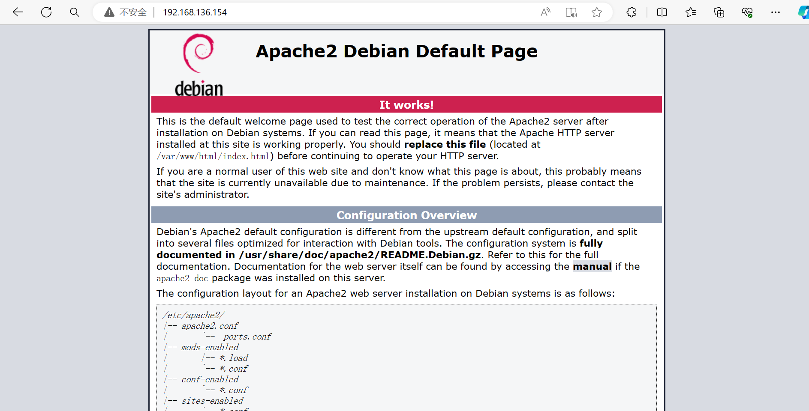

[靶机地址](https://www.vulnhub.com/entry/empire-breakout,751/)

靶机描述:
```
Description
Difficulty: Easy

This box was created to be an Easy box, but it can be Medium if you get lost.
```


环境配置:
ovf导入 启动后改NAT

靶机ip:
`192.168.136.154`



**信息收集**
`nmap -A`

这次扫到的挺多的

```
PORT      STATE SERVICE     VERSION
80/tcp    open  http        Apache httpd 2.4.51 ((Debian))
|_http-server-header: Apache/2.4.51 (Debian)
|_http-title: Apache2 Debian Default Page: It works
139/tcp   open  netbios-ssn Samba smbd 4.6.2
445/tcp   open  netbios-ssn Samba smbd 4.6.2
10000/tcp open  http        MiniServ 1.981 (Webmin httpd)
|_http-title: 200 &mdash; Document follows
20000/tcp open  http        MiniServ 1.830 (Webmin httpd)
```

熟悉的445 熟悉的Samba
搜索Samba smbd 4.6.2版本 找到 `CVE-2017-7494` Linux的核弹级漏洞...
msf中对应的为 
`4  exploit/linux/samba/is_known_pipename                2017-03-24       excellent  Yes    Samba is_known_pipename() Arbitrary Module Load`

但貌似照着复现打打不通...
重新扫了扫445端口也感觉没什么重要信息...
emmm... 先放一放

10000端口是登陆界面
又要爆破吗 但我觉得字典应该跑不出来...

先搁着吧  还是先打DC-4...