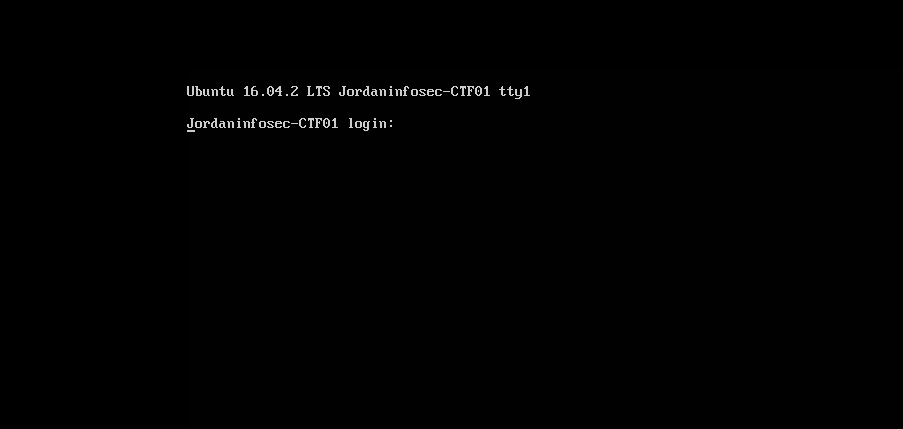
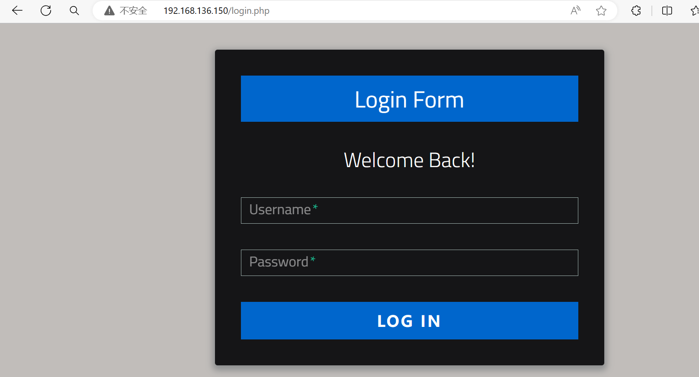
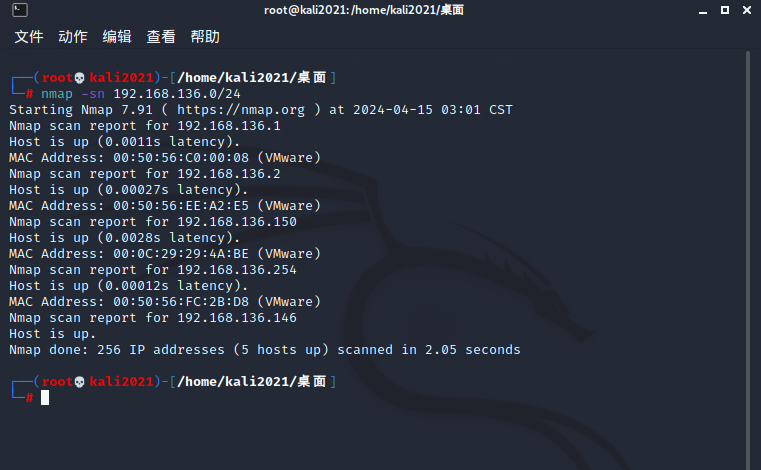

靶机描述:
```
Description
VM Name: JIS-CTF : VulnUpload

Difficulty: Beginner

Description: There are five flags on this machine. Try to find them. It takes 1.5 hour on average to find all flags.

This works better with VirtualBox rather than VMware
```


[搭好环境](../环境搭建.txt)

靶机:





kali扫网段 找到靶机ip
`nmap -sn 192.168.136.0/24`


靶机ip: 192.168.136.150

信息收集
`nmap -A 192.168.136.150`
```
┌──(root💀kali2021)-[/home/kali2021/桌面]
└─# nmap -A 192.168.136.150  
Starting Nmap 7.91 ( https://nmap.org ) at 2024-04-15 03:10 CST
Nmap scan report for 192.168.136.150
Host is up (0.00076s latency).
Not shown: 998 closed ports
PORT   STATE SERVICE VERSION
22/tcp open  ssh     OpenSSH 7.2p2 Ubuntu 4ubuntu2.1 (Ubuntu Linux; protocol 2.0)
| ssh-hostkey: 
|   2048 af:b9:68:38:77:7c:40:f6:bf:98:09:ff:d9:5f:73:ec (RSA)
|   256 b9:df:60:1e:6d:6f:d7:f6:24:fd:ae:f8:e3:cf:16:ac (ECDSA)
|_  256 78:5a:95:bb:d5:bf:ad:cf:b2:f5:0f:c0:0c:af:f7:76 (ED25519)
80/tcp open  http    Apache httpd 2.4.18 ((Ubuntu))
| http-robots.txt: 8 disallowed entries 
| / /backup /admin /admin_area /r00t /uploads 
|_/uploaded_files /flag
|_http-server-header: Apache/2.4.18 (Ubuntu)
| http-title: Sign-Up/Login Form
|_Requested resource was login.php
MAC Address: 00:0C:29:29:4A:BE (VMware)
Device type: general purpose
Running: Linux 3.X|4.X
OS CPE: cpe:/o:linux:linux_kernel:3 cpe:/o:linux:linux_kernel:4
OS details: Linux 3.2 - 4.9
Network Distance: 1 hop
Service Info: OS: Linux; CPE: cpe:/o:linux:linux_kernel

TRACEROUTE
HOP RTT     ADDRESS
1   0.76 ms 192.168.136.150

OS and Service detection performed. Please report any incorrect results at https://nmap.org/submit/ .
Nmap done: 1 IP address (1 host up) scanned in 8.58 seconds

```

可以发现扫出了 ssh 和 tcp 端口
还有/robots.txt:
```
User-agent: *
Disallow: /
Disallow: /backup
Disallow: /admin
Disallow: /admin_area
Disallow: /r00t
Disallow: /uploads
Disallow: /uploaded_files
Disallow: /flag
```

访问/flag拿到第一个flag
**flag1**: The 1st flag is : {8734509128730458630012095}


接下来访问上面几个路由都不大对劲
能访问通的有 /uploaded_files /admin_area(显示not work)

应该是有文件上传点?
是要先登录吗???

尝试sqlmap打登陆sql 未果 手动测试感觉也不大能注入


dirb扫到/assets路由 能找到js源码

能看到对上传文件大小等有限制 但应该还是要登录先

弱口令爆破一下
尝试以admin和root作为username  用 `某集团下发弱口令字典` 9.6w+没爆出来 大概率不是弱口令


或者还有可能是前面的ssh能登陆?
看了看host key好像可以authentic 是要在本地转成rsa pubkey?

没辙...

回去看/admin_area路由
ctrl+u看源码...

```
<!--	username : admin
	password : 3v1l_H@ck3r
	The 2nd flag is : {7412574125871236547895214}
-->
```
得到了flag2和登陆用户名/密码...

**flag2**: {7412574125871236547895214}

username: admin
password: 3v1l_H@ck3r

登陆发现可以传文件 那应该就是文件上传shell了

看前面/assets路由泄露的js发现对文件是有waf的
```js
beforeEach: function(file){
			if(!file.type.match(/^image\//)){
				alert('Only images are allowed!');
				
				// Returning false will cause the
				// file to be rejected
				return false;
			}
		},
```

然而无论传什么都是success回显 且找不到文件路径...
/uploaded_files路由也没有信息
然后发现是这个路由: `http://192.168.136.150/uploaded_files/1.php`
就能看到上传的文件

AntSword连接
进一步信息收集
```
(www-data:/var/www/html/uploaded_files) $ ls ../
admin_area
assets
check_login.php
css
flag
flag.txt
hint.txt
index.php
js
login.php
logout.php
robots.txt
uploaded_files
```

访问hint.txt:
```
try to find user technawi password to read the flag.txt file, you can find it in a hidden file ;)
The 3rd flag is : {7645110034526579012345670}
```

**flag3**: {7645110034526579012345670}
然后根据尝试和提示知道flag.txt需要一定权限

hidden file???
用find来找与 technawi用户相关的信息
```
(www-data:/var/www/html) $ find / -user technawi 2>/dev/null
/etc/mysql/conf.d/credentials.txt
/var/www/html/flag.txt
/home/technawi
/home/technawi/.cache
/home/technawi/.bash_history
/home/technawi/.sudo_as_admin_successful
/home/technawi/.profile
/home/technawi/.bashrc
/home/technawi/.bash_logout
```

然而都没有权限... 好的看漏了第一个mysql...
`cat /etc/mysql/conf.d/credentials.txt` 得到flag4
```
(www-data:/var/www/html) $ cat /etc/mysql/conf.d/credentials.txt
The 4th flag is : {7845658974123568974185412}
username : technawi
password : 3vilH@ksor
```

**flag4**: {7845658974123568974185412}

username : technawi
password : 3vilH@ksor

还有个问题是怎么在蚁剑的shell执行su...
尝试mysql登陆 也报权限❌
```
(www-data:/var/www/html) $ mysql -u technawi -p
Enter password: ERROR 1045 (28000): Access denied for user 'technawi'@'localhost' (using password: NO)
```

也有可能是前面ssh端口的账户密码 尝试kali ssh连接靶机
```
┌──(root💀kali2021)-[/home/kali2021/桌面]
└─# ssh technawi@192.168.136.150 -p 22
technawi@192.168.136.150's password: 
Welcome to Ubuntu 16.04.2 LTS (GNU/Linux 4.4.0-72-generic x86_64)

 * Documentation:  https://help.ubuntu.com
 * Management:     https://landscape.canonical.com
 * Support:        https://ubuntu.com/advantage

0 packages can be updated.
0 updates are security updates.


Last login: Fri Apr 21 17:22:16 2017
technawi@Jordaninfosec-CTF01:~$ 
technawi@Jordaninfosec-CTF01:~$ cat /var/www/html/flag.txt
The 5th flag is : {5473215946785213456975249}

Good job :)

You find 5 flags and got their points and finish the first scenario....

```
成功！

**flag5**: {5473215946785213456975249}

---
---

总结:
打的第一个machine 磕磕绊绊也算是整完了...
重点真的是信息收集!!!!!!!!!!!!!!!!!!!!!!
等会儿总结一下nmap的扫法 还有ssh的相关知识
冲!
每一个渗透高手的进阶之路都有一个微不足道的开始！