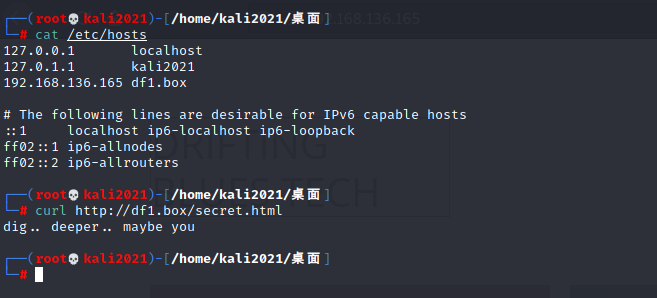
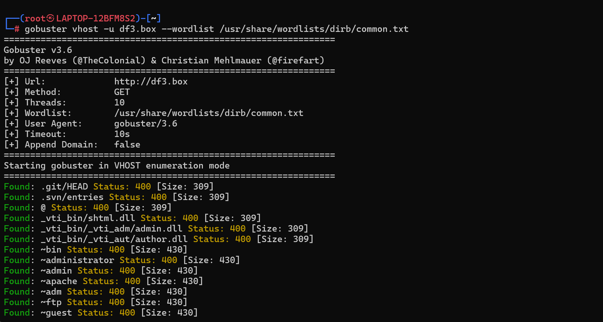
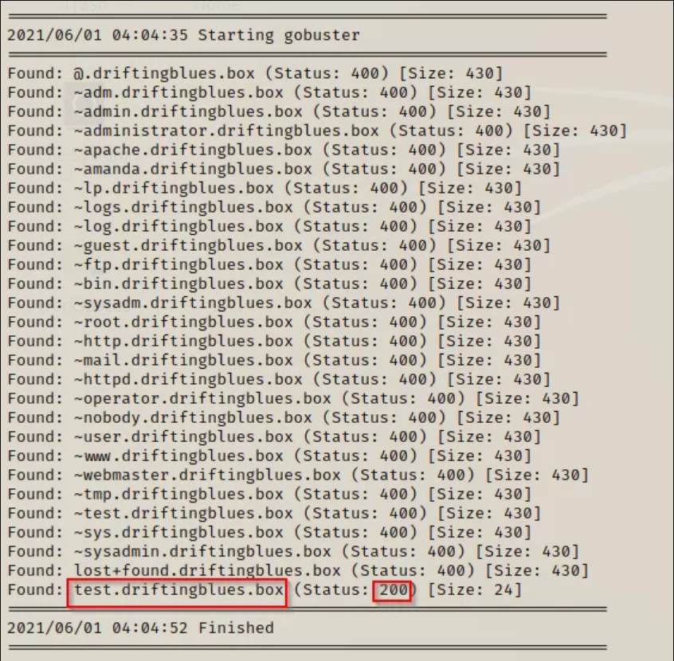

楽 3的配不好 1的可以...

[walkthrough参考](https://nepcodex.com/2021/06/vulnhub-driftingblues-1-walkthrough/)
(这个真的得看国外老哥咋做的... 这种类型不熟)

**环境配置**:
ova导入 启动后改NAT

**靶机ip**: `192.168.136.165`

**信息收集**
nmap
```
Starting Nmap 7.91 ( https://nmap.org ) at 2024-05-11 22:04 CST
Nmap scan report for 192.168.136.165
Host is up (0.0020s latency).
Not shown: 998 closed ports
PORT   STATE SERVICE VERSION
22/tcp open  ssh     OpenSSH 7.2p2 Ubuntu 4ubuntu2.10 (Ubuntu Linux; protocol 2.0)
| ssh-hostkey: 
|   2048 ca:e6:d1:1f:27:f2:62:98:ef:bf:e4:38:b5:f1:67:77 (RSA)
|   256 a8:58:99:99:f6:81:c4:c2:b4:da:44:da:9b:f3:b8:9b (ECDSA)
|_  256 39:5b:55:2a:79:ed:c3:bf:f5:16:fd:bd:61:29:2a:b7 (ED25519)
80/tcp open  http    Apache httpd 2.4.18 ((Ubuntu))
|_http-server-header: Apache/2.4.18 (Ubuntu)
|_http-title: Drifting Blues Tech
MAC Address: 00:0C:29:AF:15:69 (VMware)
Service Info: OS: Linux; CPE: cpe:/o:linux:linux_kernel

Service detection performed. Please report any incorrect results at https://nmap.org/submit/ .
Nmap done: 1 IP address (1 host up) scanned in 7.20 seconds

```


直接看网页找不到任何突破口 看源码找到 `L25vdGVmb3JraW5nZmlzaC50eHQ=`
`/noteforkingfish.txt`
emmm... 访问发现是Ook编码...
得到 `my man, i know you are new but you should know how to use host file to reach our secret location. -eric`


要用`goburster`爆破vhost
我们先把靶机加到/etc/hosts里


就类似Windows配本机DNS解析

然后goburster来爆破vhost
`gobuster vhost -u df3.box --wordlist /usr/share/wordlists/dirb/common.txt`



本机kali出了点问题... 借图了


扫到一个 `test.df1.box`
把这个也加入到/etc/hosts 然后访问

emmm 从这里就有问题了... (因为我的gobuster根本扫不到这个Status:200的点...)

这系列的机子都有点难绷...

md不做评价 这系列靶机不打了... 环境太难绷了...