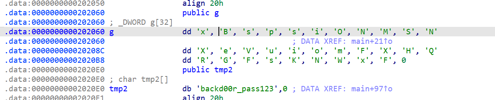

参考(照抄):
[+++](https://www.icekam.com/post/rotating-fortress-1.0.1-vulnhub-ctf-drone-exercise-record/)

**靶机下载地址**:https://download.vulnhub.com/rotatingfortress/rotating_fortress_v1.0.1.ova

**靶机难度**: medium -> hard   (刚好适合讲课...)

**环境配置**:
OVA导入 启动后改NAT即可

**靶机ip**: 192.168.136.171

## 信息收集
**nmap全端口扫描**

开放了80和27052端口


## web服务器渗透
访问 http://192.168.136.171

回显  You're not the Admin! 

第一想法就是伪造Cookie绕过

bp抓包
`Cookie: isAdmin=0`
改为1即可

回显得到**flag1**

同时得到路径
/LELv3FfpLrbX1S4Q2FHA1hRtIoQa38xF8dzc8O9z

**dirb**扫目录

扫出 robots.txt

```
User-agent: *
Disallow: /
Disallow: /icons/loki.bin
Disallow: /eris.php
```


下载loki.bin
wsl file查看 发现是ELF64
运行 ./loki.bin 提示需要输入密码

IDA逆向


上面是真密码 下面是假密码

得到密码`xBspsiONMSNXeVuiomF`

得到**flag2**


艹 ，后面都是些什么煞笔步骤啊。。。 失策了。。。
