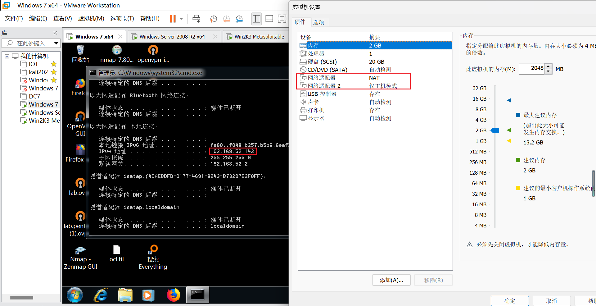
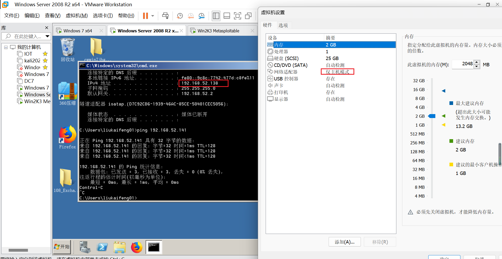
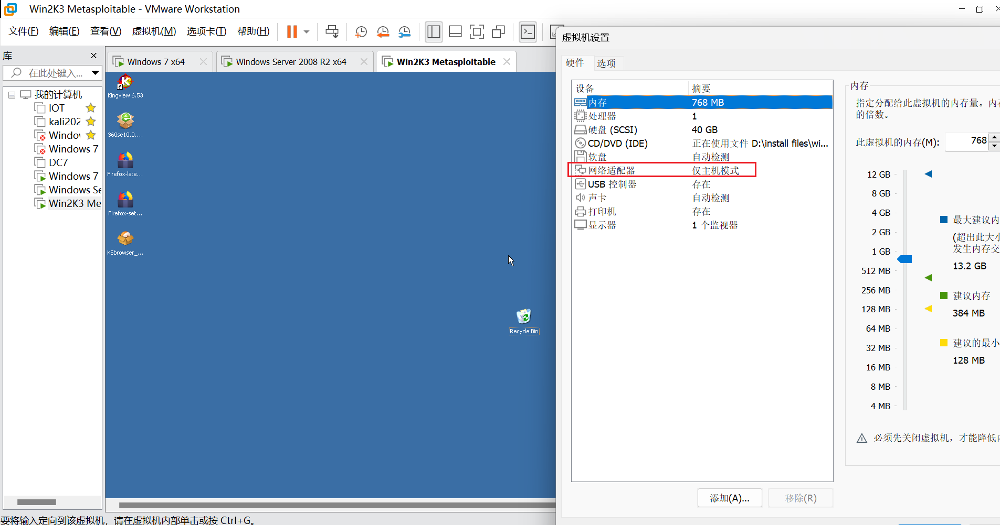
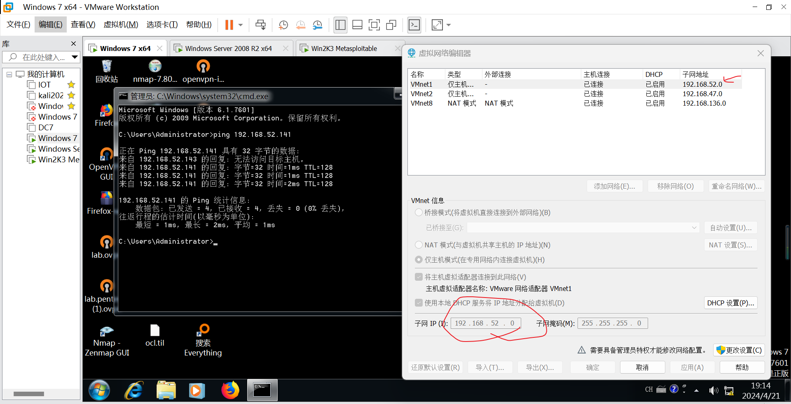

[靶机下载](http://vulnstack.qiyuanxuetang.net/vuln/detail/2/#file)

靶机描述:
```
红队实战系列，主要以真实企业环境为实例搭建一系列靶场，通过练习、视频教程、博客三位一体学习。另外本次实战完全模拟ATT&CK攻击链路进行搭建，开成完整闭环。后续也会搭建真实APT实战环境，从实战中成长。关于环境可以模拟出各种各样实战路线，目前给出作者实战的一套攻击实战路线如下，虚拟机所有统一密码：hongrisec@2019：

一、环境搭建
1.环境搭建测试
2.信息收集

二、漏洞利用
3.漏洞搜索与利用
4.后台Getshell上传技巧
5.系统信息收集
6.主机密码收集

三、内网搜集
7.内网--继续信息收集
8.内网攻击姿势--信息泄露
9.内网攻击姿势-MS08-067
10.内网攻击姿势-SMB远程桌面口令猜测
11.内网攻击姿势-Oracle数据库TNS服务漏洞
12.内网攻击姿势-RPC DCOM服务漏洞


四、横向移动
13.内网其它主机端口-文件读取
14.内网其它主机端口-redis
15.内网其它主机端口-redis Getshell
16.内网其它主机端口-MySQL数据库
17.内网其它主机端口-MySQL提权

五、构建通道
18.内网其它主机端口-代理转发

六、持久控制
19.域渗透-域成员信息收集
20.域渗透-基础服务弱口令探测及深度利用之powershell
21.域渗透-横向移动[wmi利用]
22.域渗透-C2命令执行
23.域渗透-利用DomainFronting实现对beacon的深度隐藏
24.域渗透-域控实现与利用

七、痕迹清理
25、日志清理
```


# 环境配置
刚开始肯定不会直接pentest 搭好环境 利用现成的域环境熟悉一下Windows内网

hongrisec@2019 or hongrisec@2024

[教程](https://www.cnblogs.com/Cl0ud/p/13688649.html)

重点是win7的攻击机要加一个网卡







按教程的方法改 然后在虚拟网络配置里面把网络连起来


能ping通metasploitable(192.168.52.141)就行


然后Win7 phpstudy启动一下web服务
