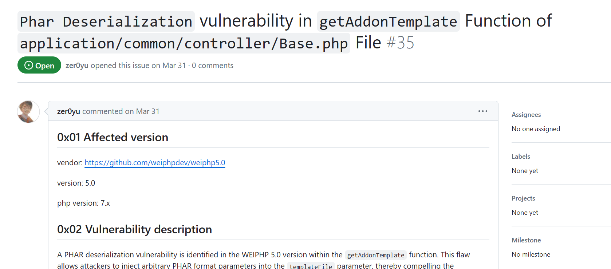
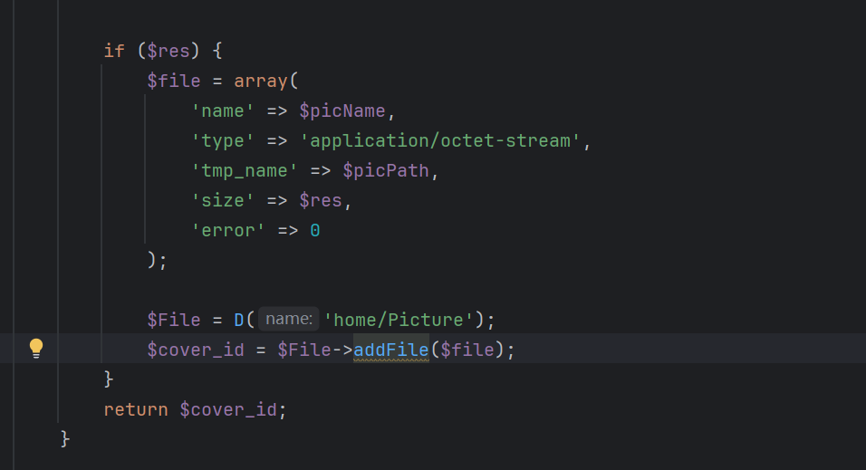
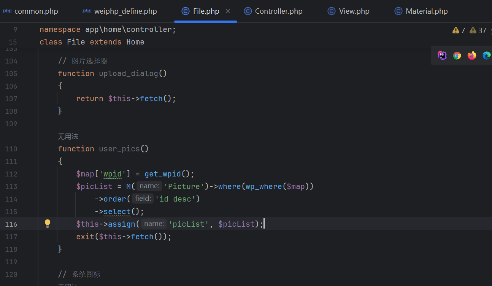
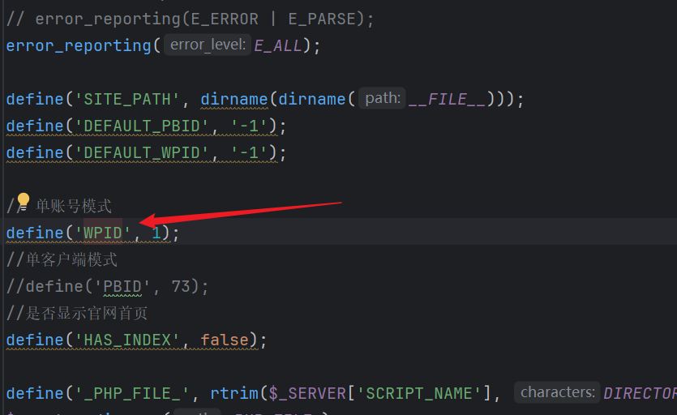
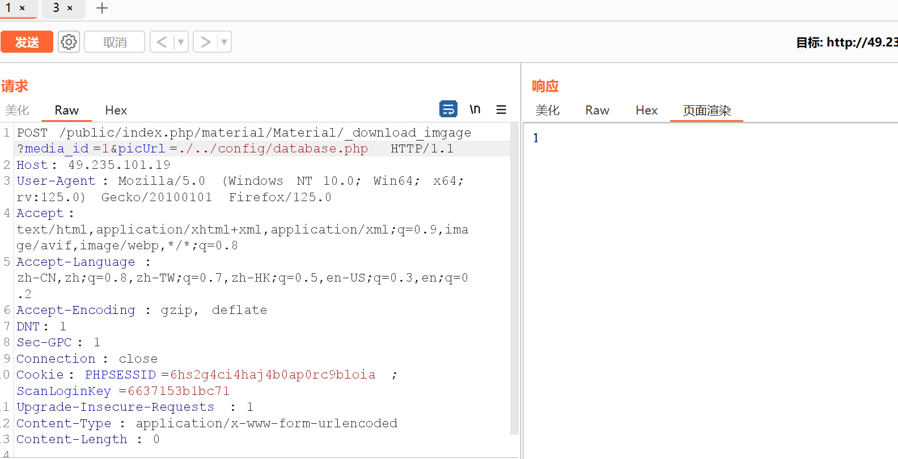
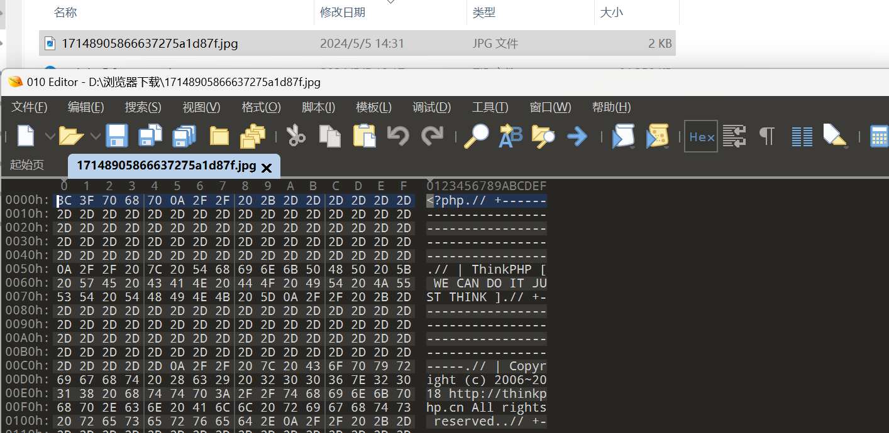
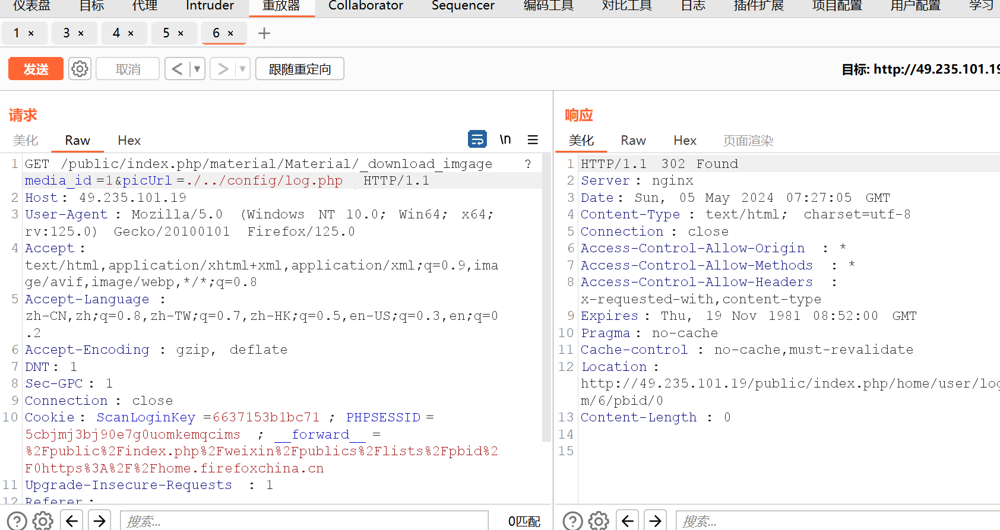

<!-- more-->

源码下载: https://github.com/weiphpdev/weiphp5.0
参考:
[y4](https://y4tacker.blog.csdn.net/article/details/116567491)
[gitbook](https://1229507902.gitbook.io/neutron/test/cms-lou-dong/weiphp/weiphp5.0-qian-tai-wen-jian-ren-yi-du-qu-cnvd202068596#ying-xiang-ban-ben)

貌似这个CMS有两个CNVD
在github的issue还有一个爆出的phar反序列化


跟着练习一下审计

## 漏洞描述
Weiphp5.0 存在前台文件任意读取漏洞，可以读取数据库配置等敏感文件

## 影响版本
Weiphp <= 5.0

## FOFA
Fofa语法: "Weiphp5.0"

## 环境搭建
在线验证环境: http://49.235.101.19/
本地源码审计

## 漏洞复现
漏洞函数文件: `application\material\controller\Material.php`
漏洞函数: `_download_image`

代码:
```php
public function _download_imgage($media_id, $picUrl = '', $dd = null)
    {
        $savePath = SITE_PATH . '/public/uploads/picture/' . time_format(NOW_TIME, 'Y-m-d');
        mkdirs($savePath);
        $cover_id = 0;
        if (empty($picUrl)) {
            // 获取图片URL
            $url = 'https://api.weixin.qq.com/cgi-bin/material/get_material?access_token=' . get_access_token();
            $param['media_id'] = $media_id;
            // dump($url);
            $picContent = post_data($url, $param, 'json', false);
            $picjson = json_decode($picContent, true);
            // dump($picjson);die;
            if (isset($picjson['errcode']) && $picjson['errcode'] != 0) {
                $cover_id = do_down_image($media_id, $dd['thumb_url']);
                if (!$cover_id) {
                    return 0;
                    exit();
                }
            }
            $picName = NOW_TIME .uniqid(). '.jpg';
            $picPath = $savePath . '/' . $picName;
            $res = file_put_contents($picPath, $picContent);
        } else {
            $content = wp_file_get_contents($picUrl);
            // 获取图片扩展名
            $picExt = substr($picUrl, strrpos($picUrl, '=') + 1);
            if (empty($picExt) || $picExt == 'jpeg' || strpos('jpg,gif,png,jpeg,bmp', $picExt) === false) {
                $picExt = 'jpg';
            }
            $picName = NOW_TIME .uniqid(). '.' . $picExt;
            $picPath = $savePath . '/' . $picName;
            $res = file_put_contents($picPath, $content);
            if (!$res) {
                $cover_id = do_down_image($media_id);
                if (!$cover_id) {
                    return 0;
                    exit();
                }
            }
        }

        if ($res) {
            $file = array(
                'name' => $picName,
                'type' => 'application/octet-stream',
                'tmp_name' => $picPath,
                'size' => $res,
                'error' => 0
            );

            $File = D('home/Picture');
            $cover_id = $File->addFile($file);
        }
        return $cover_id;
    }
```

可以审计出来能任意download picurl 只是怎么获得下载的路径呢?
继续跟

这个 `$file`存储的是我们下载的文件要保存的相关内容
跟进 addFile (/home/Picture)

```php
function addFile($file)
    {
        $data['md5'] = md5_file($file['tmp_name']);
        $id = $this->where('md5', $data['md5'])->value('id');
        if ($id > 0) {
            return $id;
        }

        $info = pathinfo($file['tmp_name']);
        $data['path'] = str_replace(SITE_PATH . '/public', '', $file['tmp_name']);

        $data['sha1'] = hash_file('sha1', $file['tmp_name']);
        $data['create_time'] = NOW_TIME;
        $data['status'] = 1;
        $data['wpid'] = get_wpid();

        $id = $this->insertGetId($data);
        return $id;
    }
```

最后就是这句代码 ` $id = $this->insertGetId($data);`
也就是写入了 Picture的数据表中

注意下作者的一个定义
```php
function M($name = '')
{
    return db($name, [], false);
}
```

所以我们搜索 `M('Picture')`来找出现Picture表的地方

找到这里


这里wpid的值默认为1


`$this->assign`进行的是合并操作
所以这个页面是会把`Picture`表的数据同步合并后显示的 而且这个路由可以公开访问

根据thinkphp的路由规则 访问 `url/public/index.php/home/file/user_pics`即可


PoC:
首先用 `POST` 任意下载`/config/database.php`


然后访问 `http://49.235.101.19/public/index.php/home/file/user_pics`即可

对应链接下载即可获得



其实我觉得最严重的甚至是直接就能访问`/file/user_pics`得到小程序/微信中大量用户记录图片！！！
http://49.235.101.19/public/index.php/home/file/user_pics
大量敏感数据(身份证etc...)

---
---

最后解决上述没有提到的一个问题 为什么第一步任意下载要用POST传?
如果用GET:


参考文章说是 `用POST绕过登陆验证`
应该是在前面某个地方有验证 找了半天也没找着
当作一个trick记着吧 `尝试POST绕过登陆验证`
