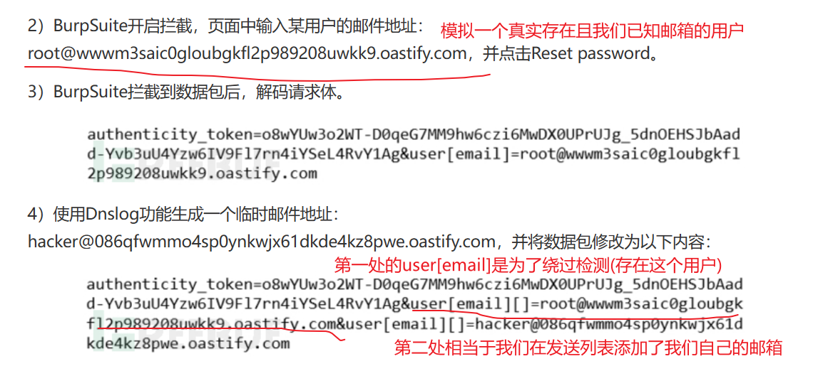
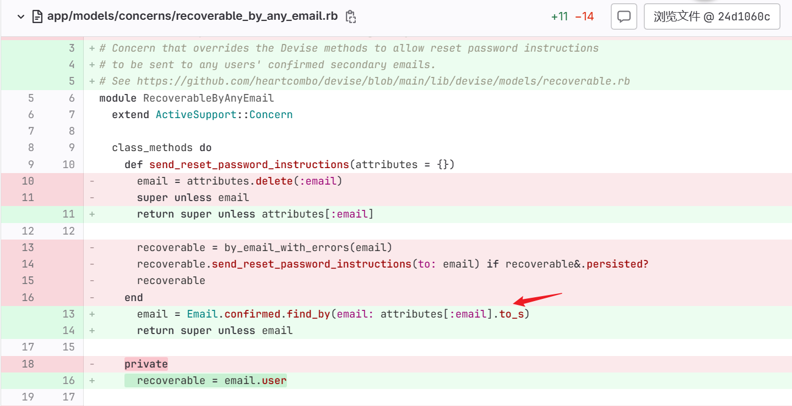

补丁修改:
[patch](https://gitlab.com/rluna-gitlab/gitlab-ce/-/commit/24d1060c0ae7d0ba432271da98f4fa20ab6fd671)

参考:
[分析1](https://www.freebuf.com/articles/network/391113.html)
[分析2](https://y4tacker.github.io/2024/01/12/year/2024/1/%E6%B5%85%E6%9E%90Gitlab%E6%9C%AA%E6%8E%88%E6%9D%83%E5%AF%86%E7%A0%81%E9%87%8D%E7%BD%AE-CVE-2023-7028/)

原先的app/models/concerns/recoverable_by_any_email.rb:
完全不熟悉ruby 让AI写注释来分析

```rb
module RecoverableByAnyEmail
  extend ActiveSupport::Concern

  class_methods do
    # 定义一个类方法，用于发送重置密码的指令
    def send_reset_password_instructions(attributes = {})
      # 从传入的参数中获取邮箱地址
      email = attributes.delete(:email)
      # 如果没有提供邮箱地址，则调用父类方法（这里假设是 Devise 提供的方法）
      super unless email

      # 调用私有方法 by_email_with_errors，查找数据库中是否有匹配的记录
      recoverable = by_email_with_errors(email)
      # 如果找到匹配的记录并且该记录已经持久化到数据库中，则发送重置密码的指令
      recoverable.send_reset_password_instructions(to: email) if recoverable&.persisted?
      # 返回 recoverable 对象
      recoverable
    end

    private

    # 定义一个私有类方法，用于根据邮箱查找记录并处理可能的错误情况
    def by_email_with_errors(email)
      # 使用 find_by_any_email 方法查找数据库中是否存在已确认的记录，如果不存在则创建一个新的记录
      record = find_by_any_email(email, confirmed: true) || new
      # 如果新创建的记录没有持久化到数据库中，则添加错误信息到该记录
      record.errors.add(:email, :invalid) unless record.persisted?
      # 返回处理后的记录
      record
    end
  end

  # 实例方法，用于发送重置密码的指令，并返回生成的 token
  def send_reset_password_instructions(opts = {})
    # 生成重置密码的 token
    token = set_reset_password_token
    # 发送通知邮件
    send_reset_password_instructions_notification(token, opts)

    # 返回生成的 token
    token
  end

  private

  # 定义一个私有方法，用于发送重置密码的通知邮件
  def send_reset_password_instructions_notification(token, opts = {})
    # 调用 Devise 提供的方法发送重置密码的通知邮件
    send_devise_notification(:reset_password_instructions, token, opts)
  end
end


```

这段代码的主要功能是提供了一个模块 RecoverableByAnyEmail，用于处理通过任意邮箱地址重置密码的功能。
它通过类方法 send_reset_password_instructions 和实例方法 send_reset_password_instructions 来处理发送重置密码的指令，以及发送重置密码的通知邮件。


`find_by_any_email`:
```rb
def find_by_any_email(email, confirmed: false)
  return unless email

  by_any_email(email, confirmed: confirmed).take
end
```

如果设置了email 就会执行by_any_email
```rb
def by_any_email(emails, confirmed: false)
  from_users = by_user_email(emails)
  from_users = from_users.confirmed if confirmed

  from_emails = by_emails(emails).merge(Email.confirmed)
  from_emails = from_emails.confirmed if confirmed

  items = [from_users, from_emails]

  user_ids = Gitlab::PrivateCommitEmail.user_ids_for_emails(Array(emails).map(&:downcase))
  items << where(id: user_ids) if user_ids.present?

  from_union(items)
end

...

scope :by_user_email, -> (emails) { iwhere(email: Array(emails)) }
scope :by_emails, -> (emails) { joins(:emails).where(emails: { email: Array(emails).map(&:downcase) }) }
scope :for_todos, -> (todos) { where(id: todos.select(:user_id).distinct) }
scope :with_emails, -> { preload(:emails) }
scope :with_dashboard, -> (dashboard) { where(dashboard: dashboard) }
scope :with_public_profile, -> { where(private_profile: false) }
scope :with_expiring_and_not_notified_personal_access_tokens, ->(at) do
  where('EXISTS (?)', ::PersonalAccessToken
    .where('personal_access_tokens.user_id = users.id')
    .without_impersonation
    .expiring_and_not_notified(at).select(1)
  )


```

by_any_mail的 `scope :by_user_email, -> (emails) { iwhere(email: Array(emails)) }`
可以看到emails的类型是数组 如果以数组传入一个经过验证的邮箱就能满足条件
就会返回一个用户实例

其实这么说挺绕的 但看看漏洞的触发效果就明白了


利用的就是`user[email][]`的这种特性吧 具体是什么也不大清楚 但大致思路能领会
然后绕过验证后发送重置链接 两个邮箱都能收到 就能未授权密码重置了

再看看patch的修改
主要是这个点:


把参数的email转为字符串 就避免了数组绕过的漏洞
