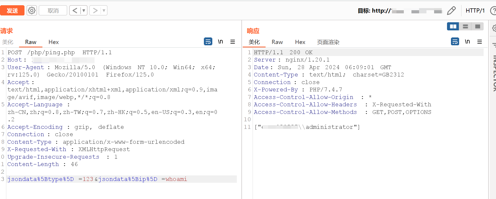
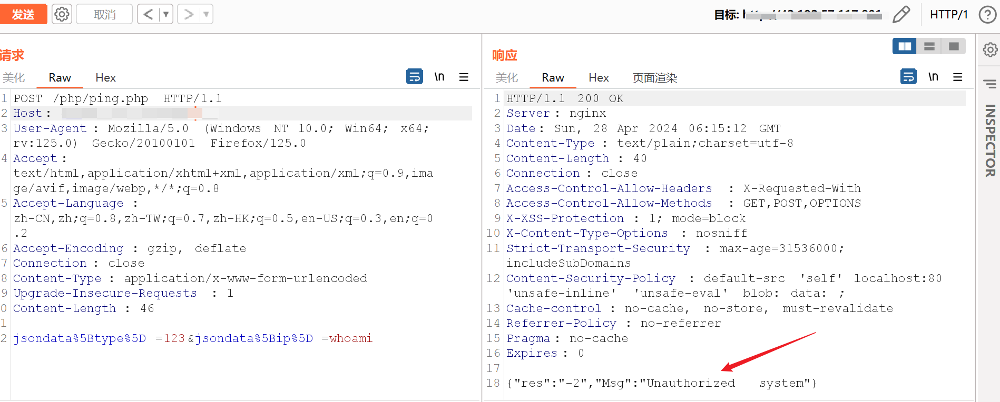

## 一.漏洞描述
海康威视网络对讲广播系统是海康威视提供的安防解决方案的一部分，用于管理和实现对讲和广播功能。
该产品存在远程命令执行漏洞，攻击者可通过此漏洞获取服务器权限。

## 二.漏洞影响版本
IP网络对讲广播系统

## 三.网络空间测绘查询

fofa:icon_hash="-1830859634"
hunter:web.icon=="e854b2eaa9e4685a95d8052d5e3165bc"

## 四.漏洞复现
经典的ping RCE

有waf的:

